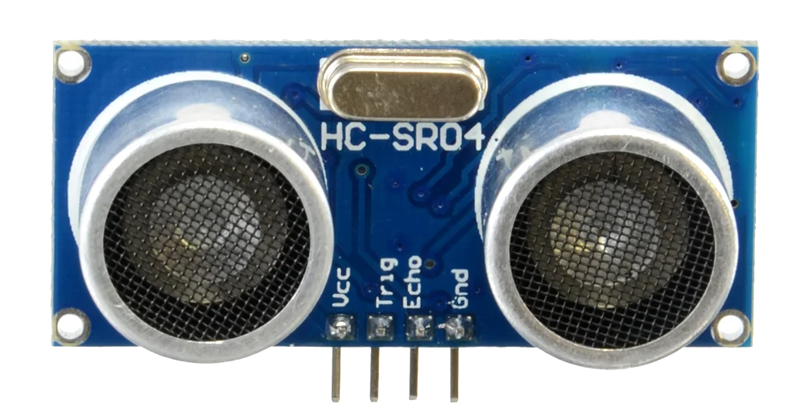

====================================================
MoveMotor distance sensors
====================================================

Set up the distance sensors
----------------------------------------

.. py:class:: MOVEMotorDistanceSensors() 

| Set up the Distance Sensors for use.
| Import the MOVEMotor module first.
| Use ``distance_sensor = MOVEMotor.MOVEMotorDistanceSensors()`` to be able to use the distance sensing methods.

.. code-block:: python

    from microbit import *
    import MOVEMotor

    # setup distance_sensor
    distance_sensor = MOVEMotor.MOVEMotorDistanceSensors()

Distance to an object
----------------------------------------

| The distance, in cm, to an object can be found using: ``distance()``.

.. py:method:: distance()

    Returns the distance, in cm, to an object.

sonar = HCSR04()
while True:
    if button_a.is_pressed():
        distance = round(sonar.distance_mm()/10)
        if distance < 10:
            display.show(str(distance))
        else:
            display.scroll(str(distance))
        while button_a.is_pressed():
            sleep(100)
    sleep(100)

----

| The code below, using ``distance_sensor.distance() < 10``,  measures the distance to objects and if the distance is less than 10cm it spins the buggy to the left for 1 second.

.. code-block:: python

    from microbit import *
    import MOVEMotor

    # setup buggy
    buggy = MOVEMotor.MOVEMotorMotors()
    
    # setup distance_sensor
    distance_sensor = MOVEMotor.MOVEMotorDistanceSensors()
    
    while True:
        buggy.forward()
        if distance_sensor.distance() < 10:
            buggy.spin(speed=1, direction='left', duration=1000)
        sleep(200)

----

.. admonition:: Tasks

    #. Write code to drive the buggy forward until it measures and object 100cm in front and then stops.
    #. Write code to drive the buggy forward until it measures and object 50cm in front and then it stops for 500ms, goes backwards for 500ms, then spins, goes forwards and repeats.

-----

HC-SR04 Distance sensor
----------------------------------------

| The HC-SR04 Distance sensor measures distances to objects in the range 2cm to 400cm with a ranging accuracy of 3mm. The angle to objects can be up to 15 degrees.

| Using the same principle as bats (Echo location), this the HC-SR04 uses the Trigger pin13 to send a signal and the Echo pin14 to listen for it to be 'bounced back'.

            def distanceCm(self):
            pin14.set_pull(pin14.NO_PULL)
            pin13.write_digital(0)
            utime.sleep_us(2)
            pin13.write_digital(1)
            utime.sleep_us(10)
            pin13.write_digital(0)
            distance = machine.time_pulse_us(pin14, 1, 1160000)
            if distance > 0:
                return round(distance/58)
            else:
                return round(distance)