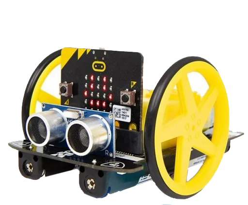

====================================================
MoveMotor motors
====================================================

MOVEMotor.py module
----------------------------------------

| The MOVEMotor module is required to control the motors.
| Download the python file :download:`MOVEMotor.py module <pythonfiles/MOVEMotor.py>`.
| Place it in the mu_code folder: C:\\Users\\username\\mu_code
| The file needs to be copied onto the microbit.
| In Mu editor, with the microbit attached by USB, click the Files icon.
| Files on the microbit are shown on the left.
| Files in the mu_code folder are listed on the right.
| Click and drag the MOVEMotor.py file from the right window to the left window to copy it to the microbit.

Before copying:

.. image:: images/Mu_files.png
    :scale: 50 %

After copying:

.. image:: images/Mu_files_copied.png
    :scale: 50 %

Use MOVEMotor library
----------------------------------------

| To use the MOVEMotor module, import it via: ``import MOVEMotor``.

.. code-block:: python

    from microbit import *
    import MOVEMotor

Set up the buggy
----------------------------------------

.. py:function:: MOVEMotor.MOVEMotor_motors()

    Set up the buggy motors for use.

.. code-block:: python

    from microbit import *
    import MOVEMotor

    # setup buggy
    buggy = MOVEMotor.MOVEMotor_motors()

----

Independent motor control
----------------------------------------

| The left and right motors can be run independently using the four methods below:
| ``left_motor(speed=1)`` runs the left motor.
| ``right_motor(speed=1)`` runs the right motor.
| ``stop_left()`` stops the left motor.
| ``stop_right()`` stops the right motor.

.. py:function:: left_motor(speed=1)

    | Make the left motor run. 
    | ``speed`` values are integers or floats (decimals) from -10 to 10.
    | Default ``speed`` is 1.
    | If speed < 0 the motor turns the wheel backwards.

| ``left_motor()`` and ``left_motor(1)`` and ``left_motor(speed=1)`` all set the speed to 1.

| The code below, using ``left_motor(5)``,  runs the left motor at about half speed.

.. code-block:: python

    from microbit import *
    import MOVEMotor

    # setup buggy
    buggy = MOVEMotor.MOVEMotor_motors()

    buggy.left_motor(5)

----

.. py:function:: right_motor(speed=1)

    | Make the left motor run. 
    | ``speed`` values are integers or floats (decimals) from -10 to 10.
    | Default ``speed`` is 1.
    | If speed < 0 the motor turns the wheel backwards.

| ``right_motor()`` and ``right_motor(1)`` and ``right_motor(speed=1)`` all set the speed to 1.

| The code below, using ``right_motor(-10)``, runs the right motor backwards at full speed.

.. code-block:: python

    from microbit import *
    import MOVEMotor

    # setup buggy
    buggy = MOVEMotor.MOVEMotor_motors()

    buggy.right_motor(-10)

----

.. py:function:: stop_left()

    | Stop the left motor.

| The code below runs the left motor for 1 sec then stops it.

.. code-block:: python

    from microbit import *
    import MOVEMotor

    # setup buggy
    buggy = MOVEMotor.MOVEMotor_motors()

    buggy.left_motor()
    sleep(1000)
    buggy.stop_left()

----

.. py:function:: stop_right()

    | Stop the right motor.

| The code below runs the right motor for 1 sec then stops it.

.. code-block:: python

    from microbit import *
    import MOVEMotor

    # setup buggy
    buggy = MOVEMotor.MOVEMotor_motors()

    buggy.right_motor()
    sleep(1000)
    buggy.stop_right()

----

Stop both motors
----------------------------------------

.. py:function:: stop()

    | Stop both motors.

| The code below runs the left motor at about half speed.

.. code-block:: python

    from microbit import *
    import MOVEMotor

    # setup buggy
    buggy = MOVEMotor.MOVEMotor_motors()
    
    buggy.left_motor(5)
    buggy.right_motor()
    sleep(1000)
    buggy.stop()

----

.. admonition:: Tasks

    #. Write code to drive the left motor at speed 2 for 1 second, stop it, run the right motor at speed 2 for 1 sec then stop it.
    #. Write code to drive the right motor at speed 3 while the left motor runs at speed 2 for 3 sec then stop it.
    #. Write code to drive the left motor at speed 3 while the right motor runs at speed 2 for 3 sec then stop it.
    #. Write code that drives the left side faster than the right side then the right side faster the left side so that it zig zags for 5 sec then stop it.
    #. Write code so that the buggy repetitively zig zags forwards for 5 zigs and zags then backwards backwards for 5 zigs and zags.
    #. Modify the zig zag code so that it uses variables for the 2 motor speeds, the number of zig zags forwards and backward, and the time for each zig and zag.

----

Straight line control
----------------------------------------

| The left and right motors can be run so that the buggy moves forwards or backwards in a straight line:
| ``forward(speed=1, decrease_left=0, decrease_right=0)``
| ``backward(speed=1, decrease_left=0, decrease_right=0)``
| ``decrease_left`` is used to reduce the motor speed on the left side in case the buggy drifts to the right due to the left motor being slightly faster than the right.
| ``decrease_right`` is used to reduce the motor speed on the right side in case the buggy drifts to the left due to the right motor being slightly faster than the left.
| Any ``decrease_left`` and ``decrease_right`` values used to give a straight line are best found by experimentation.

.. py:function:: forward(speed=1, decrease_left=0, decrease_right=0)

    | Drive the buggy forwards.
    | ``speed`` values are integers or floats (decimals) from 0 to 10.
    | Default ``speed`` is 1.
    | ``decrease_left`` and ``decrease_right`` take numbers from 0 to 20. These are converted to a percentage of the maximum analog motor speed of 255 (speed setting 10) so they have similar effect at any speed.
    | ``decrease_left`` and ``decrease_right`` default values are 0.

| ``forward(10, 6)`` and ``forward(10, 6, 0)`` and ``forward(speed=10, decrease_left=6)`` all set the speed to 10 with the left wheel slowed by roughly 2% (6/255).

| The code below, has an adjustment of 6 to the left motor. This is roughly a 2% (6/255) decrease in speed.

.. code-block:: python

    from microbit import *
    import MOVEMotor

    # setup buggy
    buggy = MOVEMotor.MOVEMotor_motors()

    buggy.forward(speed=10, decrease_left=6, decrease_right=0)
    sleep(3000)
    buggy.stop()

----

.. py:function:: backward(speed=1, decrease_left=0, decrease_right=0)

    | Drive the buggy backwards.
    | ``speed`` values are integers or floats (decimals) from 0 to 10.
    | Default ``speed`` is 1.
    | ``decrease_left`` and ``decrease_right`` take numbers from 0 to 20. These are converted to a percentage of the maximum analog motor speed of 255 (speed setting 10) so they have similar effect at any speed.
    | ``decrease_left`` and ``decrease_right`` default values are 0.

| ``backward(10, 0, 3)`` and ``backward(speed=10, decrease_right=3)`` all set the speed to 10 with the right wheel slowed by roughly 1% (3/255).

| The code below, has an adjustment of 3 to the right motor. This is roughly a 1% (3/255) decrease in speed.
| The parameter names have been omitted in ``forward(10, 0, 3)``; instead values are in their specified order.

.. code-block:: python

    from microbit import *
    import MOVEMotor

    # setup buggy
    buggy = MOVEMotor.MOVEMotor_motors()

    buggy.forward(10, 0, 3)
    sleep(3000)
    buggy.stop()

----

.. admonition:: Tasks

    #. Write code to drive the buggy as close as possible to a straight line by experimenting with the decrease_left and decrease_right values.

----

Turning
----------------------------------------

| The left and right motors are adjusted to turn the buggy:
| ``left(speed=1, radius=25)``
| ``right(speed=1, radius=25)``
| When turning left the left wheel is slowed slightly based on the radius value.
| When turning right the right wheel is slowed slightly based on the radius value.
| The turning radius is approximate only, and is automatically calculated using 8.5 cm as the distance between the 2 wheels.

.. py:function:: left(speed=1, radius=25)

    | Drive the buggy forwards to the left.
    | ``speed`` values are integers or floats (decimals) from -10 to 10.
    | Default ``speed`` is 1.
    | ``radius`` values are 4 to 800 (in cm)
    | Default ``radius`` is 25 (in cm).

| ``left()`` and ``left(1, 25)`` and ``left(speed=1, radius=25)`` all set the speed to 1 with radius 25cm.

| The code below, ``left(speed=3, radius=20)``, drives the buggy forward at speed 3 while it turns left in a circular path of approximate radius 20 cm.

.. code-block:: python

    from microbit import *
    import MOVEMotor

    # setup buggy
    buggy = MOVEMotor.MOVEMotor_motors()

    buggy.left(speed=3, radius=20)
    sleep(4000)
    buggy.stop()

----

.. admonition:: Tasks

    #. Write code to drive the buggy to the left at speed 2 in small circles of 10 cm radius.
    #. Write code to drive the buggy to the left at speed 5 in medium circles of 50 cm radius.
    #. Write code to drive the buggy to the left at speed 8 in circles of 20, 40 and 60 cm radius for 5 seconds each. Use a for loop and a list of the radii.

----

.. py:function:: right(speed=1, radius=25)

    | Drive the buggy forwards to the right.
    | ``speed`` values are integers or floats (decimals) from -10 to 10.
    | Default ``speed`` is 1.
    | ``radius`` values are 4 to 800 (in cm)
    | Default ``radius`` is 25 (in cm).

| ``right()`` and ``right(1, 25)`` and ``right(speed=1, radius=25)`` all set the speed to 1 with radius 25cm.

| The code below, ``left(speed=3, radius=20)``, drives the buggy forward at speed 2 while it turns right in a circular path of approximate radius 40 cm.

.. code-block:: python

    from microbit import *
    import MOVEMotor

    # setup buggy
    buggy = MOVEMotor.MOVEMotor_motors()

    buggy.left(speed=2, radius=40)
    sleep(4000)
    buggy.stop()

----

.. admonition:: Tasks

    #. Write code to drive the buggy to the right at speed 4 in small circles of 5 cm radius.
    #. Write code to drive the buggy to the right at speed 7 in medium circles of 80 cm radius.
    #. Write code to drive the buggy to the right at speed 10 in in circles of increasing size. Use a range function to increase the radius every 4 seconds from 10 to 100 in steps of 10.

----

