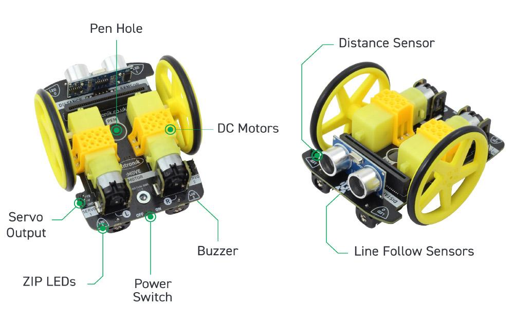

====================================================
MoveMotor pins
====================================================

| Length 110mm.
| Width 90mm.
| Power 4xAA batteries

Pins
---------

The pin numbers used to control different parts of the :MOVEMotor are below.

=======  ===========================
 Pin     Purpose
=======  ===========================
 pin0    Audio Buzzer
 pin1    right Line Follow (IR)
 pin2    left Line Follow (IR)
 pin8    4x ZIP LEDs
 pin13   Ultrasonic Trigger
 pin14   Ultrasonic Echo
 pin15   Servo Connection
 pin16   Servo Connection
 pin19   motor (via I2C)
 pin20   motor (via I2C)
=======  ===========================
