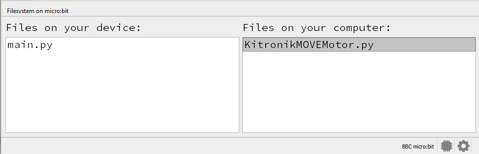
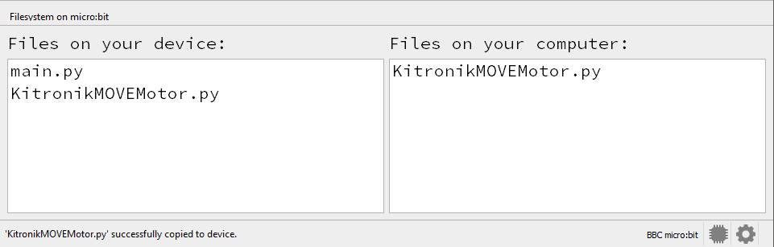

====================================================
Move Motor motors
====================================================

.. image:: images/move-motor.jpg
    :scale: 50 %
    
KitronikMOVEMotor.py module
----------------------------------------

| The KitronikMOVEMotor module is required to control the motors.
| Download the library python file :download:`KitronikMOVEMotor.py module <pythonfiles/KitronikMOVEMotor.py>`.
| Place it in the mu_code folder: C:\\Users\\username\\mu_code
| The file needs to be copied onto the microbit.
| In Mu editor, with the microbit attached by USB, click the Files icon.
| Files on the microbit are shown on the left.
| Files in the mu_code folder are listed on the right.
| Click and drag the KitronikMOVEMotor.py file from the right window to the left window to copy it to the microbit.

Before copying:

After copying:

Use KitronikMOVEMotor library
----------------------------------------

| To use the KitronikMOVEMotor library, import it: ``import KitronikMOVEMotor``.

.. code-block:: python

    from microbit import *
    import KitronikMOVEMotor

Set up buggy
----------------------------------------

.. py:function:: KitronikMOVEMotor.MOVEMotor()

    Set up the buggy motors for use.

.. code-block:: python

    from microbit import *
    import KitronikMOVEMotor

    # setup buggy
    buggy = KitronikMOVEMotor.MOVEMotor()

----

Independent motor control
----------------------------------------

| The left and right motors can be run independently using the four methods below:
| ``LeftMotor(speed=1)`` runs the left motor.
| ``RightMotor(speed=1)`` runs the right motor.
| ``StopLeft()`` stops the left motor.
| ``StopRight()`` stops the right motor.

.. py:function:: LeftMotor(speed=1)

    | Make the left motor run. 
    | Speed values are integers or floats (decimals) from -10 to 10.
    | Default speed is 1.
    | If speed < 0 the motor goes in reverse.

| The code below, using ``LeftMotor(5)``,  runs the left motor at about half speed.

.. code-block:: python

    from microbit import *
    import KitronikMOVEMotor

    # setup buggy
    buggy = KitronikMOVEMotor.MOVEMotor()

    buggy.LeftMotor(5)

----

.. py:function:: RightMotor(speed=1)

    | Make the left motor run. 
    | Speed values are integers or floats (decimals) from -10 to 10.
    | Default speed is 1.
    | If speed < 0 the motor goes in reverse.

| The code below, using ``RightMotor(-10)``, runs the right motor in reverse at full speed.

.. code-block:: python

    from microbit import *
    import KitronikMOVEMotor

    # setup buggy
    buggy = KitronikMOVEMotor.MOVEMotor()

    buggy.RightMotor(-10)

----

.. py:function:: StopLeft()

    | Stops the left motor.

| The code below runs the left motor then stops it.

.. code-block:: python

    from microbit import *
    import KitronikMOVEMotor

    # setup buggy
    buggy = KitronikMOVEMotor.MOVEMotor()

    buggy.LeftMotor()
    sleep(1000)
    buggy.StopLeft()

----

.. py:function:: StopRight()

    | Stops the right motor.

| The code below runs the right motor then stops it.

.. code-block:: python

    from microbit import *
    import KitronikMOVEMotor

    # setup buggy
    buggy = KitronikMOVEMotor.MOVEMotor()

    buggy.RightMotor()
    sleep(1000)
    buggy.StopRight()

----

Stop both motors
----------------------------------------

.. py:function:: Stop()

    | Stops both motors.

| The code below runs the left motor at about half speed.

.. code-block:: python

    from microbit import *
    import KitronikMOVEMotor

    # setup buggy
    buggy = KitronikMOVEMotor.MOVEMotor()
    
    buggy.LeftMotor(5)
    buggy.RightMotor()
    sleep(1000)
    buggy.Stop()

----

.. admonition:: Tasks

    #. Write code to drive the left motor at speed 2 for 1 second, stop it, run the right motor at speed 2 for 1 sec then stop it.
    #. Write code to drive the right motor at speed 3 while the left motor runs at speed 2 for 3 sec then stop it.
    #. Write code to drive the left motor at speed 3 while the right motor runs at speed 2 for 3 sec then stop it.
    #. Write code that drives the left side faster than the right side then the right side faster the left side so that it zig zags for 5 sec then stop it.
    #. Write code that it repetitively zig zags forwards for 5 zigs and zags then reverses backwards for 5 zigs and zags.
    #. Modify the zig zag code so that it uses variables for the 2 motor speeds, the number of zig zags forwards and in reverse, and the time for each zig and zag.

----

Straight line control
----------------------------------------

| The left and right motors can be run so that the buggy moves forwards or backwards in a straight line:
| ``Forward(speed=1, decrease_left=0, decrease_right=0)``
| ``Reverse(speed=1, decrease_left=0, decrease_right=0)``

.. py:function:: Forward(speed=1, decrease_left=0, decrease_right=0)

    | Drive the buggy forwards.
    | Speed values are integers or floats (decimals) from -10 to 10.
    | Default speed is 1.
    | decrease_left and decrease_right are used to adjust the motor speed on each side in case the buggy doesn't go straight due to one motor being slightly faster than the other.
    | decrease_left and decrease_right take numbers from 0 to 20. These are subtracted from the analog motor speed which has a maximum value of 255 when the speed is 10 and converted to a percentage change so they have similar effect at any speed. 
    | What works to give a straight line is best found by experimentation.

| The code below, has an adjustment to the left motor to slow it down by 6 when the speed is 10. This is a decrease of 6 compared to the maximum analog value of 255. This is roughly a 2% (6/255) adjustment.

.. code-block:: python

    from microbit import *
    import KitronikMOVEMotor

    # setup buggy
    buggy = KitronikMOVEMotor.MOVEMotor()

    buggy.Forward(10, decrease_left=6, decrease_right=0)
    sleep(3000)
    buggy.Stop()

----

.. py:function:: Reverse(speed=1, decrease_left=0, decrease_right=0)

    | Drive the buggy backwards.
    | Speed values are integers or floats (decimals) from -10 to 10.
    | Default speed is 1.
    | decrease_left and decrease_right are used to adjust the motor speed on each side in case the buggy doesn't go straight due to one motor being slightly faster than the other.
    | decrease_left and decrease_right take numbers from 0 to 20. These are subtracted from the analog motor speed which has a maximum value of 255 when the speed is 10 and converted to a percentage change so they have similar effect at any speed. 

    

