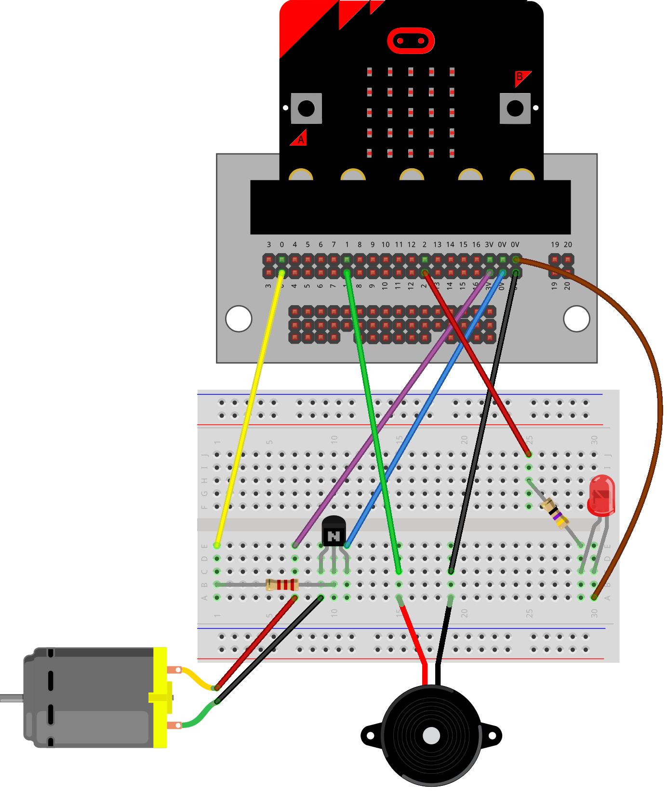

====================================
EXT: Car demo
====================================

| The code below is a demonstration of a micro:bit-based embedded system that simulates three vehicle subsystems: air conditioning, sound, and lights.
| The program provides a menu-driven interface that allows the user to select a subsystem using Button A and demonstrate it using Button B.
| Each subsystem is demonstrated using three predefined output levels to simulate different operating settings.

| This is based on the work of Miles M. and Nate L. term2 2026.

.. code-block:: python

    """
    Vehicle Systems Demonstrator

    A micro:bit-based embedded system that demonstrates three vehicle subsystems:
    air conditioning, sound, and lights.

    The program provides a menu-driven interface that allows the user to select
    a subsystem using Button A and demonstrate it using Button B. Each subsystem is
    demonstrated using three predefined output levels to simulate different
    operating settings.

    Inputs:
        Button A - Change selected subsystem.
        Button B - Run subsystem demonstration.

    Outputs:
        pin0 - Motor/fan output.
        pin1 - buzzer output.
        pin2 - LED output.

    The LED display is used to show menu selections, operating levels, and
    system status messages.
    """

    from microbit import *
    import music

    # turn off in built speaker so that the in-built speaker does not also play sounds.
    speaker.off()

    # Constants
    SCROLL_SPEED = 70
    DEMO_TIME = 4000
    DEMO_GAP_TIME = 1000
    DISPLAY_INTERVAL = 2000

    # Subsystem Data Dictionary
    # This maps each option ID to its name and its respective levels/settings
    MODULES = {
        1: {
            "name": "AC",
            "type": "analog",
            "pin": pin0,
            "levels": {1: 250, 2: 500, 3: 1023}
        },
        2: {
            "name": "SOUND",
            "type": "sound",
            "pin": pin1,
            "levels": {
                1: {"vol": 155, "bpm": 120, "tune": music.BIRTHDAY},
                2: {"vol": 200, "bpm": 80,  "tune": music.WEDDING},
                3: {"vol": 255, "bpm": 100, "tune": music.FUNERAL}
            }
        },
        3: {
            "name": "LIGHTS",
            "type": "analog",
            "pin": pin2,
            "levels": {1: 250, 2: 500, 3: 1023}
        }
    }

    # Initialise tracking variables
    last_display_time = running_time()
    current_module_selected = 1
    previous_module_selected = None

    def load_animation():
        clocks = [Image.CLOCK12, Image.CLOCK3, Image.CLOCK6, Image.CLOCK9, Image.CLOCK12]
        display.show(clocks, delay=120)
        display.clear()
        sleep(250)

    def show_current_option():
        global previous_module_selected, last_display_time

        if (previous_module_selected != current_module_selected
                or running_time() - last_display_time > DISPLAY_INTERVAL):

            # Grab the module name instantly from our dictionary using the key
            current_module_name = MODULES[current_module_selected]["name"]
            display.scroll(current_module_name, SCROLL_SPEED)
            last_display_time = running_time()  # Reset the timer

        previous_module_selected = current_module_selected
        sleep(200)

    # Unified demonstration loop
    def run_subsystem_demo(module_id):
        module = MODULES[module_id]
        display.scroll('DEMO...', SCROLL_SPEED)

        # Loop through levels 1 to 3
        for level in range(1, 4):
            display.show(level)
            settings = module["levels"][level]

            if module["type"] == "analog":
                # Handles both AC and Lights dynamically
                module["pin"].write_analog(settings)
                sleep(DEMO_TIME)
                module["pin"].write_analog(0)

            elif module["type"] == "sound":
                # Handles sound settings mapping
                set_volume(settings["vol"])
                music.set_tempo(bpm=settings["bpm"])
                music.play(settings["tune"], wait=False, pin=module["pin"])
                sleep(DEMO_TIME)
                music.stop()

            sleep(DEMO_GAP_TIME)

        display.clear()

    ###################################################################

    # Welcome and button hints
    music.play("C", pin=pin1)
    display.scroll('WELCOME!', SCROLL_SPEED)
    load_animation()
    display.scroll('MODULE A -> DEMO B', SCROLL_SPEED)
    load_animation()

    # Main loop
    while True:
        show_current_option()

        if button_a.was_pressed():
            current_module_selected += 1
            # Rollover dynamically based on how many elements are in our dictionary
            if current_module_selected > len(MODULES):
                current_module_selected = 1

        if button_b.was_pressed():
            load_animation()

            # Call the unified function passing the current active ID
            run_subsystem_demo(current_module_selected)

            load_animation()
            previous_module_selected = None   # to cause module display to update

        sleep(50)

