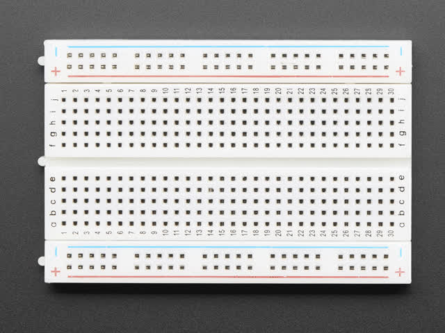
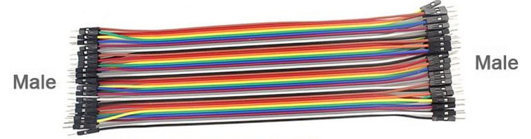
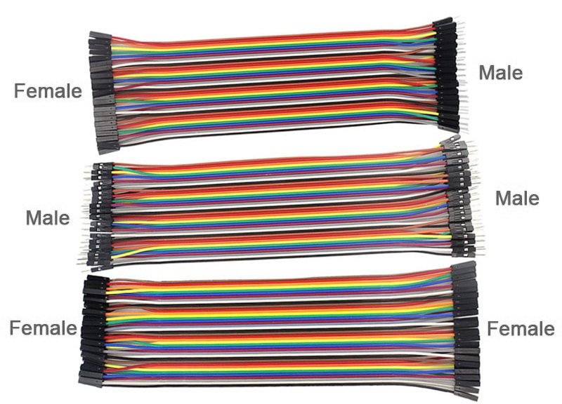

==========================
Breadboard connections
==========================

| The breadboard allows electrical devices, such as resistors, LEDS, motors, buzzers and potentiometers, to be connected in circuits.
| The microbit can be connected to the electical devices and control them or collect data from them.

----

Rows
--------------------------

| Holes in the same numbered row are connected.
| Rows on either side of the central divide are not connected.

----

Columns
--------------------------

| Holes in the same lettered column are not connected.

----

Rails
--------------------------

| Holes in the same rail are connected.
| The holes in the red rail (+) are connected.
| The holes in the blue rail (-) are connected.

----

Jumpers
--------------------------

| Male to Male jumper wires are used to connect holes on the breadboard.

| The 3 types of jumpers are shown below.

