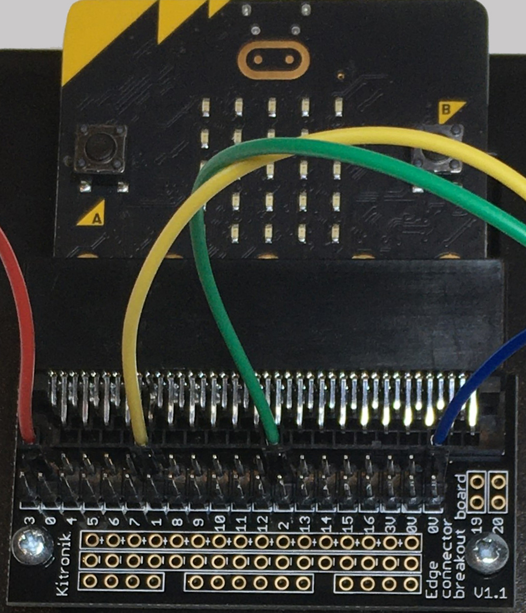

==========================
Edge_Connector
==========================

Connecting the microbit to the edge connector
----------------------------------------------------

| Place the microbit in the edge connector next to the breadboard, with the front button side of the microbit facing the breadboard.

.. image:: images/edge_connector.jpg
    :scale: 50 %

| The main pins used are numbered 0, 1, 2, and 0V.
| The jumper wires are connected in the back row of pins marked 0, 1 and 2 and the ground connection marked 0V. 

