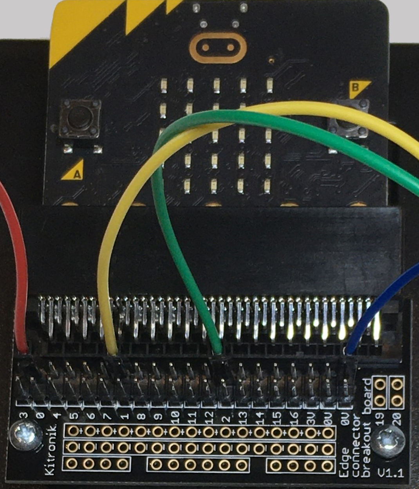

==========================
Edge_Connector
==========================

Connecting the microbit to the edge connector
----------------------------------------------------

| The edge connector is used to connect the microbit to the breadboard.
| The main pins used are numbered 0, 1, 2, and 0V.

----

| Male to Female jumper wires are used to connect the edge connector to the breadboard.

----

| The microbit in the edge connector is facing up.
| The female to male jumper wires in the photo have been connected in the back row of pins marked 0, 1 and 2 and the ground connection marked 0V. 
| Each microbit pin has 2 pins on the edge connector for jumper wires to plug onto. The female end is placed over the pins that stick up.
| The 0V ground pin of the microbit has 4 pins on the edge connector to connect to.
| Devices that are connected via the breadboard will usually have jumpers from pin 0, 1 or 2, with the circuit completed via the ground 0V pin.

