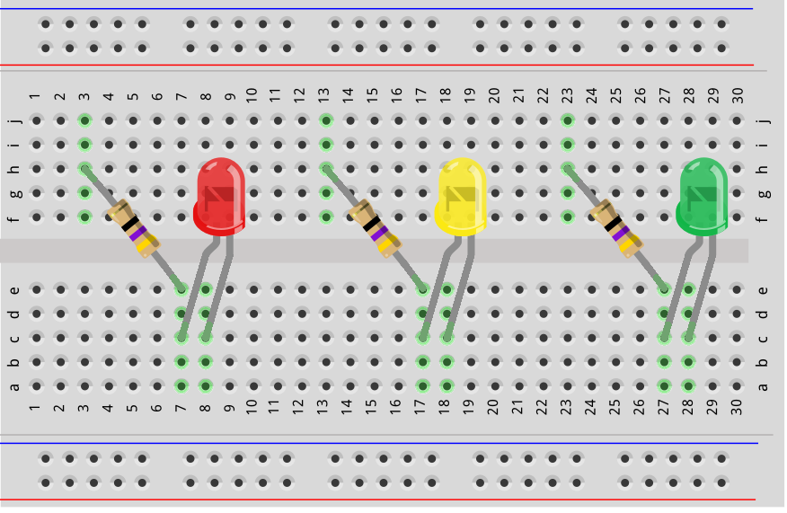
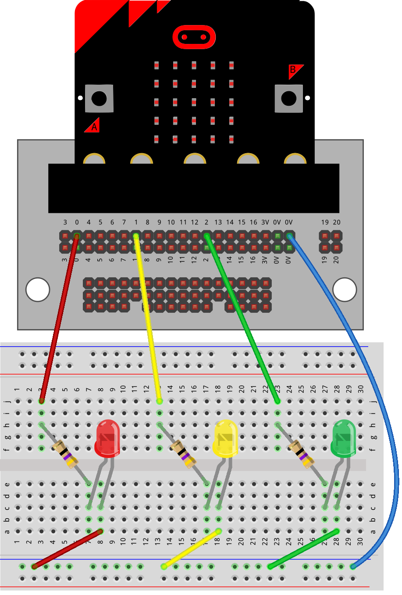

==========================
LEDs_with_resistors
==========================

Connections
--------------------------

| The LEDs must be placed in line with a 47 ohm resistor.
| The 47 ohm resistor has Yellow, Violet, Black, Gold coloured bands.
| LEDS are normally connected to pin0, pin1, or pin2.
| All LEDS are also connected to the 0V pins.

----

Model
----------------------------------------

#.  Place the resistors first.
#.  Place the LEDs with the long lead (leg) so that it is closest to the pin side of the circuit. In this model, the long lead is on the left side of the breadboard.
#.  Connect with the jumper wires.

.. image:: images/3LEDS_1_bb.png
    :scale: 50 %

Write digital
----------------------------------------

| To turn the LED on fully use ``pin0.write_digital(1)`` for the LED on pin0.
| To turn the LED off use ``pin0.write_digital(0)`` for the LED on pin0.
| For the other pins, just replace ``pin0`` with ``pin1`` or ``pin2``.

Turn on and off pin0
----------------------------------------

| Pressing A turns **on** the LED on pin0.
| Pressing B turns **off** the LED on pin0.

.. code-block:: python

    from microbit import *

    def turnon_0():
        pin0.write_digital(1)

    def turnoff_0():
        pin0.write_digital(0)

    while True:
        if button_a.is_pressed():
            turnon_0()
        elif button_b.is_pressed():
            turnoff_0()
        sleep(500)

Blink All
----------------------------------------

| Pressing A blinks all 3 LEDS in order.
| Pressing B blinks all 3 LEDS together.

.. code-block:: python

    from microbit import *

    def blink_all_in_sequence():
        pin0.write_digital(1)
        sleep(1000)
        pin0.write_digital(0)
        pin1.write_digital(1)
        sleep(300)
        pin1.write_digital(0)
        pin2.write_digital(1)
        sleep(1000)
        pin2.write_digital(0)

    def blink_all():
        pin0.write_digital(1)
        pin1.write_digital(1)
        pin2.write_digital(1)
        sleep(1000)
        pin0.write_digital(0)
        pin1.write_digital(0)
        pin2.write_digital(0)

    while True:
        if button_a.is_pressed():
            blink_all_in_sequence()
        elif button_b.is_pressed():
            blink_all()
        sleep(500)

Blink using for i in range
----------------------------------------

| Repeated blinking can be done with a for loop. 

.. code-block:: python

    from microbit import *

    def blink0():
        for i in range(3):
            pin0.write_digital(1)
            sleep(1000)
            pin0.write_digital(0)
            sleep(1000)

    blink0()

----

.. admonition:: Tasks

    #. Write code so that pressing A turns on the green LED only and pressing B turns on the yellow LED for 3 seconds then turns on the red LED only.   
    #. Write code so that pressing A blinks red and yellow 3 times, while pressing B blinks yellow and green 3 times.

----

Write analog
----------------------------------------

| To turn the LED on fully use ``pin0.write_analog(1023)`` for the LED on pin0.
| To turn the LED off use ``pin0.write_analog(0)`` for the LED on pin0.
| ``write_analog`` can have values from 0 to 1023.
| ``write_analog`` can be used to dim the LED.

| Here is some sample code making use of ``write_analog`` on pin0.

.. code-block:: python

    from microbit import *
    import random

    def pulse_on():
        sleeptime = 4
        stepsize = 30
        for i in range(0, 1021, stepsize):
            pin0.write_analog(i)
            sleep(sleeptime)
        pin0.write_analog(0)

    def pulse_off():
        sleeptime = 4
        stepsize = 30
        for i in range(1020, -1, -stepsize):
            pin0.write_analog(i)
            sleep(sleeptime)
        pin0.write_analog(0)

    while True:
        if button_a.is_pressed():
            pulpulse_on()
        elif button_b.is_pressed():
            pulse_off()
        sleep(500)

----

.. admonition:: Tasks

    #. Write code so pulse all 3 LEDs.

