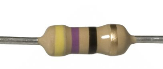

==========================
LEDs_with_resistors
==========================

Connections
--------------------------

| The LEDs must be placed in line with a 47 ohm resistor.
| The 47 ohm resistor has Yellow, Violet, Black, Gold coloured bands.
| LEDS are normally connected to pin0, pin1, or pin2.
| All LEDS are also connected to the 0V pins.

| Bend the resistor by holding it at the bend position so it is U-shaped.

.. image:: images/resistor_shape.png
    :scale: 50 %

| Place the resistor in the breadboard so that the legs go in about 5mm. 

.. image:: images/resistor_on_breadboard_low.png
    :scale: 50 %

----

Model
----------------------------------------

#.  Place the resistors first.
#.  Place the LEDs with the **long lead** (leg) so that it is closest to the pin side of the circuit. In this model, the long lead is on the **left** side of the breadboard.
#.  Check that the red LED is connected to pin0, yellow to pin1, and green to pin2.
#.  Connect with the jumper wires.

.. image:: images/3LEDS_1_bb.png
    :scale: 50 %

.. image:: images/3LEDS_2_bb.png
    :scale: 50 %

.. image:: images/3LEDS_3_bb.png
    :scale: 50 %

.. image:: images/LEDS.jpg
    :scale: 30 %

----

Write digital
----------------------------------------

| To turn the LED on fully use ``pin0.write_digital(1)`` for the LED on pin0.
| To turn the LED off use ``pin0.write_digital(0)`` for the LED on pin0.
| For the other pins, just replace ``pin0`` with ``pin1`` or ``pin2``.

----

Turn on and off pin0
----------------------------------------

| Pressing A turns **on** the LED on pin0.
| Pressing B turns **off** the LED on pin0.

.. code-block:: python

    from microbit import *

    def turnon_0():
        pin0.write_digital(1)

    def turnoff_0():
        pin0.write_digital(0)

    while True:
        if button_a.is_pressed():
            turnon_0()
        elif button_b.is_pressed():
            turnoff_0()
        sleep(500)

----

Blink All
----------------------------------------

| Pressing A blinks all 3 LEDS in order.
| Pressing B blinks all 3 LEDS together.

.. code-block:: python

    from microbit import *

    def blink_all_in_sequence():
        pin0.write_digital(1)
        sleep(1000)
        pin0.write_digital(0)
        pin1.write_digital(1)
        sleep(300)
        pin1.write_digital(0)
        pin2.write_digital(1)
        sleep(1000)
        pin2.write_digital(0)

    def blink_all():
        pin0.write_digital(1)
        pin1.write_digital(1)
        pin2.write_digital(1)
        sleep(1000)
        pin0.write_digital(0)
        pin1.write_digital(0)
        pin2.write_digital(0)

    while True:
        if button_a.is_pressed():
            blink_all_in_sequence()
        elif button_b.is_pressed():
            blink_all()
        sleep(500)

----

Blink using for i in range
----------------------------------------

| Repeated blinking can be done with a for-loop.
| The for-loop below runs 3 times, with i values of 0, 1, and 2.

.. code-block:: python

    from microbit import *

    def blink0():
        for i in range(3):
            pin0.write_digital(1)
            sleep(1000)
            pin0.write_digital(0)
            sleep(1000)

    blink0()

----

.. admonition:: Tasks

    Remember that the red LED is on pin0, yellow on pin1, and green on pin2.

    #. Write code so that pressing A turns on the green LED only and pressing B turns on the yellow LED for 3 seconds then turns on the red LED only.   
    #. Write code so that pressing A blinks red and yellow 3 times, while pressing B blinks yellow and green 3 times.
    #. Write code to turn on each of the LED's separately with button presses. e.g. button-A turns on red and turns the others off.

    .. dropdown::
            :icon: codescan
            :color: primary
            :class-container: sd-dropdown-container

            .. tab-set::

                .. tab-item:: Q1

                    Write code so that pressing A turns on the green LED only and pressing B turns on the yellow LED for 3 seconds then turns on the red LED only. 

                    .. code-block:: python

                        from microbit import *

                        def do_A():
                            pin0.write_digital(0)
                            pin1.write_digital(0)
                            pin2.write_digital(1)

                        def do_B():
                            pin0.write_digital(0)
                            pin1.write_digital(1)
                            pin2.write_digital(0)
                            sleep(3000)
                            pin0.write_digital(1)
                            pin1.write_digital(0)

                        while True:
                            if button_a.is_pressed():
                                do_A()
                            elif button_b.is_pressed():
                                do_B()
                            sleep(500)

                .. tab-item:: Q2

                    Write code so that pressing A blinks red and yellow 3 times, while pressing B blinks yellow and green 3 times. 

                    .. code-block:: python

                        from microbit import *

                        def blink_A():
                            for i in range(3):
                                pin0.write_digital(1)
                                pin1.write_digital(1)
                                sleep(1000)
                                pin0.write_digital(0)
                                pin1.write_digital(0)
                                sleep(1000)

                        def blink_B():
                            for i in range(3):
                                pin1.write_digital(1)
                                pin2.write_digital(1)
                                sleep(1000)
                                pin1.write_digital(0)
                                pin2.write_digital(0)
                                sleep(1000)

                        while True:
                            if button_a.is_pressed():
                                blink_A()
                            elif button_b.is_pressed():
                                blink_B()
                            sleep(500)

                .. tab-item:: Q3

                    Write code to turn on each of the LED's separately with button presses. e.g. button-A turns on red and turns the others off. 

                    .. code-block:: python

                        from microbit import *

                        def red_on():
                            pin0.write_digital(1)
                            pin1.write_digital(0)
                            pin2.write_digital(0)

                        def yellow_on():
                            pin0.write_digital(0)
                            pin1.write_digital(1)
                            pin2.write_digital(0)

                        def green_on():
                            pin0.write_digital(0)
                            pin1.write_digital(0)
                            pin2.write_digital(1)

                        while True:
                            if button_a.is_pressed() and button_b.is_pressed():
                                red_on()
                            elif button_a.is_pressed():
                                yellow_on()
                            elif button_b.is_pressed():
                                green_on()
                            sleep(500)

----

Write analog
----------------------------------------

| To turn the LED on fully use ``pin0.write_analog(1023)`` for the LED on pin0.
| To turn the LED off use ``pin0.write_analog(0)`` for the LED on pin0.
| ``write_analog`` can have values from 0 to 1023.
| ``write_analog`` can be used to dim the LED.

| Here is some sample code making use of ``write_analog`` on pin0.

.. code-block:: python

    from microbit import *

    def pulse_on():
        sleeptime = 40
        stepsize = 30
        for i in range(0, 1024, stepsize):
            pin0.write_analog(i)
            sleep(sleeptime)
        pin0.write_analog(0)

    def pulse_off():
        sleeptime = 40
        stepsize = 30
        for i in range(1023, -1, -stepsize):
            pin0.write_analog(i)
            sleep(sleeptime)
        pin0.write_analog(0)

    while True:
        if button_a.is_pressed():
            pulse_on()
        elif button_b.is_pressed():
            pulse_off()
        sleep(500)

----

.. admonition:: Tasks

    #. Modify the code to pulse on and off all 3 LEDs together.
    #. Write code to pulse all 3 LEDs but with an analog difference of about 340, so that when the red LED is at 1023 the yellow is at (1023 - 340) and the green LED is at (1023 - 340 -340).

    .. dropdown::
            :icon: codescan
            :color: primary
            :class-container: sd-dropdown-container

            .. tab-set::

                .. tab-item:: Q1

                    Modify the code to pulse on and off all 3 LEDs together.

                    .. code-block:: python

                        from microbit import *
                        

                        def pulse_all_on():
                            sleeptime = 40
                            stepsize = 30
                            for i in range(0, 1024, stepsize):
                                pin0.write_analog(i)
                                pin1.write_analog(i)
                                pin2.write_analog(i)
                                sleep(sleeptime)

                        def pulse_all_off():
                            sleeptime = 40
                            stepsize = 30
                            for i in range(1023, -1, -stepsize):
                                pin0.write_analog(i)
                                pin1.write_analog(i)
                                pin2.write_analog(i)
                                sleep(sleeptime)

                        while True:
                            if button_a.is_pressed():
                                pulse_all_on()
                            elif button_b.is_pressed():
                                pulse_all_off()
                            sleep(500)

                .. tab-item:: Q2

                    Write code to pulse all 3 LEDs but with an analog difference of about 340, so that when the red LED is at 1023 the yellow is at (1023 - 340) and the green LED is at (1023 - 340 -340).

                    .. code-block:: python

                        from microbit import *

                        def pulse_all_diff_on():
                            sleeptime = 50
                            stepsize = 30
                            for i in range(0, 1704, stepsize):
                                pin0.write_analog(min(1023, i))
                                pin1.write_analog(max(0, min(1023, i - 340)))
                                pin2.write_analog(max(0, min(1023, i - 680)))
                                sleep(sleeptime)

                        def pulse_all_diff_off():
                            sleeptime = 50
                            stepsize = 30
                            for i in range(1704, -1, -stepsize):
                                pin0.write_analog(min(1023, i))
                                pin1.write_analog(max(0, min(1023, i - 340)))
                                pin2.write_analog(max(0, min(1023, i - 680)))
                                sleep(sleeptime)
                            pin0.write_analog(0)

                        while True:
                            if button_a.is_pressed():
                                pulse_all_diff_on()
                            elif button_b.is_pressed():
                                pulse_all_diff_off()
                            sleep(500)

 ----

.. admonition:: Exercises

    #. Investigate the use of the randrange function for creating random light displays. See: https://www.w3schools.com/python/ref_random_randrange.asp
    #. Investigate the use of the choice function for creating random light displays. Use ``pinlist = [pin0, pin1, pin2]`` to make a list of pins to choose from. See: https://www.w3schools.com/python/ref_random_choice.asp.
    #. V2 microbit: Use power module so that the b button puts the microbit into a deep sleep for 10 minutes. Wake it on pressing the a button. Turn on random LEDS at random brightness every 3 seconds, then off.

    .. dropdown::
            :icon: codescan
            :color: primary
            :class-container: sd-dropdown-container

            .. tab-set::

                .. tab-item:: Q1

                    .. code-block:: python

                        from microbit import *
                        import random

                        def random_colours():
                            randval = random.randrange(0, 1024)
                            randpin = random.randrange(0, 3)
                            if randpin = 0:
                                pin0.write_analog(randval)
                            elif randpin = 1:
                                pin1.write_analog(randval)
                            rlif randpin = 2:
                                pin2.write_analog(randval)

                
                        while True:
                            random_colours()
                            sleep(100)

                .. tab-item:: Q2

                    .. code-block:: python

                        from microbit import *
                        import random

                        pinlist = [pin0, pin1, pin2]

                        def random_pin_brightness():
                            randval = random.randrange(0, 1024)
                            randpin = random.choice(pinlist)
                            randpin.write_analog(randval)

                        while True:
                            random_pin_brightness()
                            sleep(100)

                .. tab-item:: Q2

                    .. code-block:: python

                        from microbit import *
                        import random
                        import power

                        pinlist = [pin0, pin1, pin2]

                        def random_pin_brightness():
                            randval = random.randrange(0, 1024)
                            randpin = random.choice(pinlist)
                            randpin.write_analog(randval)

                        def turnoff():
                            pin0.write_digital(0)
                            pin1.write_digital(0)
                            pin2.write_digital(0)
                            
                        @run_every(s=3)
                        def wakeup_call():
                            random_pin_brightness()
                            sleep(2000)
                            turnoff()

                        while True:
                            if button_b.was_pressed():
                                sleep(300)
                                power.deep_sleep(wake_on=button_a,ms=600 * 1000,run_every=False)
                            sleep(1000)

