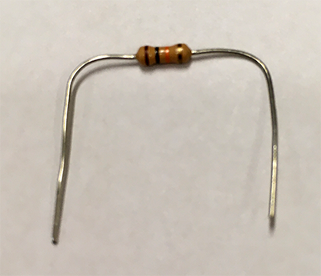
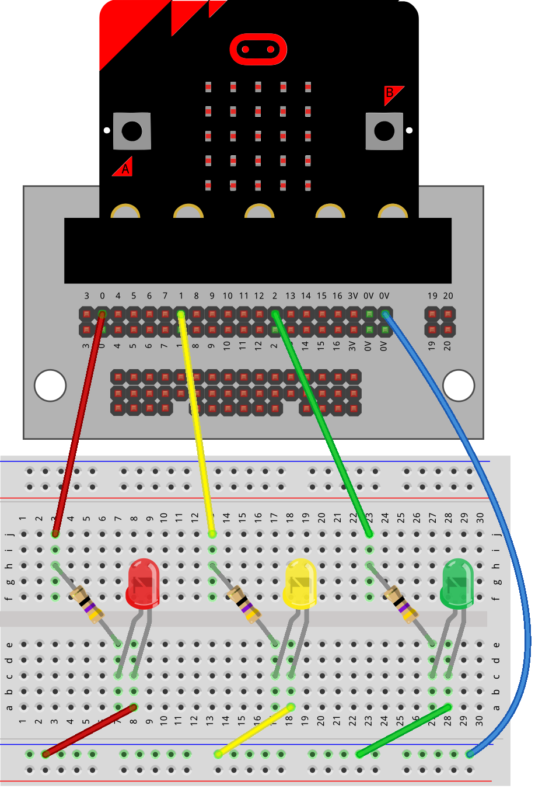

==========================
LEDs_with_resistors
==========================

| The examples below use sequence only. No definition blocks are used.
| For better organising code into def blocks see: `<https://pc-microbit-micropython.readthedocs.io/en/latest/breadboards/LEDs_with_resistors_2.html>`__

----
Connections
--------------------------

| The LEDs must be placed in line with a 47 ohm resistor.
| The 47 ohm resistor has Yellow, Violet, Black, Gold coloured bands.
| LEDS are normally connected to pin0, pin1, or pin2.
| All LEDS are also connected to the 0V pins.

.. image:: images/47ohm.png
    :scale: 50 %

| Bend the resistor by holding it at the bend position so it is U-shaped.

| Place the resistor in the breadboard so that the legs go in about 5mm.

.. image:: images/resistor_on_breadboard_low.png
    :scale: 50 %

----

Model
----------------------------------------

#.  Place the resistors first.
#.  Place the LEDs with the **long lead** (leg) so that it is closest to the pin side of the circuit. In this model, the long lead is on the **left** side of the breadboard.
#.  Check that the red LED is connected to pin0, yellow to pin1, and green to pin2.
#.  Connect with the jumper wires.

.. image:: images/3LEDS_1_bb.png
    :scale: 50 %

.. image:: images/3LEDS_2_bb.png
    :scale: 50 %

.. image:: images/LEDS.jpg
    :scale: 30 %

----

Write digital
----------------------------------------

.. py:function:: pinx.write_digital(value)

    | ``pinx`` is the pin. e.g pin0, pin1, pin2.
    | ``value`` is 1 for on and 0 for off.

| To turn the LED on fully use ``pin0.write_digital(1)`` for the LED on pin0.
| To turn the LED off use ``pin0.write_digital(0)`` for the LED on pin0.
| For the other pins, just replace ``pin0`` with ``pin1`` or ``pin2``.

----

Turn on and off pin0
----------------------------------------

| Pressing A turns **on** the LED on pin0.
| Pressing B turns **off** the LED on pin0.

.. code-block:: python

    from microbit import *

    while True:
        if button_a.is_pressed():
            pin0.write_digital(1)
        elif button_b.is_pressed():
            pin0.write_digital(0)
        sleep(500)

----

Turn all on and off
----------------------------------------

| Pressing A turns **on** the LED on pin0, pin1 and pin2.
| Pressing B turns **off** the LED on pin0, pin1 and pin2.

.. code-block:: python

    from microbit import *

    while True:
        if button_a.is_pressed():
            pin0.write_digital(1)
            pin1.write_digital(1)
            pin2.write_digital(1)
        elif button_b.is_pressed():
            pin0.write_digital(0)
            pin1.write_digital(0)
            pin2.write_digital(0)
        sleep(500)

----

.. admonition:: Tasks

    Remember that the red LED is on pin0, yellow on pin1, and green on pin2.

    #. Write code so that pressing A turns on the red LED only and pressing B turns on the yellow and green LEDs only.
    #. Write code so that pressing A turns on the green LED only and pressing B turns on the yellow and red LEDs only.

    .. dropdown::
        :icon: codescan
        :color: primary
        :class-container: sd-dropdown-container

        .. tab-set::

            .. tab-item:: Q1

                Write code so that pressing A turns on the red LED only and pressing B turns on the yellow and green LEDs only.

                .. code-block:: python

                    from microbit import *

                    while True:
                        if button_a.is_pressed():
                            pin0.write_digital(1)
                            pin1.write_digital(0)
                            pin2.write_digital(0)
                        elif button_b.is_pressed():
                            pin0.write_digital(0)
                            pin1.write_digital(0)
                            pin2.write_digital(1)
                        sleep(500)

            .. tab-item:: Q2

                Write code so that pressing A turns on the green LED only and pressing B turns on the yellow and red LEDs only.

                .. code-block:: python

                    from microbit import *

                    while True:
                        if button_a.is_pressed():
                            pin0.write_digital(0)
                            pin1.write_digital(0)
                            pin2.write_digital(1)
                        elif button_b.is_pressed():
                            pin0.write_digital(1)
                            pin1.write_digital(1)
                            pin2.write_digital(0)
                        sleep(500)

----

Blink All
----------------------------------------

| Pressing A blinks all 3 LEDS in order, one after the other every one and a half seconds.
| Pressing B blinks all 3 LEDS together every one and a half seconds.

.. code-block:: python

    from microbit import *

    while True:
        if button_a.is_pressed():
            pin0.write_digital(1)
            sleep(500)
            pin0.write_digital(0)
            pin1.write_digital(1)
            sleep(500)
            pin1.write_digital(0)
            pin2.write_digital(1)
            sleep(500)
            pin2.write_digital(0)
        elif button_b.is_pressed():
            pin0.write_digital(1)
            pin1.write_digital(1)
            pin2.write_digital(1)
            sleep(750)
            pin0.write_digital(0)
            pin1.write_digital(0)
            pin2.write_digital(0)
            sleep(750)

----

Blink using for i in range
----------------------------------------

| Repeated blinking can be done with a for-loop.
| The for-loop below runs 3 times in 6 seconds then sleeps for 3 seconds before repeating.

.. code-block:: python

    from microbit import *

    while True:
        for i in range(3):
            pin0.write_digital(1)
            sleep(1000)
            pin0.write_digital(0)
            sleep(1000)
        sleep(3000)

----

.. admonition:: Tasks

    Remember that the red LED is on pin0, yellow on pin1, and green on pin2.

    #. Write code so that pressing A turns on the green LED only and pressing B turns on the yellow LED for 3 seconds then turns on the red LED only.
    #. Write code so that pressing A blinks red and yellow 3 times, while pressing B blinks yellow and green 3 times.
    #. Write code to turn on each of the LED's separately with button presses. e.g. button-A turns on red and turns the others off.

    .. dropdown::
        :icon: codescan
        :color: primary
        :class-container: sd-dropdown-container

        .. tab-set::

            .. tab-item:: Q1

                Write code so that pressing A turns on the green LED only and pressing B turns on the yellow LED for 3 seconds then turns on the red LED only.

                .. code-block:: python

                    from microbit import *

                    while True:
                        if button_a.is_pressed():
                            pin0.write_digital(0)
                            pin1.write_digital(0)
                            pin2.write_digital(1)
                        elif button_b.is_pressed():
                            pin0.write_digital(0)
                            pin1.write_digital(1)
                            pin2.write_digital(0)
                            sleep(3000)
                            pin0.write_digital(1)
                            pin1.write_digital(0)
                        sleep(500)

            .. tab-item:: Q2

                Write code so that pressing A blinks red and yellow 3 times, while pressing B blinks yellow and green 3 times.

                .. code-block:: python

                    from microbit import *

                    while True:
                        if button_a.is_pressed():
                            for i in range(3):
                                pin0.write_digital(1)
                                pin1.write_digital(1)
                                sleep(1000)
                                pin0.write_digital(0)
                                pin1.write_digital(0)
                                sleep(1000)
                        elif button_b.is_pressed():
                            for i in range(3):
                                pin1.write_digital(1)
                                pin2.write_digital(1)
                                sleep(1000)
                                pin1.write_digital(0)
                                pin2.write_digital(0)
                                sleep(1000)
                        sleep(500)

            .. tab-item:: Q3

                Write code to turn on each of the LED's separately with button presses. e.g. button-A turns on red and turns the others off.

                .. code-block:: python

                    from microbit import *

                    while True:
                        if button_a.is_pressed() and button_b.is_pressed():
                            pin0.write_digital(1)
                            pin1.write_digital(0)
                            pin2.write_digital(0)
                        elif button_a.is_pressed():
                            pin0.write_digital(0)
                            pin1.write_digital(1)
                            pin2.write_digital(0)
                        elif button_b.is_pressed():
                            pin0.write_digital(0)
                            pin1.write_digital(0)
                            pin2.write_digital(1)
                        sleep(500)

----

Write analog
----------------------------------------

.. py:function:: pinx.write_analog(value)

    | ``pinx`` is the pin. e.g pin0, pin1, pin2.
    | ``value`` is an integer from 0 to 1023.

| To turn the LED on fully use ``pin0.write_analog(1023)`` for the LED on pin0.
| To turn the LED off use ``pin0.write_analog(0)`` for the LED on pin0.
| ``write_analog`` can have values from 0 to 1023.
| ``write_analog`` can be used to dim the LED.

| Here is some sample code that set various brightnesses using ``write_analog`` on pin0.

.. code-block:: python

    from microbit import *

    while True:
        if button_a.is_pressed():
            pin0.write_analog(256)
            sleep(500)
            pin0.write_analog(512)
            sleep(500)
            pin0.write_analog(768)
            sleep(500)
            pin0.write_analog(1023)
            sleep(500)
            pin0.write_analog(0)
            sleep(500)
        sleep(500)

----

.. admonition:: Tasks

    #. Write code to use the A button to turn on all 3 LEDs at half brightness and the B button to turn them all off.
    #. Write code to use the A button to turn on the red LED at half brightness, yellow at three quarter brightness and green at full brightness and the B button to turn them all off.

    .. dropdown::
        :icon: codescan
        :color: primary
        :class-container: sd-dropdown-container

        .. tab-set::

            .. tab-item:: Q1

                Write code to use the A button to turn on all 3 LEDs at half brightness and the B button to turn them all off.

                .. code-block:: python

                    from microbit import *

                    while True:
                        if button_a.is_pressed():
                            pin0.write_analog(512)
                            pin1.write_analog(512)
                            pin2.write_analog(512)
                        elif button_b.is_pressed():
                            pin0.write_analog(0)
                            pin1.write_analog(0)
                            pin2.write_analog(0)
                        sleep(500)

            .. tab-item:: Q2

                Write code to use the A button to turn on the red LED at half brightness, yellow at three quarter brightness and green at full brightness and the B button to turn them all off.

                .. code-block:: python

                    from microbit import *

                    while True:
                        if button_a.is_pressed():
                            pin0.write_analog(512)
                            pin1.write_analog(768)
                            pin2.write_analog(1023)
                        elif button_b.is_pressed():
                            pin0.write_analog(0)
                            pin1.write_analog(0)
                            pin2.write_analog(0)
                        sleep(500)

----

| Here is some sample code that cycles through a brightness list using ``write_analog`` on pin0.

.. code-block:: python

    from microbit import *

    brightness_list = [0, 256, 512, 768, 1023]
    sleep_time = 250
    while True:
        if button_a.is_pressed():
            # pulse_on
            for i in brightness_list:
                pin0.write_analog(i)
                sleep(sleep_time)
        sleep(500)

| Here is some sample code that cycles through a brightness list using ``write_analog`` on pin0.
| The brightness value in the list is subtracted from 1023, so as the list value increases, the LED brightness decreases.

.. code-block:: python

    from microbit import *

    brightness_list = [0, 256, 512, 768, 1023]
    sleep_time = 250
    while True:
        if button_b.is_pressed():
            # pulse_off
            for i in brightness_list:
                pin0.write_analog(1023-i)
                sleep(sleep_time)
        sleep(500)

----

.. admonition:: Tasks

    #. Modify the code to pulse on all 3 LEDs together.
    #. Modify the code to pulse off all 3 LEDs together.

    .. dropdown::
        :icon: codescan
        :color: primary
        :class-container: sd-dropdown-container

        .. tab-set::

            .. tab-item:: Q1

                Modify the code to pulse on all 3 LEDs together.

                .. code-block:: python

                    from microbit import *

                    brightness_list = [0, 256, 512, 768, 1023]
                    sleep_time = 250
                    while True:
                        if button_a.is_pressed():
                            # pulse_all_on
                            for i in brightness_list:
                                pin0.write_analog(i)
                                pin1.write_analog(i)
                                pin2.write_analog(i)
                                sleep(sleep_time)
                        sleep(500)

            .. tab-item:: Q2

                Modify the code to pulse off all 3 LEDs together.

                .. code-block:: python

                    from microbit import *

                    brightness_list = [0, 256, 512, 768, 1023]
                    sleep_time = 250
                    while True:
                        if button_b.is_pressed():
                            # pulse_all_off
                            for i in brightness_list:
                                pin0.write_analog(1023-i)
                                pin1.write_analog(1023-i)
                                pin2.write_analog(1023-i)
                                sleep(sleep_time)
                        sleep(500)

----

.. admonition:: EXT Exercise

    #. Write code to pulse on all 3 LEDs but with delay of 1 step in the list for yellow using ``brightness_list[i - 1]`` and 2 steps for green using ``brightness_list[i - 2]``.
    #. Write code to pulse off all 3 LEDs but with delay of 1 step in the list for yellow using ``brightness_list[i - 1]`` and 2 steps for green using ``brightness_list[i - 2]``.

    .. dropdown::
        :icon: codescan
        :color: primary
        :class-container: sd-dropdown-container

        .. tab-set::

            .. tab-item:: Q1

                Write code to pulse on all 3 LEDs but with delay of 1 step in the list for yellow using ``brightness_list[i - 1]`` and 2 steps for green using ``brightness_list[i - 2]``.

                .. code-block:: python

                    from microbit import *

                    brightness_list = [0, 256, 512, 768, 1023, 1023, 1023]
                    sleep_time = 250

                    while True:
                        if button_a.is_pressed():
                            # Pulse LEDs with staggered delays
                            for i in range(len(brightness_list)):
                                pin0.write_analog(brightness_list[i])  # Red LED
                                if i >= 1:
                                    pin1.write_analog(brightness_list[i - 1])  # Yellow LED (1 step delay)
                                if i >= 2:
                                    pin2.write_analog(brightness_list[i - 2])  # Green LED (2 step delay)
                                sleep(sleep_time)

                        sleep(500)

            .. tab-item:: Q2

                Write code to pulse off all 3 LEDs but with delay of 1 step in the list for yellow using ``brightness_list[i - 1]`` and 2 steps for green using ``brightness_list[i - 2]``.

                .. code-block:: python

                    from microbit import *

                    brightness_list = [0, 256, 512, 768, 1023, 1023, 1023]  # Adjusted valid range with max brightness at end
                    sleep_time = 250

                    while True:
                        if button_b.is_pressed():
                            # Pulse LEDs using inverted brightness values
                            for i in range(len(brightness_list)):
                                pin0.write_analog(1023 - brightness_list[i])  # Red LED (inverted brightness)
                                if i >= 1:
                                    pin1.write_analog(1023 - brightness_list[i - 1])  # Yellow LED (1 step delay, inverted)
                                if i >= 2:
                                    pin2.write_analog(1023 - brightness_list[i - 2])  # Green LED (2 step delay, inverted)
                                sleep(sleep_time)
                        sleep(500)

