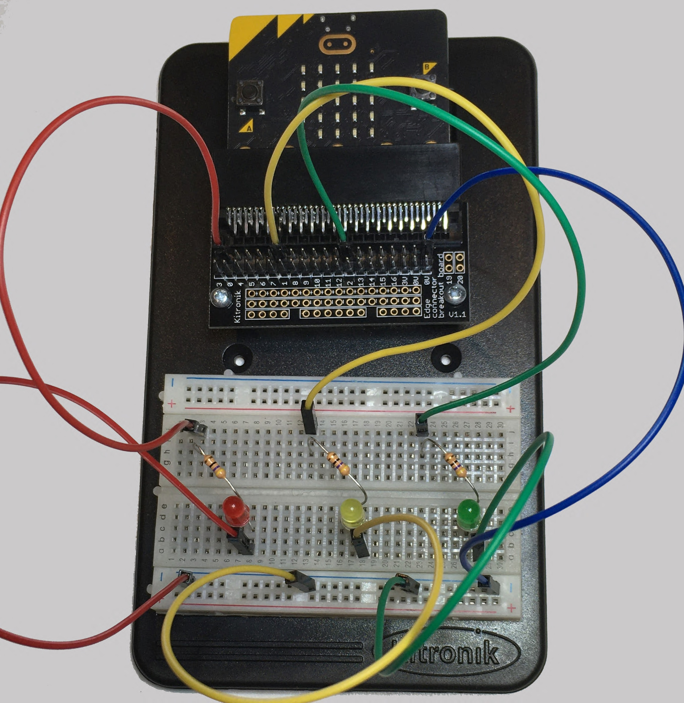

==========================
EXT: LEDs_with_resistors
==========================

The examples below use definition blocks to better organize the code.

----

Connections
--------------------------

| The LEDs must be placed in line with a 47 ohm resistor.
| The 47 ohm resistor has Yellow, Violet, Black, Gold coloured bands.
| LEDS are normally connected to pin0, pin1, or pin2.
| All LEDS are also connected to the 0V pins.

.. image:: images/47ohm.png
    :scale: 50 %

| Bend the resistor by holding it at the bend position so it is U-shaped.

.. image:: images/resistor_shape.png
    :scale: 50 %

| Place the resistor in the breadboard so that the legs go in about 5mm.

----

Model
----------------------------------------

#.  Place the resistors first.
#.  Place the LEDs with the **long lead** (leg) so that it is closest to the pin side of the circuit. In this model, the long lead is on the **left** side of the breadboard.
#.  Check that the red LED is connected to pin0, yellow to pin1, and green to pin2.
#.  Connect with the jumper wires.

.. image:: images/3LEDS_1_bb.png
    :scale: 50 %

.. image:: images/3LEDS_3_bb.png
    :scale: 50 %

----

Write digital
----------------------------------------

.. py:function:: pinx.write_digital(value)

    | ``pinx`` is the pin. e.g pin0, pin1, pin2.
    | ``value`` is 1 for on and 0 for off.

| To turn the LED on fully use ``pin0.write_digital(1)`` for the LED on pin0.
| To turn the LED off use ``pin0.write_digital(0)`` for the LED on pin0.
| For the other pins, just replace ``pin0`` with ``pin1`` or ``pin2``.

----

Turn on and off pin0
----------------------------------------

| Pressing A turns **on** the LED on pin0.
| Pressing B turns **off** the LED on pin0.

.. code-block:: python

    from microbit import *

    def turnon_0():
        pin0.write_digital(1)

    def turnoff_0():
        pin0.write_digital(0)

    while True:
        if button_a.is_pressed():
            turnon_0()
        elif button_b.is_pressed():
            turnoff_0()
        sleep(500)

----

Blink All
----------------------------------------

| Pressing A blinks all 3 LEDS in order, one after the other.
| Pressing B blinks all 3 LEDS together.

.. code-block:: python

    from microbit import *

    def blink_all_in_sequence():
        pin0.write_digital(1)
        sleep(1000)
        pin0.write_digital(0)
        pin1.write_digital(1)
        sleep(300)
        pin1.write_digital(0)
        pin2.write_digital(1)
        sleep(1000)
        pin2.write_digital(0)

    def blink_all():
        pin0.write_digital(1)
        pin1.write_digital(1)
        pin2.write_digital(1)
        sleep(1000)
        pin0.write_digital(0)
        pin1.write_digital(0)
        pin2.write_digital(0)

    while True:
        if button_a.is_pressed():
            blink_all_in_sequence()
        elif button_b.is_pressed():
            blink_all()
        sleep(500)

----

Blink using for i in range
----------------------------------------

| Repeated blinking can be done with a for-loop.
| The for-loop below runs 3 times.

.. code-block:: python

    from microbit import *

    def blink0():
        for i in range(3):
            pin0.write_digital(1)
            sleep(1000)
            pin0.write_digital(0)
            sleep(1000)

    while True:
        blink0()
        sleep(3000)

----

.. admonition:: Tasks

    Remember that the red LED is on pin0, yellow on pin1, and green on pin2.

    #. Write code so that pressing A turns on the green LED only and pressing B turns on the yellow LED for 3 seconds then turns on the red LED only.
    #. Write code so that pressing A blinks red and yellow 3 times, while pressing B blinks yellow and green 3 times.
    #. Write code to turn on each of the LED's separately with button presses. e.g. button-A turns on red and turns the others off.

    .. dropdown::
        :icon: codescan
        :color: primary
        :class-container: sd-dropdown-container

        .. tab-set::

            .. tab-item:: Q1

                Write code so that pressing A turns on the green LED only and pressing B turns on the yellow LED for 3 seconds then turns on the red LED only.

                .. code-block:: python

                    from microbit import *

                    def do_A():
                        pin0.write_digital(0)
                        pin1.write_digital(0)
                        pin2.write_digital(1)

                    def do_B():
                        pin0.write_digital(0)
                        pin1.write_digital(1)
                        pin2.write_digital(0)
                        sleep(3000)
                        pin0.write_digital(1)
                        pin1.write_digital(0)

                    while True:
                        if button_a.is_pressed():
                            do_A()
                        elif button_b.is_pressed():
                            do_B()
                        sleep(500)

            .. tab-item:: Q2

                Write code so that pressing A blinks red and yellow 3 times, while pressing B blinks yellow and green 3 times.

                .. code-block:: python

                    from microbit import *

                    def blink_A():
                        for i in range(3):
                            pin0.write_digital(1)
                            pin1.write_digital(1)
                            sleep(1000)
                            pin0.write_digital(0)
                            pin1.write_digital(0)
                            sleep(1000)

                    def blink_B():
                        for i in range(3):
                            pin1.write_digital(1)
                            pin2.write_digital(1)
                            sleep(1000)
                            pin1.write_digital(0)
                            pin2.write_digital(0)
                            sleep(1000)

                    while True:
                        if button_a.is_pressed():
                            blink_A()
                        elif button_b.is_pressed():
                            blink_B()
                        sleep(500)

            .. tab-item:: Q3

                Write code to turn on each of the LED's separately with button presses. e.g. button-A turns on red and turns the others off.

                .. code-block:: python

                    from microbit import *

                    def red_on():
                        pin0.write_digital(1)
                        pin1.write_digital(0)
                        pin2.write_digital(0)

                    def yellow_on():
                        pin0.write_digital(0)
                        pin1.write_digital(1)
                        pin2.write_digital(0)

                    def green_on():
                        pin0.write_digital(0)
                        pin1.write_digital(0)
                        pin2.write_digital(1)

                    while True:
                        if button_a.is_pressed() and button_b.is_pressed():
                            red_on()
                        elif button_a.is_pressed():
                            yellow_on()
                        elif button_b.is_pressed():
                            green_on()
                        sleep(500)

----

Write analog
----------------------------------------

.. py:function:: pinx.write_analog(value)

    | ``pinx`` is the pin. e.g pin0, pin1, pin2.
    | ``value`` is an integer from 0 to 1023.

| To turn the LED on fully use ``pin0.write_analog(1023)`` for the LED on pin0.
| To turn the LED off use ``pin0.write_analog(0)`` for the LED on pin0.
| ``write_analog`` can have values from 0 to 1023.
| ``write_analog`` can be used to dim the LED.

| Here is some sample code that cycles through a brightness list using ``write_analog`` on pin0.

.. code-block:: python

    from microbit import *

    brightness = [0, 256, 512, 768, 1023]
    sleep_time = 250

    def pulse_on():
        for i in brightness:
            pin0.write_analog(i)
            sleep(sleep_time)
        pin0.write_analog(0)

    def pulse_off():
        for i in brightness
            pin0.write_analog(1023-i)
            sleep(sleep_time)
        pin0.write_analog(0)

    while True:
        if button_a.is_pressed():
            pulse_on()
        elif button_b.is_pressed():
            pulse_off()
        sleep(500)

| Here is some sample code which pulses the LED on and off.

.. code-block:: python

    from microbit import *

    def pulse_on():
        sleep_time = 40
        step_size = 30
        for i in range(0, 1024, step_size):
            pin0.write_analog(i)
            sleep(sleep_time)
        pin0.write_analog(0)

    def pulse_off():
        sleep_time = 40
        step_size = 30
        for i in range(1023, -1, -step_size):
            pin0.write_analog(i)
            sleep(sleep_time)
        pin0.write_analog(0)

    while True:
        if button_a.is_pressed():
            pulse_on()
        elif button_b.is_pressed():
            pulse_off()
        sleep(500)

----

.. admonition:: Tasks

    #. Modify the code to pulse on and off all 3 LEDs together.
    #. Write code to pulse all 3 LEDs but with an analog difference of about 340, so that when the red LED is at 1023 the yellow is at (1023 - 340) and the green LED is at (1023 - 340 -340).

    .. dropdown::
        :icon: codescan
        :color: primary
        :class-container: sd-dropdown-container

        .. tab-set::

            .. tab-item:: Q1

                Modify the code to pulse on and off all 3 LEDs together.

                .. code-block:: python

                    from microbit import *

                    def pulse_all_on():
                        sleep_time = 40
                        step_size = 30
                        for i in range(0, 1024, step_size):
                            pin0.write_analog(i)
                            pin1.write_analog(i)
                            pin2.write_analog(i)
                            sleep(sleep_time)

                    def pulse_all_off():
                        sleep_time = 40
                        step_size = 30
                        for i in range(1023, -1, -step_size):
                            pin0.write_analog(i)
                            pin1.write_analog(i)
                            pin2.write_analog(i)
                            sleep(sleep_time)

                    while True:
                        if button_a.is_pressed():
                            pulse_all_on()
                        elif button_b.is_pressed():
                            pulse_all_off()
                        sleep(500)

            .. tab-item:: Q2

                Write code to pulse all 3 LEDs but with an analog difference of about 340, so that when the red LED is at 1023 the yellow is at (1023 - 340) and the green LED is at (1023 - 340 -340).

                .. code-block:: python

                    from microbit import *

                    def pulse_all_diff_on():
                        sleep_time = 50
                        step_size = 30
                        for i in range(0, 1704, step_size):
                            pin0.write_analog(min(1023, i))
                            pin1.write_analog(max(0, min(1023, i - 340)))
                            pin2.write_analog(max(0, min(1023, i - 680)))
                            sleep(sleep_time)

                    def pulse_all_diff_off():
                        sleep_time = 50
                        step_size = 30
                        for i in range(1704, -1, -step_size):
                            pin0.write_analog(min(1023, i))
                            pin1.write_analog(max(0, min(1023, i - 340)))
                            pin2.write_analog(max(0, min(1023, i - 680)))
                            sleep(sleep_time)
                        pin0.write_analog(0)

                    while True:
                        if button_a.is_pressed():
                            pulse_all_diff_on()
                        elif button_b.is_pressed():
                            pulse_all_diff_off()
                        sleep(500)

 ----

.. admonition:: Exercises

    #. Investigate the use of the randrange function for creating random light displays. See: `<https://www.w3schools.com/python/ref_random_randrange.asp>`_
    #. Investigate the use of the choice function for creating random light displays. Use ``pin_list = [pin0, pin1, pin2]`` to make a list of pins to choose from. See: `<https://www.w3schools.com/python/ref_random_choice.asp>`_

    .. dropdown::
        :icon: codescan
        :color: primary
        :class-container: sd-dropdown-container

        .. tab-set::

            .. tab-item:: Q1

                .. code-block:: python

                    from microbit import *
                    import random

                    def random_colors():
                        rand_val = random.randrange(0, 1024)
                        rand_pin = random.randrange(0, 3)
                        if rand_pin = 0:
                            pin0.write_analog(rand_val)
                        elif rand_pin = 1:
                            pin1.write_analog(rand_val)
                        elif rand_pin = 2:
                            pin2.write_analog(rand_val)

                    while True:
                        random_colors()
                        sleep(100)

            .. tab-item:: Q2

                .. code-block:: python

                    from microbit import *
                    import random

                    pin_list = [pin0, pin1, pin2]

                    def random_pin_brightness():
                        rand_val = random.randrange(0, 1024)
                        rand_pin = random.choice(pin_list)
                        rand_pin.write_analog(rand_val)

                    while True:
                        random_pin_brightness()
                        sleep(100)

----

Advanced: deep sleep
-----------------------

1. **Imports**:
    - `from microbit import *`: Imports all functions and classes from the micro:bit module.
    - `import random`: Imports the random module for generating random numbers.
    - `import power`: Imports the power module for managing power states.

2. **Pin List**:
    - Creates a list of pins (`pin0`, `pin1`, `pin2`) that will be used to control the micro:bit's pins.

3. **Function: `random_pin_brightness`**:
    - Generates a random value between 0 and 1023 (`rand_val`).
    - Selects a random pin from `pin_list` (`rand_pin`).
    - Writes the random value to the selected pin using analog output.

4. **Function: `turnoff`**:
    - Turns off all pins (`pin0`, `pin1`, `pin2`) by setting their digital output to 0.

5. **Decorator and Function: `wakeup_call`**:
    - The `@run_every(s=3)` decorator schedules the `wakeup_call` function to run every 3 seconds.
    - `wakeup_call` calls `random_pin_brightness` to set a random pin to a random brightness.
    - Sleeps for 2 seconds (`sleep(2000)`).
    - Calls `turnoff` to turn off all pins.

6. **Main Loop**:
    - Continuously checks if button B is pressed.
    - If button B is pressed, it sleeps for 300 milliseconds, then puts the micro:bit into deep sleep mode for 10 minutes (`600 * 1000` milliseconds), waking up on button A press.
    - Sleeps for 1 second before checking again.

.. admonition:: Exercises

    #. V2 microbit: Use power module so that the B-button puts the microbit into a deep sleep for 10 minutes. Wake it on pressing the A-button. Turn on random LEDS at random brightness every 3 seconds, then off.

    .. dropdown::
        :icon: codescan
        :color: primary
        :class-container: sd-dropdown-container

        .. tab-set::

            .. tab-item:: Q1

                .. code-block:: python

                    from microbit import *
                    import random
                    import power

                    pin_list = [pin0, pin1, pin2]

                    def random_pin_brightness():
                        rand_val = random.randrange(0, 1024)
                        rand_pin = random.choice(pin_list)
                        rand_pin.write_analog(rand_val)

                    def turnoff():
                        pin0.write_digital(0)
                        pin1.write_digital(0)
                        pin2.write_digital(0)

                    @run_every(s=3)
                    def wakeup_call():
                        random_pin_brightness()
                        sleep(2000)
                        turnoff()

                    while True:
                        if button_b.was_pressed():
                            sleep(300)
                            power.deep_sleep(wake_on=button_a,ms=600 * 1000,run_every=False)
                        sleep(1000)

