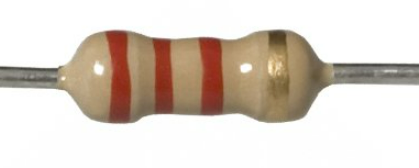
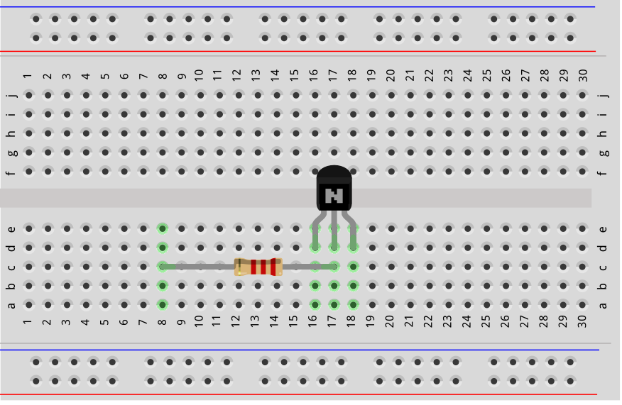
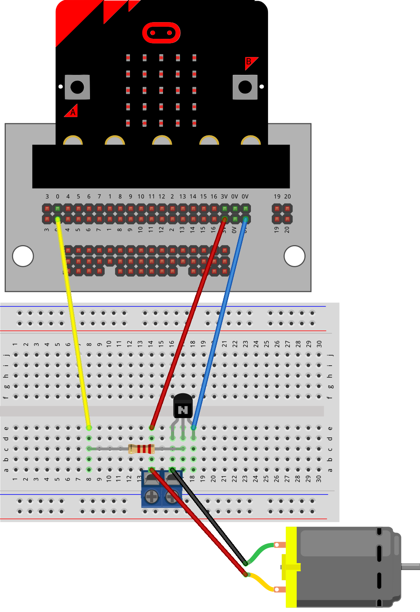
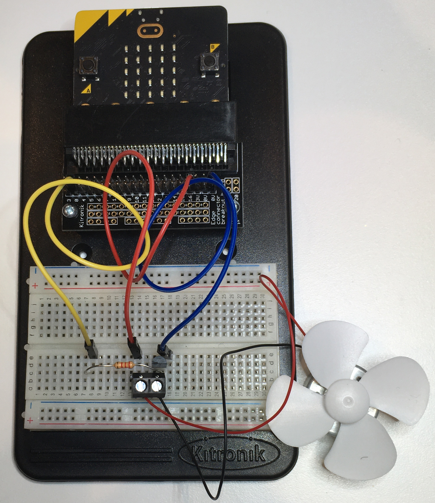
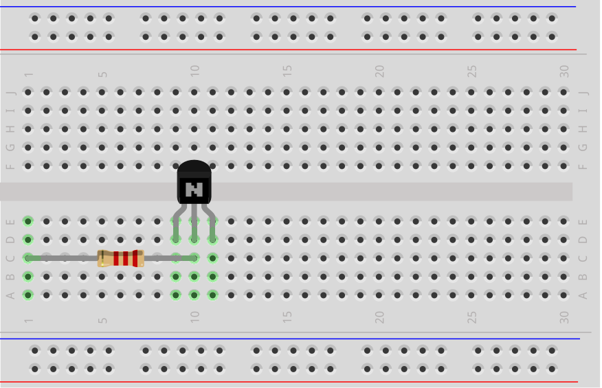
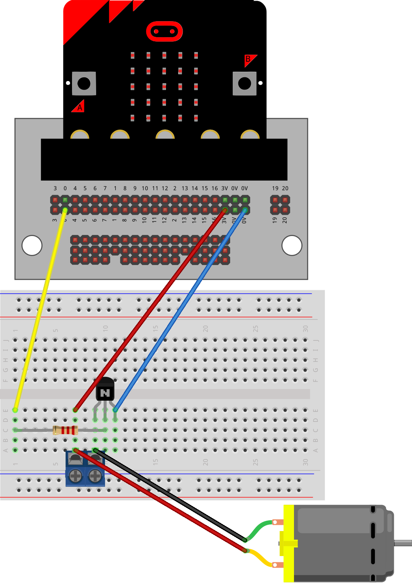
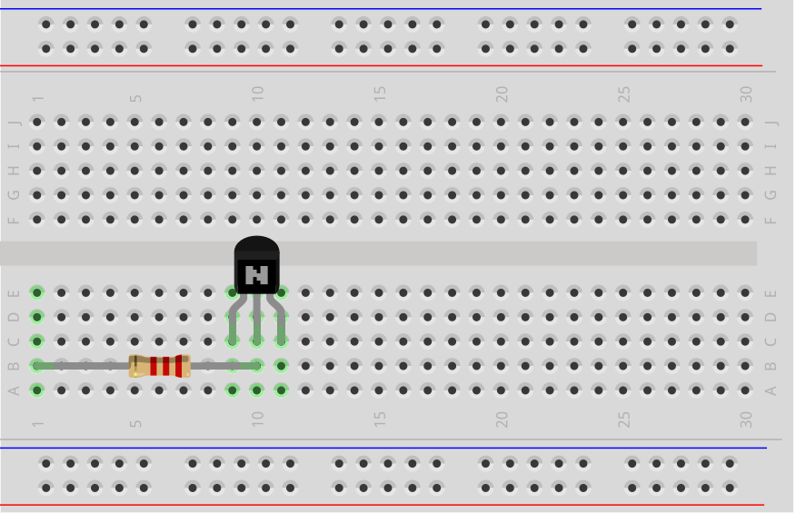
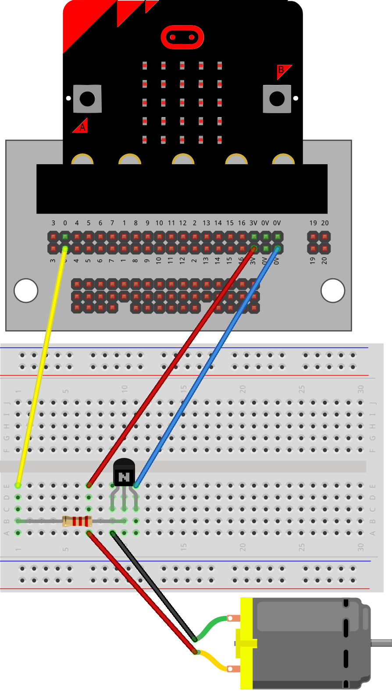

==========================
Motor_with_transistor
==========================

| The examples below use sequence without definition blocks which are preferred to better organize the code.
| See https://pc-microbit-micropython.readthedocs.io/en/latest/breadboards/Motor_with_transistor_2.html

----
Connections
--------------------------

| The motor requires a 2.2 k ohm resistor with the transistor to power it properly using code.
| The 2.2 k ohm resistor has Red, Red, Red, Gold coloured bands.

----

Model
----------

#.  Place the resistor and transistor first.
#.  Make sure the transistor front flat edge is facing forwards.
#.  Connect with the motor terminal block.
#.  Connect with the jumper wires.

----

Model: Moved to side for better terminal block attachment
--------------------------------------------------------------

#.  Place the resistor and transistor first.
#.  Make sure the transistor front flat edge is facing forwards.
#.  Connect with the motor via the pins at the end of wires.
#.  Connect with the jumper wires.

----

Model: Motor without terminal block
----------------------------------------

#.  Place the resistor and transistor first.
#.  Make sure the transistor front flat edge is facing forwards.
#.  Connect with the motor via the pins at the end of wires.
#.  Connect with the jumper wires.

----

Write digital
----------------------------------------

.. py:function:: pinx.write_digital(value)

    | ``pinx`` is the pin. e.g pin0, pin1, pin2.
    | ``value`` is 1 for on and 0 for off.

| To turn the motor on fully, use ``pin0.write_digital(1)``.
| To turn the motor off, use ``pin0.write_digital(0)``.

----

Turn on and off pin0
----------------------------------------

| Pressing A turns **on** the motor.
| Pressing B turns **off** the motor.

.. code-block:: python

    from microbit import *

    while True:
        if button_a.is_pressed():
            pin0.write_digital(1)
        elif button_b.is_pressed():
            pin0.write_digital(0)
        sleep(500)

----

.. admonition:: Tasks

    #. Write code to turn on the motor for 6 seconds then turn it off for 2 seconds before repeating.
    #. Write code to turn on the motor for 6 seconds then turn it off for 2 seconds when the A-button is pressed, and on for 2 seconds then off for 6 seconds when the B-button is pressed, and off when nothing is pressed.
    #. Write code to turn on the motor for 6 seconds then turn it off for 2 seconds when the A-button is pressed, and on for 2 seconds then off for 6 seconds when the B-button is pressed, and on for 4 seconds then off for 4 seconds when nothing is pressed.

    .. dropdown::
        :icon: codescan
        :color: primary
        :class-container: sd-dropdown-container

        .. tab-set::

            .. tab-item:: Q1

                Write code to turn on the motor for 6 seconds then turn it off for 2 seconds before repeating.

                .. code-block:: python

                    from microbit import *

                    while True:
                        pin0.write_digital(1)
                        sleep(6000)
                        pin0.write_digital(0)
                        sleep(2000)

            .. tab-item:: Q2

                Write code to turn on the motor for 6 seconds then turn it off for 2 seconds when the A-button is pressed, and on for 2 seconds then off for 6 seconds when the B-button is pressed, and leave it off when nothing is pressed.

                .. code-block:: python

                    from microbit import *

                    while True:
                        if button_a.is_pressed():
                            pin0.write_digital(1)
                            sleep(6000)
                            pin0.write_digital(0)
                            sleep(2000)
                        elif button_b.is_pressed():
                            pin0.write_digital(1)
                            sleep(2000)
                            pin0.write_digital(0)
                            sleep(6000)

            .. tab-item:: Q3

                Write code to turn on the motor for 6 seconds then turn it off for 2 seconds when the A-button is pressed, and on for 2 seconds then off for 6 seconds when the B-button is pressed, and on for 4 seconds then off for 4 seconds when nothing is pressed.

                .. code-block:: python

                    from microbit import *

                    while True:
                        if button_a.is_pressed():
                            pin0.write_digital(1)
                            sleep(6000)
                            pin0.write_digital(0)
                            sleep(2000)
                        elif button_b.is_pressed():
                            pin0.write_digital(1)
                            sleep(2000)
                            pin0.write_digital(0)
                            sleep(6000)
                        else:
                            pin0.write_digital(1)
                            sleep(4000)
                            pin0.write_digital(0)
                            sleep(4000)

----

Write analog
----------------------------------------

.. py:function:: pinx.write_analog(value)

    | ``pinx`` is the pin. e.g pin0, pin1, pin2.
    | ``value`` is an integer from 0 to 1023.

| To turn the motor on fully use ``pin0.write_analog(1023)``.
| To turn the LED off use ``pin0.write_analog(0)``.
| ``write_analog`` can have values from 0 to 1023.
| ``write_analog`` can be used to power the motor at different speeds.

| Here is some sample code making use of a list and ``write_analog`` to change the speed of the motor.

.. code-block:: python

    from microbit import *
    import random

    power_levels = [0, 50, 100, 200, 400, 1023]
    while True:
        if button_a.is_pressed():
            for power in power_levels:
                pin0.write_analog(power)
                sleep(1000)
        sleep(500)

----

.. admonition:: Tasks

    #. Modify the code so it has 3 power levels: 0, 200, 1023.
    #. Modify the code so it has 3 power levels: 200, 500, 1023, but the motor is stopped for 500ms between each.

    .. dropdown::
        :icon: codescan
        :color: primary
        :class-container: sd-dropdown-container

        .. tab-set::

            .. tab-item:: Q1

                Modify the code so it has 3 power levels: 0, 200, 1023.

                .. code-block:: python

                    from microbit import *
                    import random

                    power_levels = [0, 200, 1023]
                    while True:
                        if button_a.is_pressed():
                            for power in power_levels:
                                pin0.write_analog(power)
                                sleep(1000)
                        sleep(500)

            .. tab-item:: Q2

                Modify the code so it has 3 power levels: 200, 500, 1023, but the motor is stopped for 500ms between each.

                .. code-block:: python

                    from microbit import *
                    import random

                    power_levels = [200, 500, 1023]
                    while True:
                        if button_a.is_pressed():
                            for power in power_levels:
                                pin0.write_analog(power)
                                sleep(1000)
                                pin0.write_analog(0)
                                sleep(1000)
                        sleep(500)

----

| Here is some sample code making use of the range function and ``write_analog`` to change the speed of the motor.
| It starts with a value of 100, and goes up in 10 steps of 20.

.. code-block:: python

    from microbit import *

    sleep_time = 500
    start_val = 100
    while True:
        if button_a.is_pressed():
            # increase speed
            for i in range(10):
                pin0.write_analog(start_val + 20 * i)
                sleep(sleep_time)
        pin0.write_analog(0)
        sleep(1000)

----

.. admonition:: Tasks

    #. Modify the code so it starts at 50 and speeds up in 5 steps of 50.
    #. Modify the code so it starts at 320 and slows down in 4 steps of 80.

    .. dropdown::
        :icon: codescan
        :color: primary
        :class-container: sd-dropdown-container

        .. tab-set::

            .. tab-item:: Q1

                Modify the code so it starts at 50 and speeds up in 5 steps of 50.

                .. code-block:: python

                    from microbit import *

                    sleep_time = 500
                    start_val = 50
                    while True:
                        if button_a.is_pressed():
                            # increase speed using i = 0 to 5
                            for i in range(6):
                                pin0.write_analog(start_val + 50 * i)
                                sleep(sleep_time)
                        pin0.write_analog(0)
                        sleep(1000)

            .. tab-item:: Q2

                Modify the code so it starts at 320 and slows down in 4 steps of 80.

                .. code-block:: python

                    from microbit import *

                    sleep_time = 500
                    start_val = 320
                    while True:
                        if button_a.is_pressed():
                            # decrease speed using i = 0 to 4
                            for i in range(5):
                                pin0.write_analog(start_val - 80 * i)
                                sleep(sleep_time)
                        pin0.write_analog(0)
                        sleep(1000)

