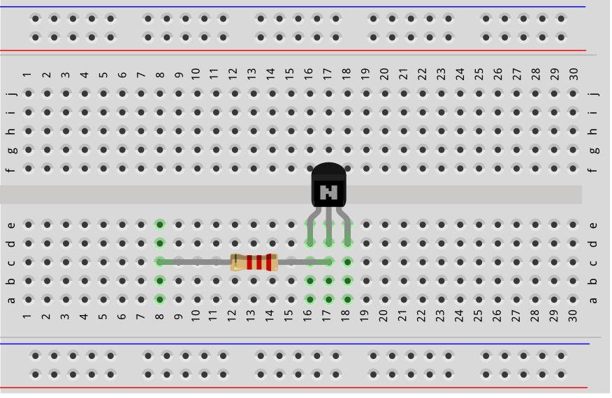

==========================
Motor_with_transistor
==========================

Connections
--------------------------

| The motor requires a 2.2 k ohm resistor with the transistor to power it properly using code.
| The 2.2 k ohm resistor has Red, Red, Red, Gold coloured bands.

----

Model
----------------------------------------

#.  Place the resistor and transistor first.
#.  Make sure the transistor front flat edge is facing forwards.
#.  Connect with the motor terminal block.
#.  Connect with the jumper wires.

.. image:: images/motor_2b_bb.png
    :scale: 50 %

Write digital
----------------------------------------

| To turn the motor on fully use ``pin0.write_digital(1)``.
| To turn the LED off use ``pin0.write_digital(0)``.

Turn on and off pin0
----------------------------------------

| Pressing A turns **on** the motor.
| Pressing B turns **off** the motor.

.. code-block:: python

    from microbit import *

    def turn_on():
        pin0.write_digital(1)

    def turn_off():
        pin0.write_digital(0)

    while True:
        if button_a.is_pressed():
            turn_on()
        elif button_b.is_pressed():
            turn_off()
        sleep(500)

Write analog
----------------------------------------

| To turn the motor on fully use ``pin0.write_analog(1023)``.
| To turn the LED off use ``pin0.write_analog(0)``.
| ``write_analog`` can have values from 0 to 1023.
| ``write_analog`` can be used to power teh motor at different speeds.

| Here is some sample code making use of ``write_analog`` to change the speed of the motor.

.. code-block:: python

    from microbit import *
    import random

    def pulse_on():
        sleeptime = 4
        stepsize = 30
        for i in range(300, 1021, stepsize):
            pin0.write_analog(i)
            sleep(sleeptime)
        pin0.write_analog(0)

    def pulse_off():
        sleeptime = 4
        stepsize = 30
        for i in range(1020, 300, -stepsize):
            pin0.write_analog(i)
            sleep(sleeptime)
        pin0.write_analog(0)

    while True:
        if button_a.is_pressed():
            pulpulse_on()
        elif button_b.is_pressed():
            pulse_off()
        sleep(500)

----

.. admonition:: Tasks

    #. Write code to turn on the motor for 5 seconds then turn it off for 2 seconds before repeating.

