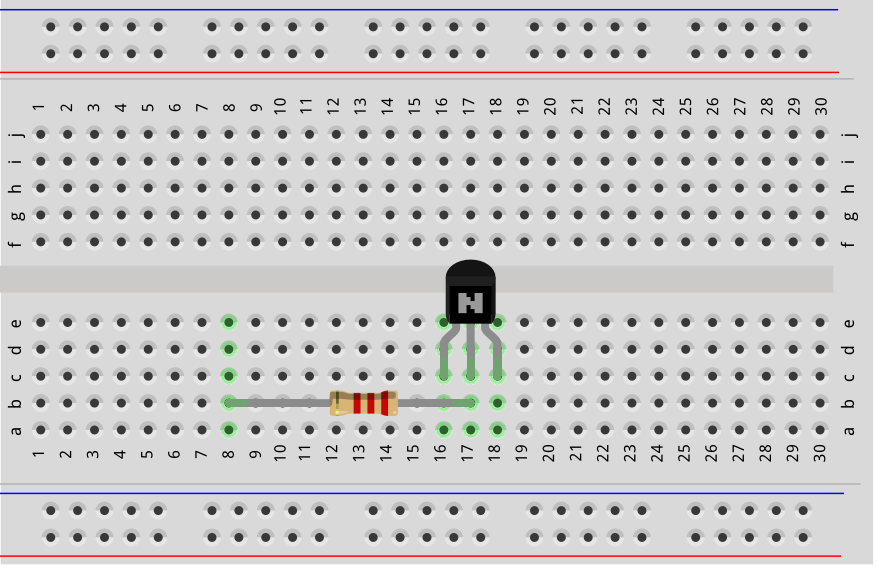
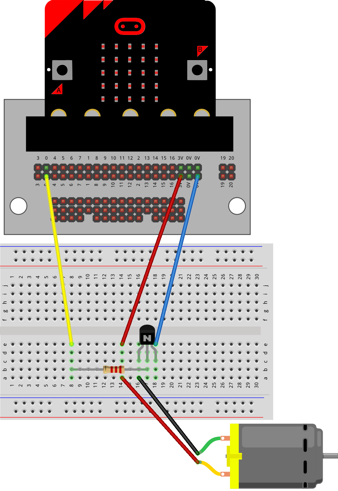

==========================
Motor_with_transistor
==========================

The examples below use definition blocks to better organize the code.

----

Connections
--------------------------

| The motor requires a 2.2 k ohm resistor with the transistor to power it properly using code.
| The 2.2 k ohm resistor has Red, Red, Red, Gold coloured bands.

.. image:: images/2.2kohm.png
    :scale: 50 %

----

Model
----------

#.  Place the resistor and transistor first.
#.  Make sure the transistor front flat edge is facing forwards.
#.  Connect with the motor terminal block.
#.  Connect with the jumper wires.

.. image:: images/motor_1b_bb.png
    :scale: 50 %

.. image:: images/motor_2b_bb.png
    :scale: 50 %

.. image:: images/motor.jpg
    :scale: 30 %

----

Model: Moved to side for better terminal block attachment
--------------------------------------------------------------

#.  Place the resistor and transistor first.
#.  Make sure the transistor front flat edge is facing forwards.
#.  Connect with the motor via the pins at the end of wires.
#.  Connect with the jumper wires.

.. image:: images/motor_1c_bb.png
    :scale: 50 %

.. image:: images/motor_2c_bb.png
    :scale: 50 %

----

Model: Motor without terminal block
----------------------------------------

#.  Place the resistor and transistor first.
#.  Make sure the transistor front flat edge is facing forwards.
#.  Connect with the motor via the pins at the end of wires.
#.  Connect with the jumper wires.

----

Write digital
----------------------------------------

.. py:function:: pinx.write_digital(value)

    | ``pinx`` is the pin. e.g pin0, pin1, pin2.
    | ``value`` is 1 for on and 0 for off.

| To turn the motor on fully, use ``pin0.write_digital(1)``.
| To turn the motor off, use ``pin0.write_digital(0)``.

----

Turn on and off pin0
----------------------------------------

| Pressing A turns **on** the motor.
| Pressing B turns **off** the motor.

.. code-block:: python

    from microbit import *

    def turn_on():
        pin0.write_digital(1)

    def turn_off():
        pin0.write_digital(0)

    while True:
        if button_a.is_pressed():
            turn_on()
        elif button_b.is_pressed():
            turn_off()
        sleep(500)

----

.. admonition:: Tasks

    Use the turn on and turn off functions to complete these tasks.

    #. Write code to turn on the motor for 6 seconds then turn it off for 2 seconds before repeating.
    #. Write code to turn on the motor for 6 seconds then turn it off for 2 seconds when the A-button is pressed, and on for 2 seconds then off for 6 seconds when the B-button is pressed, and off when nothing is pressed.
    #. Write code to turn on the motor for 6 seconds then turn it off for 2 seconds when the A-button is pressed, and on for 2 seconds then off for 6 seconds when the B-button is pressed, and on for 4 seconds then off for 4 seconds when nothing is pressed.

    .. dropdown::
        :icon: codescan
        :color: primary
        :class-container: sd-dropdown-container

        .. tab-set::

            .. tab-item:: Q1

                Write code to turn on the motor for 6 seconds then turn it off for 2 seconds before repeating.

                .. code-block:: python

                    from microbit import *

                    def turn_on():
                        pin0.write_digital(1)

                    def turn_off():
                        pin0.write_digital(0)

                    while True:
                        turn_on()
                        sleep(6000)
                        turn_off()
                        sleep(2000)

            .. tab-item:: Q2

                Write code to turn on the motor for 6 seconds then turn it off for 2 seconds when the A-button is pressed, and on for 2 seconds then off for 6 seconds when the B-button is pressed, and leave it off when nothing is pressed.

                .. code-block:: python

                    from microbit import *

                    def turn_on():
                        pin0.write_digital(1)

                    def turn_off():
                        pin0.write_digital(0)

                    while True:
                        if button_a.is_pressed():
                            turn_on()
                            sleep(6000)
                            turn_off()
                            sleep(2000)
                        elif button_b.is_pressed():
                            turn_on()
                            sleep(2000)
                            turn_off()
                            sleep(6000)

            .. tab-item:: Q3

                Write code to turn on the motor for 6 seconds then turn it off for 2 seconds when the A-button is pressed, and on for 2 seconds then off for 6 seconds when the B-button is pressed, and on for 4 seconds then off for 4 seconds when nothing is pressed.

                .. code-block:: python

                    from microbit import *

                    def turn_on():
                        pin0.write_digital(1)

                    def turn_off():
                        pin0.write_digital(0)

                    while True:
                        if button_a.is_pressed():
                            turn_on()
                            sleep(6000)
                            turn_off()
                            sleep(2000)
                        elif button_b.is_pressed():
                            turn_on()
                            sleep(2000)
                            turn_off()
                            sleep(6000)
                        else:
                            turn_on()
                            sleep(4000)
                            turn_off()
                            sleep(4000)

----

.. admonition:: Tasks

    #. Write a new function that uses the turn_on and turn-off functions and has parameters for the length of time to turn it on and the length of time to turn it off. Set both of these parameters to a default value of 4000.
    #. Write code, using this new function, to turn on the motor for 6 seconds then turn it off for 2 seconds when the A-button is pressed, and on for 2 seconds then off for 6 seconds when the B-button is pressed, and on for 4 seconds then off for 4 seconds when nothing is pressed.

    .. dropdown::
        :icon: codescan
        :color: primary
        :class-container: sd-dropdown-container

        .. tab-set::

            .. tab-item:: Q1

                Write a new function that uses the turn_on and turn-off functions and has parameters for the length of time to turn it on and the length of time to turn it off. Set both of these parameters to a default value of 4000.

                .. code-block:: python

                    from microbit import *

                    def turn_on_off(time_on=4000, time_off=4000):
                        turn_on()
                        sleep(time_on)
                        turn_off()
                        sleep(time_off)

            .. tab-item:: Q2

                Write code, using this new function, to turn on the motor for 6 seconds then turn it off for 2 seconds when the A-button is pressed, and on for 2 seconds then off for 6 seconds when the B-button is pressed, and on for 4 seconds then off for 4 seconds when nothing is pressed.

                .. code-block:: python

                    from microbit import *

                    def turn_on():
                        pin0.write_digital(1)

                    def turn_off():
                        pin0.write_digital(0)

                    def turn_on_off(time_on=4000, time_off=4000):
                        turn_on()
                        sleep(time_on)
                        turn_off()
                        sleep(time_off)

                    while True:
                        if button_a.is_pressed():
                            turn_on_off(time_on=6000, time_off=2000)
                        elif button_b.is_pressed():
                            turn_on_off(time_on=2000, time_off=6000)
                        else:
                            turn_on_off()

----

Write analog
----------------------------------------

.. py:function:: pinx.write_analog(value)

    | ``pinx`` is the pin. e.g pin0, pin1, pin2.
    | ``value`` is an integer from 0 to 1023.

| To turn the motor on fully use ``pin0.write_analog(1023)``.
| To turn the LED off use ``pin0.write_analog(0)``.
| ``write_analog`` can have values from 0 to 1023.
| ``write_analog`` can be used to power the motor at different speeds.

| Here is some sample code making use of ``write_analog`` to change the speed of the motor.

.. code-block:: python

    from microbit import *

    def pulse_on():
        sleep_time = 500
        step_size = 200
        for i in range(200, 1023, step_size):
            pin0.write_analog(i)
            sleep(sleep_time)
        pin0.write_analog(1023)

    def pulse_off():
        sleep_time = 500
        step_size = 200
        for i in range(1023, 200, -step_size):
            pin0.write_analog(i)
            sleep(sleep_time)
        pin0.write_analog(0)

    while True:
        if button_a.is_pressed():
            pulse_on()
        elif button_b.is_pressed():
            pulse_off()
        sleep(500)

----

.. admonition:: Tasks

    #. Modify the pulse_on code so it has twice as many steps. Modify the pulse_off code so each step is half as long.
    #. Modify the pulse_on and pulse_off functions further to show the motor speed as a value from 0 to 9. Hint: write a new function, ``motor_speed_display``, that uses the int function to round down the value obtained from dividing the motor speed by 100. Then use the min function to make sure the highest possible value returned is 9.

    .. dropdown::
        :icon: codescan
        :color: primary
        :class-container: sd-dropdown-container

        .. tab-set::

            .. tab-item:: Q1

                Modify the pulse_on code so it has twice as many steps. Modify the pulse_off code so each step is half as long.

                .. code-block:: python

                    from microbit import *

                    def pulse_on():
                        sleep_time = 500
                        step_size = 100
                        for i in range(200, 1023, step_size):
                            pin0.write_analog(i)
                            sleep(sleep_time)
                        pin0.write_analog(1023)

                    def pulse_off():
                        sleep_time = 250
                        step_size = 200
                        for i in range(1023, 200, -step_size):
                            pin0.write_analog(i)
                            sleep(sleep_time)
                        pin0.write_analog(0)

                    while True:
                        if button_a.is_pressed():
                            pulse_on()
                        elif button_b.is_pressed():
                            pulse_off()
                        sleep(500)

Scaling the readings
----------------------------------------

| The analog range, from 0 to 1023, can roughly be converted to a scaled range of 0 to 9 by dividing by 100.
| The expression below uses `int` to round down to an integer and `min` to keep the maximum value at 9.

.. py:function:: min(9, int(analog_val / 100))

    Converts an analog value from a range of 0 to 1023 to 0 to 9.

    e.g. scaled_value = min(9, int(analog_val / 100))

.. admonition:: Tasks

    #. Modify the pulse_on and pulse_off code to show the motor speed as a value from 0 to 9.

    .. dropdown::
        :icon: codescan
        :color: primary
        :class-container: sd-dropdown-container

        .. tab-set::

            .. tab-item:: Q1

                Modify the pulse_on and pulse_off code to show the motor speed as a value from 0 to 9.

                .. code-block:: python

                    from microbit import *

                    def motor_speed_display(analog_val):
                        display.show(min(9, int(analog_val / 100)))

                    def pulse_on():
                        sleep_time = 500
                        step_size = 100
                        for i in range(200, 1023, step_size):
                            pin0.write_analog(i)
                            motor_speed_display(i)
                            sleep(sleep_time)
                        pin0.write_analog(1023)
                        motor_speed_display(1023)

                    def pulse_off():
                        sleep_time = 250
                        step_size = 200
                        for i in range(1023, 200, -step_size):
                            pin0.write_analog(i)
                            motor_speed_display(i)
                            sleep(sleep_time)
                        pin0.write_analog(0)
                        motor_speed_display(0)

                    while True:
                        if button_a.is_pressed():
                            pulse_on()
                        elif button_b.is_pressed():
                            pulse_off()
                        sleep(500)

