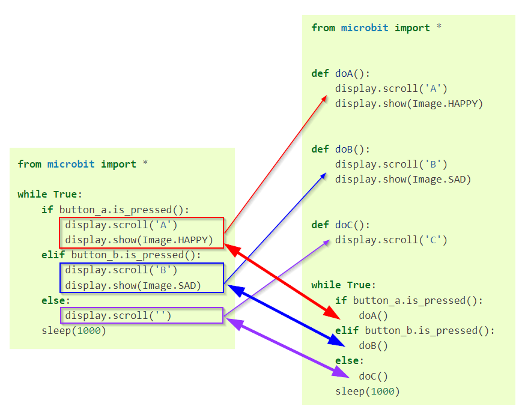

====================================================
def: Organising code with definitions
====================================================

Definitions
----------------------------------------

| Definitions help break up lengthy code into smaller well defined blocks.

| Definitions use the same naming conventions as for variables.
| Variable names should be in lowercase, with words separated by underscores (this is known as snake_case)
| Variable names can only contain alphanumeric characters and underscores.
| Variable cannot start with a number.

| Definitions start with the ``def`` keyword.
| All the code for a definition is indented.

| Below is an example of a definition that scrolls some text and displays an image.
| The definition is run by calling it via ``doA()``.

.. code-block:: python

    from microbit import *

    def doA():
        display.scroll('A')
        display.show(Image.HAPPY)

    doA()

----

Organising blocks into definitions
----------------------------------------

| Compare the two code examples below.
| The first example does not have any definitions.
| The second example takes each block of code in the various branches of the if block and reallocates them to separate definitions.
| This makes the main block of code in the ``while True`` loop more compact and more readable.
| Each definition block can be easily edited and changed.

.. list-table::
   :widths: 50 50
   :header-rows: 1
   :width: 100%

   * - code in sequence without definitions
     - code organised with definitions
   * - .. code-block:: python

           from microbit import *

           while True:
               if button_a.is_pressed():
                   display.scroll('A')
                   display.show(Image.HAPPY)
               elif button_b.is_pressed():
                   display.scroll('B')
                   display.show(Image.SAD)
               else:
                   display.scroll('C')
               sleep(1000)
     - .. code-block:: python

           from microbit import *

           def doA():
               display.scroll('A')
               display.show(Image.HAPPY)

           def doB():
               display.scroll('B')
               display.show(Image.SAD)

           def doC():
               display.scroll('C')

           while True:
               if button_a.is_pressed():
                   doA()
               elif button_b.is_pressed():
                   doB()
               else:
                   doC()
               sleep(1000)

| Side by side comparison:

----

.. admonition:: Tasks

    1.  Reorganise the code below to follow the structure of the examples above.

        .. code-block:: python

            from microbit import *

            while True:
                if button_a.is_pressed():
                    for char in 'ABC':
                        display.scroll(char, delay=80)
                elif button_b.is_pressed():
                    for sport in ['123']:
                        display.scroll(sport, delay=80)
                else:
                    display.clear()

    2.  Reorganise the code below to follow the structure of the examples above.

        .. code-block:: python

            from microbit import *

            while True:
                if button_a.is_pressed():
                    for num in range(1, 10, 2):
                        display.scroll(num, delay=80)
                elif button_b.is_pressed():
                    for num in range(10, -1, -2):
                        display.scroll(num, delay=80)
                else:
                    display.clear()

    .. dropdown::
        :icon: codescan
        :color: primary
        :class-container: sd-dropdown-container

        .. tab-set::

            .. tab-item:: Q1

                Reorganise the code below to follow the structure of the examples above.

                .. code-block:: python

                    from microbit import *

                    def doA():
                        for char in 'ABC':
                            display.scroll(char, delay=80)

                    def doB():
                        for sport in ['123']:
                                display.scroll(sport, delay=80)

                    def doC():
                        display.clear()

                    while True:
                        if button_a.is_pressed():
                            doA()
                        elif button_b.is_pressed():
                            doB()
                        else:
                            doC()

            .. tab-item:: Q2

                Reorganise the code below to follow the structure of the examples above.

                .. code-block:: python

                    from microbit import *

                    def doA():
                        for num in range(1, 10, 2):
                            display.scroll(num, delay=80)

                    def doB():
                        for num in range(10, -1, -2):
                            display.scroll(num, delay=80)

                    def doC():
                        display.clear()

                    while True:
                        if button_a.is_pressed():
                            doA()
                        elif button_b.is_pressed():
                            doB()
                        else:
                            doC()

