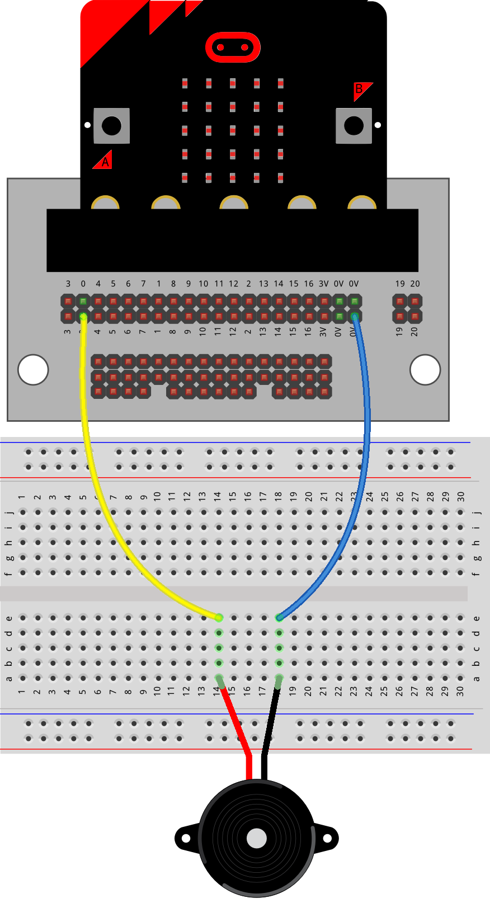
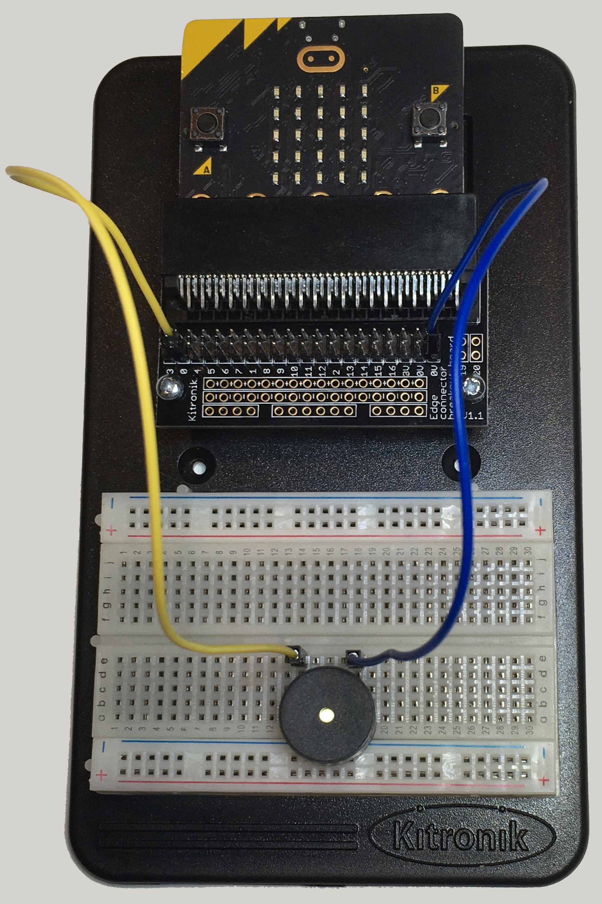

==========================
Piezo_Buzzer_and_music
==========================

| See: https://microbit-micropython.readthedocs.io/en/v2-docs/music.html

.. admonition:: Warning

    | For use of the buzzer on the **breadboard**, set the speaker to **off** so that the in-built speaker does not also play sounds.
    | For use of the inbuilt speaker on the **V2 microbit**, set the speaker to **on**.

----

Connections
--------------------------

| The buzzer is usually connected to pin0.
| If it is connected to pin1 or pin2 instead, the pin number must be used as a parameter in the play method.

----

Model
----------------------------------------

#.  Place the buzzer first. It pins directly into the breadboard. Ignore the diagram suggestion that wires are used.
#.  Connect with the jumper wires to the edge-connector using pin0 and ground, 0V.

----

Library
-------------------

| Put ``import music`` at the top under ``from microbit import *``.

.. code-block:: python

    from microbit import *
    import music

----

**V2** speaker
---------------------

| By default sound output will be via the edge connector on pin0 and the **V2** built-in speaker.
| The **V2** built-in speaker can be turned off or on without affecting playing via pin0.

.. py:function::  speaker.off()

    Use off() to turn off the speaker. This does not disable sound output to an edge connector pin.

.. py:function::  speaker.on()

    Use on() to turn on the speaker.

| For use of the buzzer on the breadboard, set the speaker to off so that the in-built speaker does not also play sounds.

----

Playing music notes
-----------------------

.. py:function::  music.play(music, pin=pin0, wait=True, loop=False)

    | Play the music.
    | If music can be a string, such as 'c4:4', or a list of notes as strings, such as ['c', 'd', 'e']
    | The duration and octave values are reset to their defaults before the music is played.
    | The output pin can be used to override the default pin0. Use pin=None to prevent sounds being played.
    | If wait is set to True, playing is blocking, and the music will be played to the end.
    | If loop is set to True, the music repeats until stop is called.

----

Notes
----------------------------------------

| An individual note is specified thus: ``NOTE[octave][:duration]``.
| Notes are the letters "a" to "g". "R" is a rest. Lower case or upper case are the same. eg. "a" and "A"
| Accidentals (flats and sharps) are denoted by the b (flat - a lower case b) and # (sharp - a hash symbol).
| For example, ``Ab`` is A-flat and ``C#`` is C-sharp.
| If the octave is left out it defaults to 4 (containing middle C).
| If the duration is left out it defaults to 4 (a crotchet).
| For example, ``a4:8`` refers to the note "A" in octave 4 that lasts for eight ticks (a tick is an arbitrary length of time defined by a tempo setting function). If the note name R is used then it is treated as a rest (silence).
| The octave and duration parameters are states that carry over to subsequent notes until re-specified.
| The tempo can be set using ``music.set_tempo(ticks=4, bpm=120)``

| Use ``music.play(note)`` to play a note in the ``note`` variable.

.. code-block:: python

    from microbit import *
    import music

    speaker.off()
    note = 'c4:8'
    music.play(note)

| Use ``music.play(notes)`` to play a list of notes in the ``notes_list`` variable.
| The code below plays a list of notes that use various forms to specify them.

.. code-block:: python

    from microbit import *
    import music

    speaker.off()
    notes_list = ['c4:1', 'e:4', 'g:8', 'c:2', 'e5', 'g4','f#','eb']

    music.set_tempo(ticks=4, bpm=240)
    music.play(notes_list)

----

.. admonition:: Tasks

    #. Play the 5 notes: c, e, g, e, c.
    #. Play the 3 notes: 'e4:4', 'f#', 'g'

    .. dropdown::
        :icon: codescan
        :color: primary
        :class-container: sd-dropdown-container

        .. tab-set::

            .. tab-item:: Q1

                Play the 5 notes: c, e, g, e, c.

                .. code-block:: python

                    from microbit import *
                    import music

                    speaker.off()
                    notes_list = ['c4:4', 'e', 'g', 'e', 'c']

                    while True:
                        music.play(notes_list)
                        sleep(1000)

            .. tab-item:: Q2

                Play the 3 notes: 'e4:4', 'f#', 'g'

                .. code-block:: python

                    from microbit import *
                    import music

                    speaker.off()
                    notes_list = ['e4:4', 'f#', 'g']

                    while True:
                        music.play(notes_list)
                        sleep(1000)

----

Tempo
-----------

.. py:function::  music.set_tempo(ticks=4, bpm=120)

    Sets the tempo for playback.

    A number of ticks, expressed as an integer, make a beat. The default is 4 ticks per beat.

    Each beat is to be played at a certain frequency, beats per minute, expressed as an integer. The default is 120 bpm.

| Examples of use:
| music.set_tempo() - reset the tempo to default of ticks = 4, bpm = 120
| music.set_tempo(ticks=8) - change the beat to 8 ticks
| music.set_tempo(bpm=240) - just change the tempo to 240 beats per minute

| The length of a beat in milliseconds is (60 sec * 1000 / bpm).
| For the default value of 120 bpm, that's 60000/120 or 1 beat in 500 milliseconds.

----

.. admonition:: Tasks

    #. Play the 5 notes: c, e, g, e, c with a tempo of 120, 180 and 240bpm.
    #. Design a function that takes a tempo list of 120, 240, 360 , 480 and 600 bpm as one parameter and a sleep_time with default value 1000. Use a repeat loop to set the tempo and play the notes_list.

    .. dropdown::
        :icon: codescan
        :color: primary
        :class-container: sd-dropdown-container

        .. tab-set::

            .. tab-item:: Q1

                Play the 5 notes: c, e, g, e, c with a tempo of 120, 180 and 240bpm.

                .. code-block:: python

                    from microbit import *
                    import music

                    speaker.off()
                    notes_list = ['c4:4', 'e', 'g', 'e', 'c']

                    while True:
                        music.set_tempo(bpm=120)
                        music.play(notes_list)
                        sleep(1000)
                        music.set_tempo(bpm=180)
                        music.play(notes_list)
                        sleep(1000)
                        music.set_tempo(bpm=240)
                        music.play(notes_list)
                        sleep(1000)

            .. tab-item:: Q2

                Design a function that takes a tempo list of 120, 240, 360, 480 and 600 bpm as one parameter and a sleep_time with default value 1000. Use a repeat loop to set the tempo and play the notes_list.

                .. code-block:: python

                    from microbit import *
                    import music

                    speaker.off()
                    notes_list = ['c4:4', 'e', 'g', 'e', 'c']
                    tempo_list = [120, 240, 360, 480, 600]

                    def tempo_play(tempo_list, sleep_time=1000):
                        for tempo in tempo_list:
                            music.set_tempo(bpm=tempo)
                            music.play(notes_list)
                            sleep(sleep_time)

                    while True:
                        tempo_play(tempo_list, sleep_time=1000)

----

Other music methods
-----------------------

.. py:function::  music.stop(pin=pin0)

    Stops all music playback on the built-in speaker and any pin outputting sound.

    An optional argument can be provided to specify a pin, eg. music.stop(pin1).

.. py:function::  music.reset()

    Resets the state of the following attributes as listed:

    ticks = 4; bpm = 120; duration = 4; octave = 4

.. py:function::  music.get_tempo()

    Gets the current tempo as a tuple of integers: (bpm, ticks).

| To display the tuple from get_tempo it can be converted to a string:

.. code-block:: python

    from microbit import *
    import music

    music.set_tempo(ticks=4, bpm=240)
    tempo_data = str(music.get_tempo())
    display.scroll(tempo_data)
    # (240, 4)

| Each value in the tuple can be accessed using its index as shown below:

.. code-block:: python

    from microbit import *
    import music

    music.set_tempo(ticks=2, bpm=120)
    tempo_data = music.get_tempo()
    bpm = tempo_data[0]
    ticks = tempo_data[1]
    display.scroll(bpm)
    display.scroll(ticks)

----

Tuple unpacking of get_tempo()
-------------------------------------

| For advanced users, tuple unpacking can be used instead of indices:
| ``bpm, ticks = music.get_tempo()``
| See: https://www.w3schools.com/python/python_tuples_unpack.asp

.. code-block:: python

    from microbit import *
    import music

    music.set_tempo(ticks=2, bpm=120)
    bpm, ticks = music.get_tempo()
    display.scroll(bpm)
    display.scroll(ticks)

----

Scales
----------------------------------------

| The lists below are the notes of scales.
| Press A or B to play a different scale.

.. code-block:: python

    from microbit import *
    import music

    speaker.off()
    c_major = ['c', 'd', 'e', 'f', 'g', 'a', 'b', 'c5']
    e_minor = ['e', 'f#', 'g', 'a', 'b', 'c', 'd', 'e5']

    while True:
        if button_a.is_pressed():
            music.play(c_major)
        elif button_b.is_pressed():
            music.play(e_minor)
        sleep(1000)

----

.. admonition:: Tasks

    #. Play the 8 notes of D major. See: https://www.pianoscales.org/major.html
    #. Play the 8 notes of F minor. See: https://www.pianoscales.org/minor.html
    #. Play the D major scale when the A-button is pressed and the F minor scale when the B-button is pressed.
    #. Play the C major scale combined with an animation of the heart beating.

    .. dropdown::
        :icon: codescan
        :color: primary
        :class-container: sd-dropdown-container

        .. tab-set::

            .. tab-item:: Q1

                Play the 8 notes of D major.

                .. code-block:: python

                    from microbit import *
                    import music

                    speaker.off()
                    d_major = ["D", "E", "F#", "G", "A", "B", "C#", "D"]

                    while True:
                        music.play(d_major)
                        sleep(1000)

            .. tab-item:: Q2

                Play the 8 notes of F minor.

                .. code-block:: python

                    from microbit import *
                    import music

                    speaker.off()
                    f_minor = ["F", "G", "Ab", "Bb", "C", "Db", "Eb", "F"]

                    while True:
                        music.play(f_minor)
                        sleep(1000)

            .. tab-item:: Q3

                Play the D major scale when the A-button is pressed and the F minor scale when the B-button is pressed.

                .. code-block:: python

                    from microbit import *
                    import music

                    speaker.off()
                    d_major = ["D", "E", "F#", "G", "A", "B", "C#", "D"]
                    f_minor = ["F", "G", "Ab", "Bb", "C", "Db", "Eb", "F"]

                    while True:
                        if button_a.is_pressed():
                            music.play(d_major)
                        elif button_b.is_pressed():
                            music.play(f_minor)
                        sleep(1000)

            .. tab-item:: Q4

                Play the C major scale combined with an animation of the heart beating.

                .. code-block:: python

                    from microbit import *
                    import music

                    c_major = ['c', 'd', 'e', 'f', 'g', 'a', 'b', 'c5']
                    # 1 beat every 500ms
                    while True:
                        music.play(c_major, wait=False)
                        for i in range(8):
                            display.show(Image.HEART_SMALL)
                            sleep(250)
                            display.show(Image.HEART)
                            sleep(250)
                        sleep(200)

----

Built in music
----------------------------------------

| There are built-in melodies that can be found by typing ``music.``
| Melodies can be played using ``music.play(melody)``.

.. code-block:: python

    from microbit import *
    import music

    speaker.off()
    music.play(music.POWER_UP)

| The code below uses a for-loop to loop through each melody in the ``melodies_list`` and play it.
| For a list of built-in melodies see: https://microbit-micropython.readthedocs.io/en/v2-docs/music.html

.. code-block:: python

    from microbit import *
    import music

    speaker.off()
    melodies_list = [music.DADADADUM, music.POWER_DOWN]
    for melody in melodies_list:
        music.play(melody)

----

All Built in melodies
----------------------------------------

| This code plays all the melodies.
| The A-button can be pressed to exit the for-loop then the while-loop using ``break``.
| Pressing the reset button on the back of the microbit will restart the code.

.. code-block:: python

    from microbit import *
    import music

    speaker.off()
    built_in_tunes = [music.DADADADUM, music.ENTERTAINER, music.PRELUDE,
                      music.ODE, music.NYAN, music.RINGTONE, music.FUNK, music.BLUES,
                      music.BIRTHDAY, music.WEDDING, music.FUNERAL, music.PUNCHLINE,
                      music.PYTHON, music.BADDY, music.CHASE, music.BA_DING,
                      music.WAWAWAWAA, music.JUMP_UP, music.JUMP_DOWN, music.POWER_UP,
                      music.POWER_DOWN]

    while True:
        for tune in built_in_tunes:
            music.play(tune)
            sleep(1000)
            if button_a.is_pressed():
                break
        if button_a.is_pressed():
            break

----

.. admonition:: Tasks

    #. Play any 3 melodies using a list.
    #. Use the choice function to randomly pick melodies from a melody list. See: https://www.w3schools.com/python/ref_random_choice.asp. Use https://python.microbit.org/v/3.

    .. dropdown::
        :icon: codescan
        :color: primary
        :class-container: sd-dropdown-container

        .. tab-set::

            .. tab-item:: Q1

                Play any 3 melodies using a list.

                .. code-block:: python

                    from microbit import *
                    import music

                    speaker.off()
                    melodies_list = [music.POWER_UP, music.DADADADUM, music.POWER_DOWN]
                    for melody in melodies_list:
                        music.play(melody)

            .. tab-item:: Q2

                Use the choice function to randomly pick melodies from a melody list. See: https://www.w3schools.com/python/ref_random_choice.asp.

                .. code-block:: python

                    from microbit import *
                    import music
                    import random

                    speaker.off()
                    melodies_list = [music.POWER_UP, music.DADADADUM, music.POWER_DOWN]

                    while True:
                        music.play(random.choice(melodies_list))
                        sleep(1000)

----

**V2** volume
---------------------

.. py:function:: set_volume(volume)

    Configure the output volume of the microbit speaker and pins.

    :param volume: An integer between 0 and 255 to set the volume.

| The code below plays 3 different notes at different volumes.

.. code-block:: python

    from microbit import *
    import music

    note0 = "c4:4"
    note1 = "e4:4"
    note2 = "f#4:4"
    while True:
        set_volume(255)
        music.play(note0)
        set_volume(128)
        music.play(note1)
        set_volume(64)
        music.play(note2)

----

Sound effects using pitch
----------------------------------------

.. py:function::  music.pitch(frequency, duration=-1, pin=pin0, wait=True)

    Plays a pitch at the integer frequency given for the duration specified in milliseconds.

    Only one pitch can be played on one pin at any one time.

    If duration is negative the pitch is played continuously until either the blocking call is interrupted or, in the case of a background call, a new frequency is set or stop is called.

    An optional argument to specify the output pin can be used to override the default of pin0. pin=None causes no sound to play.

    If wait is set to True, this function is blocking.

| The code below increases the pitch in steps of 16 with playing duration of 20 ms.

.. code-block:: python

    from microbit import *
    import music

    speaker.off()
    for freq in range(880, 1760, 16):
        music.pitch(freq, duration=20)

----

.. admonition:: Tasks

    #. Modify the code to increase the pitch in steps of 32 with a duration of 40.
    #. Modify the code to decrease the pitch instead.
    #. Modify the code to increase then decrease the pitch.

    .. dropdown::
        :icon: codescan
        :color: primary
        :class-container: sd-dropdown-container

        .. tab-set::

            .. tab-item:: Q1

                Modify the code to increase the pitch in steps of 32 with a duration of 40.

                .. code-block:: python

                    from microbit import *
                    import music

                    speaker.off()
                    for freq in range(880, 1760, 32):
                        music.pitch(freq, duration=40)

            .. tab-item:: Q2

                Modify the code to decrease the pitch instead.

                .. code-block:: python

                    from microbit import *
                    import music

                    speaker.off()
                    for freq in range(1760, 880, -16):
                        music.pitch(freq, duration=20)

            .. tab-item:: Q3

                Modify the code to increase then decrease the pitch.

                .. code-block:: python

                    from microbit import *
                    import music

                    speaker.off()
                    for freq in range(880, 1760, 16):
                        music.pitch(freq, duration=20)
                    for freq in range(1760, 880, -16):
                        music.pitch(freq, duration=20)

----

Note frequencies
------------------

| The table below has the frequencies for notes from A to A over 2 octaves.
| The frequency of any note is doubled when going up one octave.

======= =========
Note    Frequency
======= =========
A	    440
B flat	466
B	    494
C	    523
C sharp	554
D	    587
D sharp	622
E	    659
F	    698
F sharp	740
G	    784
A flat	831
A	    880
B flat	932
B	    988
C	    1046
C sharp	1108
D	    1174
D sharp	1244
E	    1318
F	    1396
F sharp	1480
G	    1568
A flat	1662
A	    1760
======= =========

----

| The code uses a for-loop to play each frequency.
| The A-button can be pressed to exit the while-loop using ``break``.
| Pressing the reset button on the back of the microbit will restart the code.

.. code-block:: python

    from microbit import *
    import music

    speaker.off()
    Am_freqs = [440, 494, 523, 587, 659, 698, 784, 880]
    timing = 400
    while True:
        for freq in Am_freqs:
            music.pitch(freq, duration=timing)
        if button_a.is_pressed():
            break

----

.. admonition:: Tasks

    #. Modify the code to play the pitches of the E minor scale. See: https://www.piano-keyboard-guide.com/e-minor-scale.html.
    #. Modify the code to play the pitches of the D major scale. See: http://www.piano-keyboard-guide.com/d-major-scale.html.

    .. dropdown::
        :icon: codescan
        :color: primary
        :class-container: sd-dropdown-container

        .. tab-set::

            .. tab-item:: Q1

                Modify the code to play the pitches of the E minor scale. See: https://www.piano-keyboard-guide.com/e-minor-scale.html.

                .. code-block:: python

                    from microbit import *
                    import music

                    speaker.off()
                    Em_freqs = [659, 740, 784, 880, 988, 1046, 1174, 1318]
                    timing = 400
                    while True:
                        for freq in Em_freqs:
                            music.pitch(freq, duration=timing)
                        if button_a.is_pressed():
                            break

            .. tab-item:: Q2

                Modify the code to play the pitches of the D major scale. See: http://www.piano-keyboard-guide.com/d-major-scale.html.

                .. code-block:: python

                    from microbit import *
                    import music

                    speaker.off()
                    D_freqs = [587, 659, 740, 784, 880, 988, 1108, 1174]
                    timing = 400
                    while True:
                        for freq in D_freqs:
                            music.pitch(freq, duration=timing)
                        if button_a.is_pressed():
                            break

