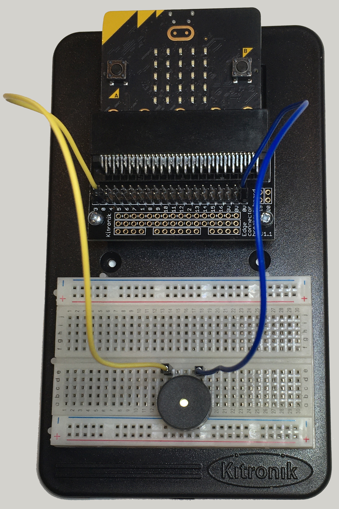

==========================
Piezo_Buzzer_and_music
==========================

| See: https://microbit-micropython.readthedocs.io/en/v2-docs/music.html

.. py:module:: music

Connections
--------------------------

| The buzzer is usually connected to pin0.
| If it is connected to pin1 or pin2 instead, the pin number must be used as a parameter in the play method.

----

Model
----------------------------------------

#.  Place the buzzer first. It pins directly into the breadboard. Ignore the diagram suggestion that wires are used.
#.  Connect with the jumper wires to the edge-connector using pin0 and ground, 0V.

.. image:: images/buzzer_bb.png
    :scale: 50 %

----

Library
----------------------------------------

| Put ``import music`` at the top under ``from microbit import *``.

----

.. py:function::  music.play(music, pin=pin0, wait=True, loop=False)

    Play the music.

    If music can be a string, such as 'c1:4', or a list of notes as strings, such as ['c', 'd', 'e']

    The duration and octave values are reset to their defaults before the music is played.

    The output pin can be used to override the default pin0. Use pin=None to prevent sounds being played.

    If wait is set to True, playing is blocking, and the music will be played to the end.

    If loop is set to True, the music repeats until stop is called.

.. py:function::  music.stop(pin=pin0)

    Stops all music playback on the built-in speaker and any pin outputting sound. 
    
    An optional argument can be provided to specify a pin, eg. music.stop(pin1).

.. py:function::  music.reset()

    Resets the state of the following attributes as listed:
    ticks = 4; bpm = 120; duration = 4; octave = 4

.. py:function::  music.set_tempo(ticks=4, bpm=120)

    Sets the tempo for playback.

    A number of ticks, expressed as an integer, make a beat. The default is 4 ticks per beat.
    
    Each beat is to be played at a certain frequency, beats per minute, expressed as an integer. The default is 120 bpm.

| Examples of use:
| music.set_tempo() - reset the tempo to default of ticks = 4, bpm = 120
| music.set_tempo(ticks=8) - change the beat to 8 ticks
| music.set_tempo(bpm=240) - just change the tempo to 240 beats per minute

| The length of a beat in milliseconds is (60 sec * 1000 / bpm). 
| For the default value of 120 bpm, that's 60000/120 or 1 beat in 500 milliseconds.

.. py:function::  music.get_tempo()

    Gets the current tempo as a tuple of integers: (bpm, ticks).

| To display the tuple from get_tempo it can be converted to a string:

.. code-block:: python

    from microbit import *
    import music

    music.set_tempo(ticks=4, bpm=240)
    tempo_data = str(music.get_tempo())
    display.scroll(tempo_data)

| Each value in the tuple can be accessed using its index as shown below:

.. code-block:: python

    from microbit import *
    import music

    music.set_tempo(ticks=2, bpm=120)
    tempo_data = music.get_tempo()
    bpm = tempo_data[0]
    ticks = tempo_data[1]
    display.scroll(bpm)
    display.scroll(ticks)

| For advanced users, tuple unpacking can be used instead of indices.
| See: https://www.w3schools.com/python/python_tuples_unpack.asp

.. code-block:: python

    from microbit import *
    import music

    music.set_tempo(ticks=2, bpm=120)
    bpm, ticks = music.get_tempo()
    display.scroll(bpm)
    display.scroll(ticks)

----

Notes
----------------------------------------

| An individual note is specified thus: ``NOTE[octave][:duration]``.
| Notes are the letters a to g. Lower case or upper case are the same.
| If the octave is left out it defaults to 4 (containing middle C).
| If the duration is left out it defaults to 4 (a crotchet).
| For example, ``a2:4`` refers to the note “A” in octave 2 that lasts for four ticks (a tick is an arbitrary length of time defined by a tempo setting function). If the note name R is used then it is treated as a rest (silence).
| Accidentals (flats and sharps) are denoted by the b (flat - a lower case b) and # (sharp - a hash symbol). For example, ``Ab`` is A-flat and ``C#`` is C-sharp.
| The octave and duration parameters are states that carry over to subsequent notes until re-specified. 
| The tempo can be set using ``music.set_tempo(ticks=4, bpm=120)``

| Use ``music.play(note)`` to play a note in the ``note`` variable.

.. code-block:: python

    from microbit import *
    import music

    note = 'c4:8'
    music.play(note)

| Use ``music.play(notes)`` to play a list of notes in the ``notes_list`` variable.
| The code below plays a list of notes that use various forms to specify them.

.. code-block:: python

    from microbit import *
    import music

    notes_list = ['c4:1', 'e:4', 'g:8', 'c:2', 'e5', 'g4','f#','eb']

    music.set_tempo(ticks=4, bpm=240)
    music.play(notes_list)

----

.. admonition:: Tasks

    #. Play the 5 notes: c, e, g, e, c.

    .. dropdown::
            :icon: codescan
            :color: primary
            :class-container: sd-dropdown-container

            .. tab-set::

                .. tab-item:: Q1

                    Play a list of notes.

                    .. code-block:: python
                        from microbit import *
                        import music

                        notes_list = ['c4:4', 'e', 'g', 'e', 'c']

                        music.set_tempo(ticks=4, bpm=240)

                        while True:
                            music.play(notes_list)
                            sleep(1000)

----

Scales
----------------------------------------

| The lists below are the notes of scales.
| Press A or B to play a different scale.

.. code-block:: python

    from microbit import *
    import music

    cmajor = ['c', 'd', 'e', 'f', 'g', 'a', 'b']
    eminor = ['e', 'f#', 'g', 'a', 'b', 'c', 'd']

    while True:
        if button_a.is_pressed():
            music.play(cmajor)
        elif button_b.is_pressed():
            music.play(eminor)
        sleep(1000)

----

Built in music
----------------------------------------

| There are built in melodies that can be found by typing ``music.``
| Melodies can be played using ``music.play(melody).

.. code-block:: python

    from microbit import *
    import music

    music.play(music.PYTHON)

| The code below uses a for loop to loop through each melody in the ``melodies_list`` and play it.
| For a list of built in meodies see: https://microbit-micropython.readthedocs.io/en/v2-docs/music.html

.. code-block:: python

    from microbit import *
    import music

    melodies_list = [music.PYTHON, music.BADDY, music.CHASE]
    for melody in melodies_list:
        music.play(melody)

----

All Built in melodies
----------------------------------------

| This code plays all the melodies.

.. code-block:: python

    from microbit import *
    import music

    built_in_tunes = [music.DADADADUM, music.ENTERTAINER, music.PRELUDE,
    music.ODE, music.NYAN, music.RINGTONE, music.FUNK, music.BLUES,
    music.BIRTHDAY, music.WEDDING, music.FUNERAL, music.PUNCHLINE,
    music.PYTHON, music.BADDY, music.CHASE, music.BA_DING, 
    music.WAWAWAWAA, music.JUMP_UP, music.JUMP_DOWN, music.POWER_UP,
    music.POWER_DOWN]

    while True:
        for tune in built_in_tunes:
            music.play(tune)
            sleep(1000)

