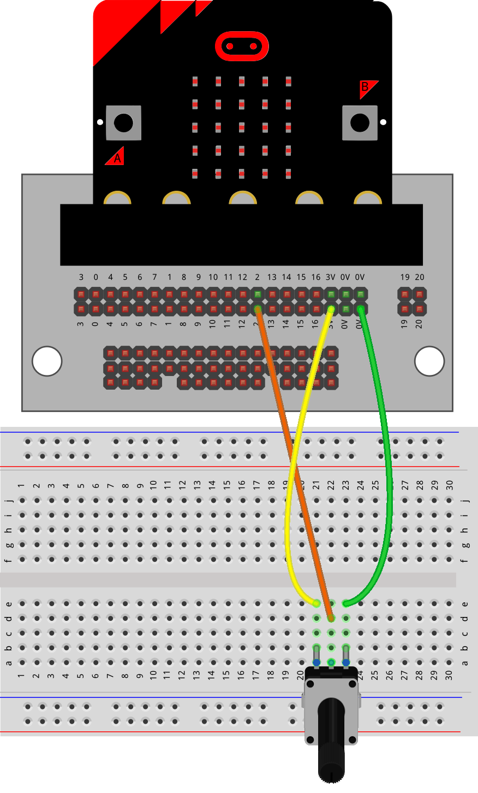
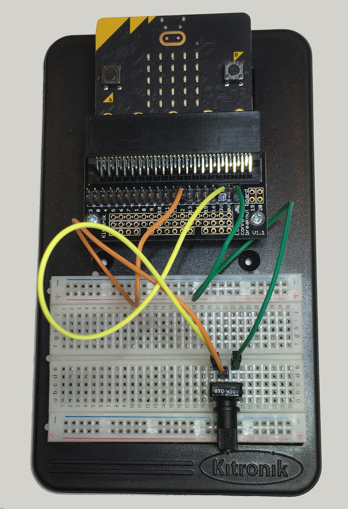

==========================
Potentiometer
==========================

| The examples below use sequence without definition blocks which are preferred to better organize the code.
| See https://pc-microbit-micropython.readthedocs.io/en/latest/breadboards/Potentiometer_2.html

----

| The potentiometer is a variable resistor.
| Turn it one way to reduce the resistance. Turn it the other way to increase it.

----

Model
----------------------------------------

#.  Place the potentiometer.
#.  Connect with the jumper wires.

----

Read analog
----------------------------------------

| To read the value of the potentiometer use ``pin2.read_analog``.
| The code below reads the value and displays it.
| Try turning it from side to side to see the effect.

.. code-block:: python

    from microbit import *

    while True:
        pot_val = pin2.read_analog()
        display.scroll(pot_val, delay=80)
        sleep(20)

----

Scaling potentiometer readings
----------------------------------------

.. py:function:: scale(value, from_, to)

    Converts a value from a range to another range.

    :param value: A number to convert.
    :param from_: A tuple to define the range to convert from.
    :param to: A tuple to define the range to convert to.

    :returns: The ``value`` converted to the ``to`` range.

    e.g. temp_fahrenheit = scale(30, from_=(0.0, 100.0), to=(32.0, 212.0))

.. admonition:: Tasks

    #. Modify the code to scale the potentiometer value in the range 0 to 9 and scrolls its value.

    .. dropdown::
            :icon: codescan
            :color: primary
            :class-container: sd-dropdown-container

            .. tab-set::

                .. tab-item:: Q1

                    Modify the code to scale the potentiometer value in the range 0 to 9 and scrolls its value.

                    .. code-block:: python

                        from microbit import *

                        while True:
                            pot_val = pin2.read_analog()
                            scaled_pot_val = scale(pot_val, from_=(0.0, 1023.0), to=(0, 9))
                            display.scroll(scaled_pot_val, delay=80)
                            sleep(20)

----

EXT: Demo: Power meter simulation
----------------------------------------

| The code below takes an analog value from the potentiometer and displays it on the microbit LEDs.
| See the custom images lesson for more on ``display.set_pixel``.
| The maximum potentiometer reading is 1023, so this can be treated as 1000 for simplicity.
| This gives 5 levels in steps of 200.
|
.. code-block:: python

    from microbit import *

    while True:
        level = pin2.read_analog()
        val = int((level % 200) * 9 / 200)

        # Determine row position for the bar
        y_val = max(0, 4 - (level // 50)) if level > 0 else 5

        # Update display pixels
        for x in range(5):
            if y_val < 5:
                display.set_pixel(x, y_val, val)  # Set active pixel brightness
            for y in range(5):
                display.set_pixel(x, y, 9 if y >= y_val else 0)  # Set other pixels

        sleep(20)