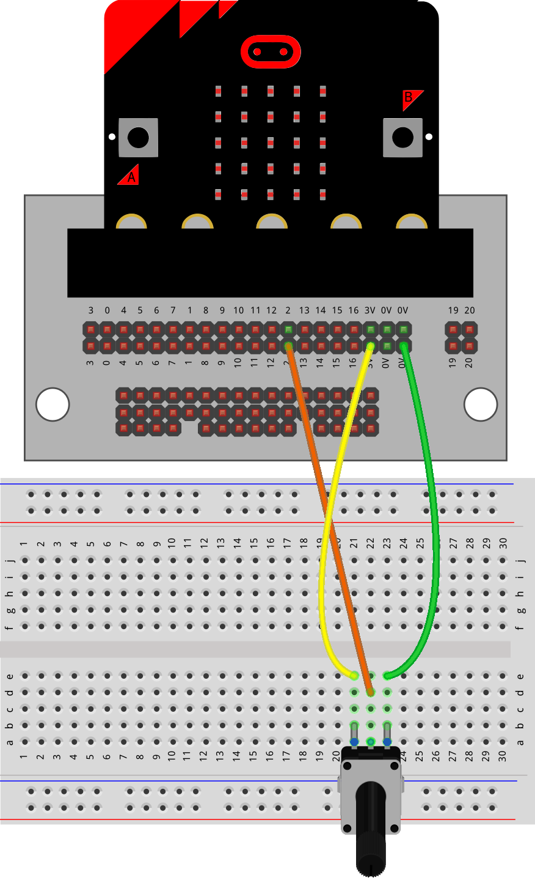
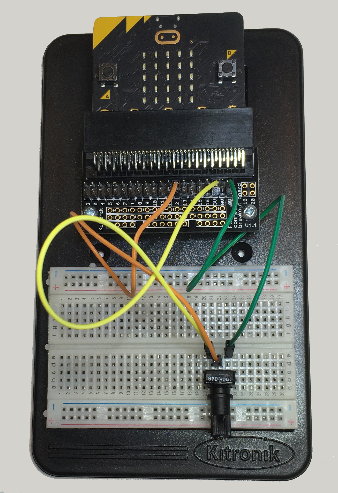

==========================
Potentiometer
==========================

| The potentiometer is a variable resistor.
| Turn it one way to reduce the resistance. Turn it the otehr way to increase it.

Model
----------------------------------------

#.  Place the potentiomter.
#.  Connect with the jumper wires.

----

Read analog
----------------------------------------

| To read the value of the potentiometer use ``pin2.read_analog``.
| The code below reads the value and displays it.
| Try turning it from side to side to see the effect.

.. code-block:: python

    from microbit import *

    while True:
        potval = pin2.read_analog()
        display.scroll(potval, delay=80)
        sleep(20)

