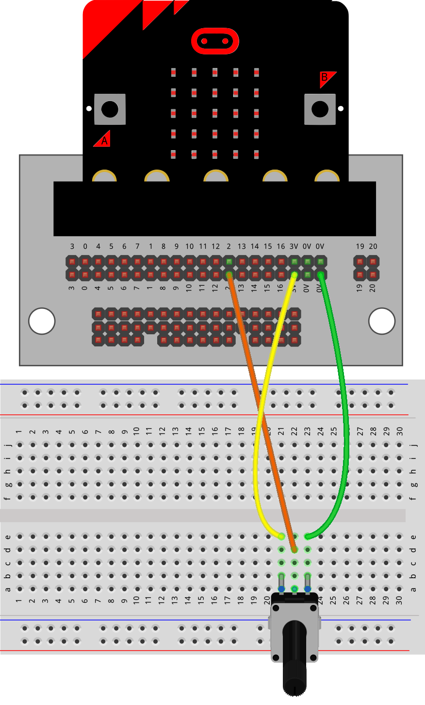

==========================
EXT: Potentiometer
==========================

The examples below use definition blocks to better organize the code.

----

| The potentiometer is a variable resistor.
| Turn it one way to reduce the resistance. Turn it the other way to increase it.

----

Model
----------------------------------------

#.  Place the potentiometer.
#.  Connect with the jumper wires.

.. image:: images/potentiometer_1.jpg
    :scale: 30 %

----

Read analog
----------------------------------------

| To read the value of the potentiometer use ``pin2.read_analog``.
| The code below reads the value and displays it.
| Try turning it from side to side to see the effect.

.. code-block:: python

    from microbit import *

    while True:
        pot_val = pin2.read_analog()
        display.scroll(pot_val, delay=80)
        sleep(20)

----

Scaling the readings
----------------------------------------

.. py:function:: scale(value, from_, to)

    Converts a value from a range to another range.

    :param value: A number to convert.
    :param from_: A tuple to define the range to convert from.
    :param to: A tuple to define the range to convert to.

    :returns: The ``value`` converted to the ``to`` range.

    e.g. temp_fahrenheit = scale(30, from_=(0.0, 100.0), to=(32.0, 212.0))

.. admonition:: Tasks

    #. Modify the code to scale the potentiometer value in the range 0 to 9 and scrolls its value.

    .. dropdown::
            :icon: codescan
            :color: primary
            :class-container: sd-dropdown-container

            .. tab-set::

                .. tab-item:: Q1

                    Modify the code to scale the potentiometer value in the range 0 to 9 and scrolls its value.

                    .. code-block:: python

                        from microbit import *

                        while True:
                            pot_val = pin2.read_analog()
                            scaled_pot_val = scale(pot_val, from_=(0.0, 1023.0), to=(0, 9))
                            display.scroll(scaled_pot_val, delay=80)
                            sleep(20)

----

Advanced: Power meter simulation
----------------------------------------

.. image:: images/potentiometer_level.png
    :scale: 50 %
    :align: center

| The code below takes an analog value from the potentiometer and displays it on the microbit LEDs.
| See the custom images lesson for more on ``display.set_pixel``.
| The maximum potentiometer reading is 1023, so this can be treated as 1000 for simplicity.
| This gives 5 levels in steps of 200.
| Each row step of 200 can be divided into 10 steps of brightness from 0 to 9.
| 3 variables are used for each section of the display: **y_clear_list** for the blank rows, **y_list** for the full brightness rows and **y_val** for the row in between that is of partial brightness.
| **y_clear_list** has the rows which are at brightness of 0.
| **y_list** has the rows which are at brightness of 9.
| **y_val** is the row with variable brightness.
| Each of these variables is first checked to see if it is ``None`` before setting the pixels it controls.

.. code-block:: python

    from microbit import *

    def display_level(level):
        x_list = [0, 1, 2, 3, 4]

        # display
        val = int((level % 200) * 9 / 200)
        if level < 200:
            y_val = 4
            y_list = None
            y_clear_list = [0, 1, 2, 3]
        elif level < 400:
            y_val = 3
            y_list = [4]
            y_clear_list = [0, 1, 2]
        elif level < 600:
            y_val = 2
            y_list = [3, 4]
            y_clear_list = [0, 1]
        elif level < 800:
            y_val = 1
            y_list = [2, 3, 4]
            y_clear_list = [0]
        elif level < 1000:
            y_val = 0
            y_list = [1, 2, 3, 4]
            y_clear_list = None
        else:
            y_val = None
            y_list = [0, 1, 2, 3, 4]
            y_clear_list = None

        for x in x_list:
            if y_val is not None:
                display.set_pixel(x, y_val, val)
            if y_list is not None:
                for y in y_list:
                    display.set_pixel(x, y, 9)
            if y_clear_list is not None:
                for y in y_clear_list:
                    display.set_pixel(x, y, 0)

    def display_potentiometer_level(pin=pin2):
        pot_val = pin2.read_analog()
        display_level(pot_val)

    while True:
        display_potentiometer_level()
        sleep(20)
