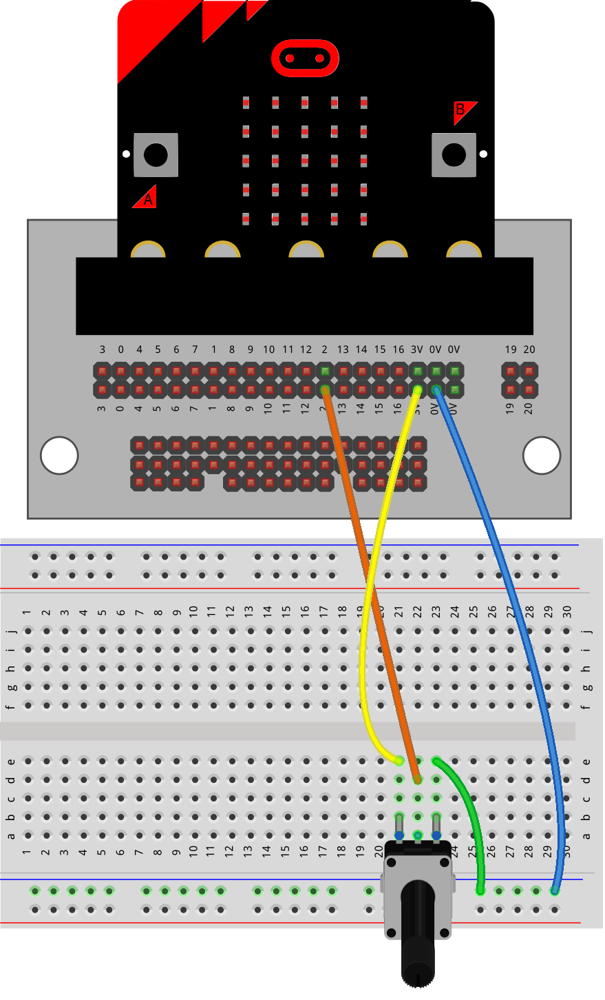
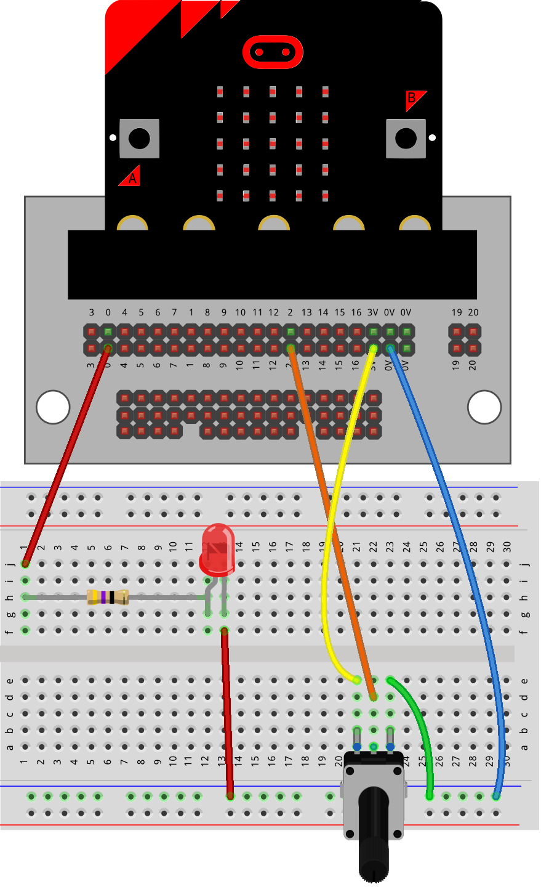

==========================
Potentiometer_with_LED
==========================

Connections
--------------------------

| The LEDs must be placed in line with a 47 ohm resistor.
| The 47 ohm resistor has Yellow, Violet, Black, Gold coloured bands.

----

Model
----------------------------------------

#.  Place the resistor first.
#.  Place the LEDs with the long lead (leg) so that it is closest to the pin side of the circuit. In this model, the long lead is on the left side of the breadboard.
#.  Place the potentiometer.
#.  Connect with the jumper wires.

Read and Write analog
----------------------------------------

| The code below reads the value of the potentiometer and uses it to control the LED brightness.
| Try turning it from side to side to see the effect.

.. code-block:: python

    from microbit import *

    while True:
        potval = pin2.read_analog()
        display.scroll(potval, delay=80)
        pin0.write_analog(potval)
        sleep(40)

----

.. admonition:: Tasks

    #. Connect a second LED with its own resistor via pin1. Control it via the potentiometer.

