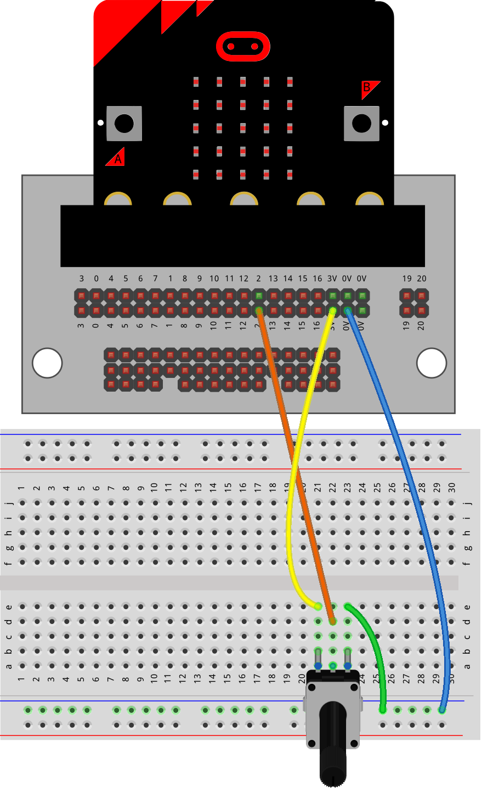

==========================
Potentiometer_with_LED
==========================

Connections
--------------------------

| The LED must be placed in line with a 47 ohm resistor.
| The 47 ohm resistor has Yellow, Violet, Black, Gold coloured bands.

.. image:: images/47ohm.png
    :scale: 50 %

----

Model
----------------------------------------

#.  Place the resistor first.
#.  Place the LEDs with the long lead (leg) so that it is closest to the pin side of the circuit. In this model, the long lead is on the left side of the breadboard.
#.  Place the potentiometer.
#.  Connect with the jumper wires.

----

Read and Write analog
----------------------------------------

| The code below reads the value of the potentiometer and uses it to control the LED brightness.
| Try turning it from side to side to see the effect.

.. code-block:: python

    from microbit import *

    while True:
        pot_val = pin2.read_analog()
        pin0.write_analog(pot_val)
        sleep(40)

----

.. admonition:: Tasks

    #. Connect a second LED with its own resistor via pin1. Control it via the potentiometer as well.
    #. With 2 LEDs connected, adjust the code so that they have opposite brightness. e.g when the potentiometer value is 1023, one LED is powered by write_analog(1023) and the other LED is powered by write_analog(0).

    .. dropdown::
            :icon: codescan
            :color: primary
            :class-container: sd-dropdown-container

            .. tab-set::

                .. tab-item:: Q1

                    Connect a second LED with its own resistor via pin1. Control it via the potentiometer as well.

                    .. code-block:: python

                        from microbit import *

                        while True:
                            pot_val = pin2.read_analog()
                            pin0.write_analog(pot_val)
                            pin1.write_analog(pot_val)
                            sleep(40)

                .. tab-item:: Q2

                    With 2 LEDs connected, adjust the code so that they have opposite brightness. e.g when the potentiometer value is 1023, one LED is powered by write_analog(1023) and the other LED is powered by write_analog(0).

                    .. code-block:: python

                        from microbit import *

                        while True:
                            pot_val = pin2.read_analog()
                            pin0.write_analog(pot_val)
                            pin1.write_analog(1023 - pot_val)
                            sleep(40)

----

.. admonition:: Exercise

    #. Use a red and yellow led on separate pins. When the potentiometer value is 500 or more, use digital write to turn on the yellow led and turn the red led off. When the potentiometer value is under 500, use digital write to turn on the red led and turn the yellow led off.
    #. Add to the code above to display a yes image when the yellow led is on and a no image when the red led is on.
    #. Use pin 8 or pin 12 for a third led and control the three leds using if and elif such that each led has at least a 300 units range for itself from the potentiometer reading.

    Some starting code to build from:

    .. code-block:: python

        from microbit import *

        def low_pot():
            pin0.write_digital(0)
            pin1.write_digital(1)

        def high_pot():
            pin0.write_digital(1)
            pin1.write_digital(0)

        while True:
            pot_val = pin2.read_analog()
            if pot_val >= 500:
                low_pot()
            else:
                high_pot()
            sleep(40)
