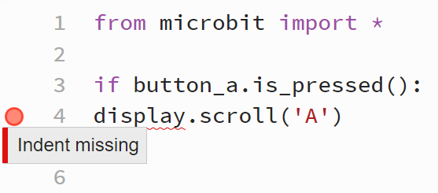
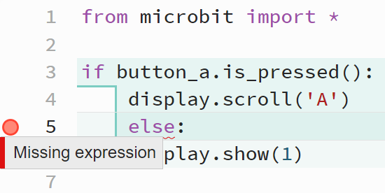
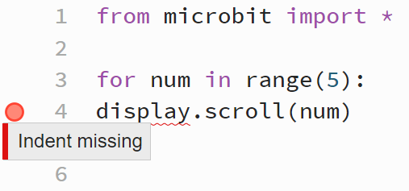

====================================================
Indentation Errors
====================================================

| Indentation needs to be consistent, since python uses indentation to block code together.
| Indentation is used with selection (if...elif...else) and iteration (while, for) to group the code together after the colon.

----

Missing Indentation after if statement
---------------------------------------------

| The correctly indented code is below:

.. code-block:: python

    from microbit import *

    if button_a.is_pressed():
        display.scroll('A')

| In the code below, ``display.scroll('A')`` should be indented, but is not.

.. code-block:: python

    from microbit import *

    if button_a.is_pressed():
    display.scroll('A')

| The error check shows that an indented block was expected to follow the if statement.

----

else statement indented by mistake
---------------------------------------------

| The correctly indented code is below:

.. code-block:: python

    from microbit import *

    if button_a.is_pressed():
        display.scroll('A')
    else:
        display.show(1)

| In the code below, ``else`` should not be indented, but it is.

.. code-block:: python

    from microbit import *

    if button_a.is_pressed():
        display.scroll('A')
        else:
        display.show(1)

| The error check shows a syntax error for the else statement.
| This needs to be fixed first, and once it's indentation is removed, the error in the last line will disappear.

----

for-loop not indented
---------------------------------------------

| The correctly indented code is below:

.. code-block:: python

    from microbit import *

    for num in range(5):
        display.scroll(num)

| In the code below, ``display.scroll(num)`` should be indented, but it is not.

.. code-block:: python

    from microbit import *

    for num in range(5):
    display.scroll(num)

| The error check shows a syntax error and an expected indentation after the for statement.

