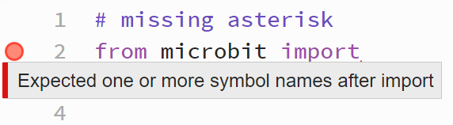
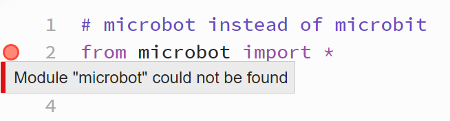
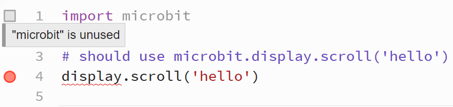

====================================================
Library Errors
====================================================

Missing asterisk
---------------------------------------------

| Normally the full microbit library is imported via ``from microbit import *``.
| In the code below, the final ``*`` has been left out.

.. code-block:: python

    # missing asterisk
    from microbit import 

| If the asterisk is left out, a small red triangle will be shown at the end of the line.

----

Missing space before asterisk
---------------------------------------------

| In the code below, a space has been left out from before the final ``*``.
| Even though the code will work, this is bad coding.

.. code-block:: python

    # missing space before the asterisk
    from microbit import*

| The Python interpreter is designed to be flexible in interpreting the syntax. In the case of import*, even though it's not the standard way to write it, the Python interpreter can still understand it.
| When the Python interpreter sees import*, it recognizes import as a keyword and * as a wildcard character. The lack of space doesn't prevent the interpreter from understanding the command. It knows that import is a command to import a module, and * means everything from that module.

----

Misspelt library
-----------------------------------

| If the microbit library is misspelt, then an **module not found** error occurs, as shown below.

.. code-block:: python

    # microbot instead of microbit
    from microbot import *

----

Imported library not used
--------------------------

| If the microbit library is imported via ``import microbit``, all microbit code needs to start with ``microbit.``.
| In the code below, the line should be: ``microbit.display.scroll('hello')``.
| If ``microbit.`` is left out, a red wavy line will be shown where the errors are.
| ``display`` will not be recognized, (**undefined name**), since python has not been told that it is in microbit library.
| The microbit library will also appear not to be used.

.. code-block:: python

    import microbit

    # should use microbit.display.scroll('hello')
    display.scroll('hello')

