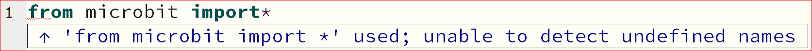
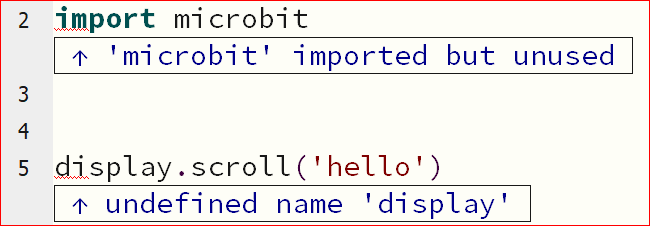

====================================================
Library Errors
====================================================

Missing asterisk
---------------------------------------------

| Normally the full microbit library is imported via ``from microbit import *``.
| In the code below, the final ``*`` has been left out.

.. code-block:: python

    # missing asterisk
    from microbit import 

| If the asterisk is left out, a red wavy line will be shown at the end of the line and a **Syntax error** is reported.
| It hints that the asterisk, \*, is missing.

----

Missing space before asterisk
---------------------------------------------

| In the code below, a space has been left out from before the final ``*``.

.. code-block:: python

    # missing space before the asterisk
    from microbit import*

| If the space before the askterisk is left out, then an **undefined names** error occurs, as shown below.

----

Misspelt library
-----------------------------------

| If the microbit library is misspelt, then an **undefined names** error occurs, as shown below.

.. code-block:: python

    # microbot instead of microbit
    from microbot import *

----

Imported library not used
--------------------------

| If the microbit library is imported via ``import microbit``, all microbit code needs to start with ``microbit.``.
| In the code below, the line should be: ``microbit.display.scroll('hello')``.
| If ``microbit.`` is left out, a red wavy line will be shown where the errors are.
| ``display`` will not be recognised, (**undefined name**), since python has not been told that it is in microbit library.
| The microbit library will also appear not to be used.

.. code-block:: python

    import microbit

    # should use microbit.display.scroll('hello')
    display.scroll('hello')

