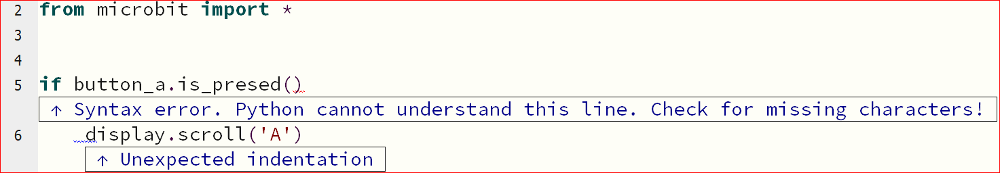
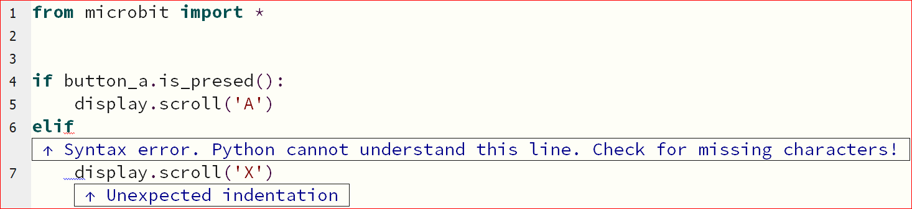
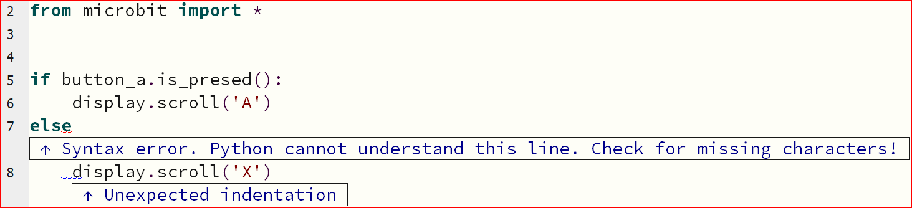
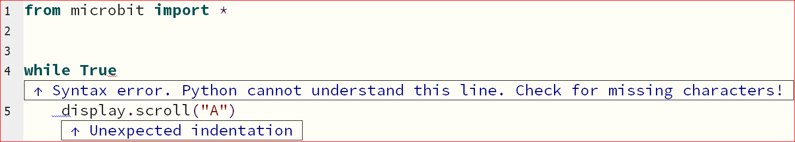
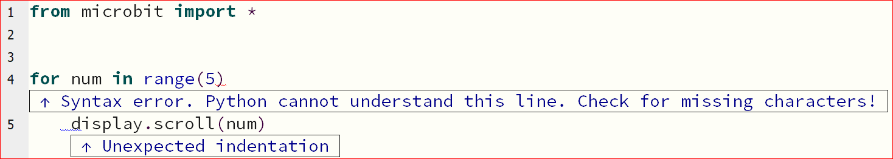

====================================================
Missing colon Errors
====================================================

If: Missing colon
-----------------------------------

| If the colon is left out from the end of the ``if`` line, a **Syntax error** occurs.

.. code-block:: python

    from microbit import *

    # if button_a.is_pressed():
    if button_a.is_pressed()
        display.scroll('A')

| A red wavy line shown where the colon should have been. 
| A blue wavy line shows where the unexpected indentation occurred.
| The indentation is only needed after a colon.
| But, it is not the indentation that needs fixing; the colon just need adding.
| This shows that it is important to fix code from the top of a python script.

----

Elif: Missing colon
-----------------------------------

| If the colon is left out from the end of the ``if`` line, a **Syntax error** occurs.

.. code-block:: python

    from microbit import *

    if button_a.is_pressed():
        display.scroll('A')
    # elif:
    elif
        display.scroll('X')  

| A red wavy line shown where the colon should have been. 
| A blue wavy line shows where the unexpected indentation occurred.
| The indentation is only needed after a colon.
| But, it is not the indentation that needs fixing; the colon just need adding.
| This shows that it is important to fix code from the top of a python script.

----

Else: Missing colon
-----------------------------------       

| If the colon is left out from the end of the ``else`` line, a **Syntax error** occurs.

.. code-block:: python

    from microbit import *

    if button_a.is_pressed():
        display.scroll('A')
    # else:
    else
        display.scroll('X')   

| A red wavy line shown where the colon should have been. 
| A blue wavy line shows where the unexpected indentation occurred.
| The indentation is only needed after a colon.

----

While: Missing colon
-----------------------------------

| If the colon is left out from the end of the ``while`` line, a **Syntax error** occurs.

.. code-block:: python

    from microbit import *

    while True
        display.scroll("A")

| The Syntax error statement suggests to check for missing characters. The end colon is missing.

----

For: Missing colon
-----------------------------------

| If the colon is left out from the end of the ``for`` line, a **Syntax error** occurs.

.. code-block:: python

    from microbit import *

    for num in range(5)
        display.scroll(num)

| The Syntax error statement suggests to check for missing characters. The end colon is missing.

    