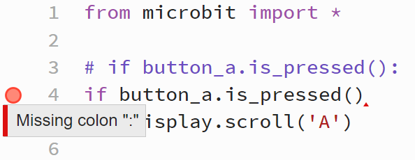
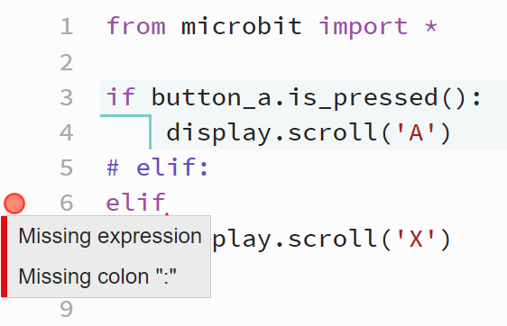
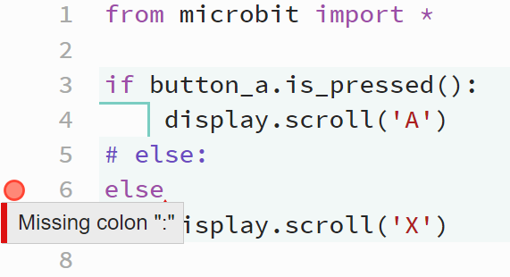

====================================================
Missing colon Errors
====================================================

If: Missing colon
-----------------------------------

| If the colon is left out from the end of the ``if`` line, an error occurs.
| A red triangle shown where the colon should have been. 

.. code-block:: python

    from microbit import *

    # if button_a.is_pressed():
    if button_a.is_pressed()
        display.scroll('A')

----

Elif: Missing colon
-----------------------------------

| If the colon is left out from the end of the ``elif`` line, an error occurs.
| A red triangle shown where the colon should have been. 

.. code-block:: python

    from microbit import *

    if button_a.is_pressed():
        display.scroll('A')
    # elif:
    elif
        display.scroll('X')  

----

Else: Missing colon
-----------------------------------       

| If the colon is left out from the end of the ``else`` line, an error occurs.
| A red triangle shown where the colon should have been. 

.. code-block:: python

    from microbit import *

    if button_a.is_pressed():
        display.scroll('A')
    # else:
    else
        display.scroll('X')   

----

While: Missing colon
-----------------------------------

| If the colon is left out from the end of the ``while`` line, an error occurs.
| A red triangle shown where the colon should have been. 

.. code-block:: python

    from microbit import *

    while True
        display.scroll("A")

.. image:: images/while_missing_colon.png
    :scale: 50 %

----

For: Missing colon
-----------------------------------

| If the colon is left out from the end of the ``for`` line, an error occurs.
| A red triangle shown where the colon should have been. 

.. code-block:: python

    from microbit import *

    for num in range(5)
        display.scroll(num)

| The Syntax error statement suggests to check for missing characters. The end colon is missing.

.. image:: images/for_missing_colon.png
    :scale: 50 %

    