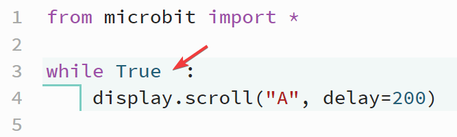

====================================================
Unwanted Whitespace
====================================================

| Whitespace is mainly made up of spaces, tabs and return characters.
| Extra spaces can sometimes work even if they shouldn't be there.
| Sometimes extra spaces can also cause errors.

----

Unwanted whitespace before parentheses
------------------------------------

| In the if statement below an unwanted space has been placed before the parentheses.
| Python's interpreter ignores the extra whitespace. 
| However, it's considered good practice to follow the convention and not include the space before the parentheses.

.. code-block:: python
    
    from microbit import *

    if button_a.is_pressed ():
        display.scroll('A')

.. image:: images/space_before_parentheses.png
    :scale: 50 %

----

Unwanted whitespace in parentheses
------------------------------------

| In the if statement below, an unwanted space has been placed in the parentheses.
| Python's interpreter ignores the extra whitespace. 
| However, it's considered good practice to follow the convention and not include the space in the parentheses.

.. code-block:: python
    
    from microbit import *

    if button_a.is_pressed( ):
        display.scroll('A')

----

Unwanted whitespace around equals in an argument
-------------------------------------------------------

| In the code below, ``delay = 200`` has a space before the equals sign and after it.
| Pressing check will indicate that the space should not be there.
| This is not an error. It will still work in the microbit.
| ``delay=200`` is the preferred format.
| Press the **tidy** button to remove the extra whitespace. 

.. code-block:: python

    from microbit import *

    while True:
        display.scroll("A", delay = 200)

----

Unwanted whitespace before colon
-------------------------------------------------------

| In the code below, ``while True  :`` has spaces before the colon.
| Pressing check with not reveal an issue.
| This is not an error. It will still work on the microbit.
| ``while True:`` is the preferred format.
| Press the **tidy** button to remove the extra whitespace. 

.. code-block:: python

    from microbit import *

    while True  :
        display.scroll("A", delay=200)

----

Unwanted whitespace after keyword
-------------------------------------------------------

| In the code below, ``while  True:`` has extra spaces after the 'while'.
| Pressing check with not reveal an issue.
| This is not an error. It will still work on the microbit.
| ``while True:`` is the preferred format.
| Press the **tidy** button to remove the extra whitespace. 

.. code-block:: python

    from microbit import *

    while  True:
        display.scroll("A", delay=200)

----

Whitespace missing around equals operator
-------------------------------------------------------

| In the code below, ``total=2+5`` lacks spaces around both the '=' and the "+" operators.
| ``total = 2 + 5`` is the preferred format.
| Press the **tidy** button to add the extra whitespace. 

.. code-block:: python

    from microbit import *

    total=2+5
    display.scroll(total, delay=200)

