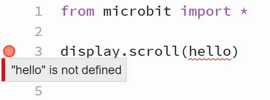

====================================================
Variable Errors
====================================================

Variable used which has no value
-----------------------------------

| ``display.scroll('hello')`` scrolls 'hello' across the microbit.
| If 'hello' is not in quotes, it will be treated as a variable.
| If ``display.scroll(hello)`` is used by accident, leaving out the quotes, a **variable not defined** error occurs. 

.. code-block:: python

    from microbit import *

    display.scroll(hello)

This can be fixed by giving the variable a value, as shown below:

.. code-block:: python
    
    from microbit import *

    hello = 'Hi'
    display.scroll(hello)

