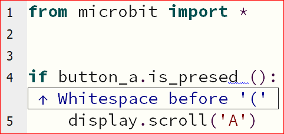
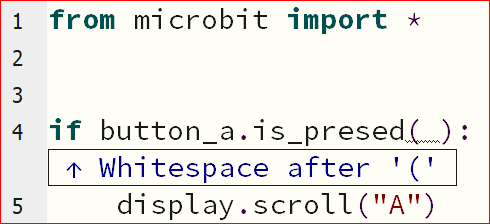

====================================================
Whitespace Errors
====================================================

| Whitespace is mainly made up of spaces, tabs and return characters.
| Extra spaces can sometimes work even if they shouldn't be there.
| Sometimes extra spaces can also cause errors.

----

Whitespace before parentheses in button method: Error
-------------------------------------------------------

| In the if statement below an unneeded space has been placed before the parentheses.
| When Check is pressed, it reports that there is Whitespace before the "(".
| Without fixing this, after flashing to the microbit, it reports a line 5 error.
| Press the **tidy** button to remove the extra whitespace. 

.. code-block:: python
    
    from microbit import *

    if button_a.is_pressed ():
        display.scroll('A')

----

Whitespace in parentheses: Error
-------------------------------------------------------

| In the if statement below an unneeded space has been placed in the parentheses.
| When Check is pressed, it reports that there is Whitespace after the "(".
| Without fixing this, after flashing to the microbit, it reports a line 4 error.
| Press the **tidy** button to remove the extra whitespace. 

.. code-block:: python
    
    from microbit import *

    if button_a.is_pressed( ):
        display.scroll('A')

