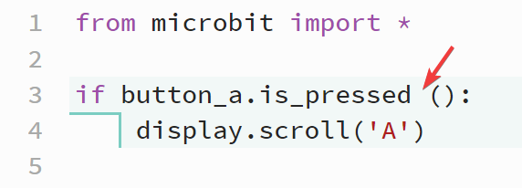

====================================================
Whitespace Errors
====================================================

| Whitespace is mainly made up of spaces, tabs and return characters.
| Extra spaces can sometimes work even if they shouldn't be there.
| Sometimes extra spaces can also cause errors.

----

Whitespace before parentheses in button method: Error
-------------------------------------------------------

| In the if statement below an unneeded space has been placed before the parentheses.
| Python's interpreter ignores the extra whitespace. 
| However, it's considered good practice to follow the convention and not include spaces, as it enhances readability and consistency in your code.

.. code-block:: python
    
    from microbit import *

    if button_a.is_pressed ():
        display.scroll('A')

----

Whitespace in parentheses: Error
-------------------------------------------------------

| In the if statement below an unneeded space has been placed in the parentheses.
| Python's interpreter ignores the extra whitespace. 
| However, it's considered good practice to follow the convention and not include spaces, as it enhances readability and consistency in your code.

.. code-block:: python
    
    from microbit import *

    if button_a.is_pressed( ):
        display.scroll('A')

.. image:: images/space_in_parentheses.png
    :scale: 50 %

