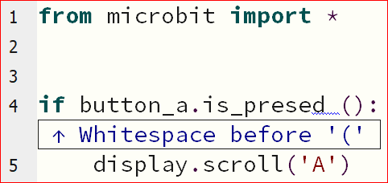

====================================================
Whitespace Non-Errors
====================================================

Proper use of Whitespace improves readability
-------------------------------------------------------

| Whitespace is properly used to improve readability of lists.
| Whitespace (tabs, spaces, line endings) are ignored within a list, so a long list can be set out like that below, 
| with all the Images lined up for easy reading.

.. code-block:: python
    
    from microbit import *

    shape_list = [
        Image.TRIANGLE,
        Image.TRIANGLE_LEFT,
        Image.DIAMOND,
        Image.DIAMOND_SMALL,
    ]
    while True:
        display.show(shape_list, delay=100)

----

Whitespace before parentheses: No Error
-------------------------------------------

| ``display.scroll ("A", delay=200)`` has an unneeded space before the parentheses.
| When Check is pressed, it reports that there is Whitespace before the "(".
| Without fixing this, after flashing to the microbit, it works.
| Press the **tidy** button to remove the extra whitespace. 

.. code-block:: python
    
    from microbit import *

    display.scroll ("A", delay=200)

----

Whitespace around equals in an argument: no Error
-------------------------------------------------------

| ``delay =200`` has a space before the equals sign.
| Pressing check will indicate that the space should not be there.
| This is not an error. It will still work in the microbit.
| ``delay=200`` is the preferred format.
| Press the **tidy** button to remove the extra whitespace. 

.. code-block:: python

    from microbit import *

    while True:
        display.scroll("A", delay =200)

----

Whitespace before colon: no Error
-------------------------------------------------------

| ``while True  :`` has spaces before the colon.
| Pressing check with not reveal an issue.
| This is not an error. It will still work on the microbit.
| ``while True:`` is the preferred format.
| Press the **tidy** button to remove the extra whitespace. 

.. code-block:: python

    from microbit import *

    while True  :
        display.scroll("A", delay=200)

----

Whitespace after keyword: no Error
-------------------------------------------------------

| ``while  True:`` has extra spaces after the 'while'.
| Pressing check with not reveal an issue.
| This is not an error. It will still work on the microbit.
| ``while True:`` is the preferred format.
| Press the **tidy** button to remove the extra whitespace. 

.. code-block:: python

    from microbit import *

    while  True:
        display.scroll("B", delay=200)

----

Whitespace missing around equals operator: no Error
-------------------------------------------------------

| ``total=2+5`` lacks spaces around the '=' operator.
| Pressing check will indicate that the space should be added.
| This is not an error. It will still work on the microbit.
| ``total = 2+5`` is the preferred format.
| Press the **tidy** button to add the extra whitespace. 

.. code-block:: python

    from microbit import *

    total=2+5
    display.scroll(total, delay=200)

