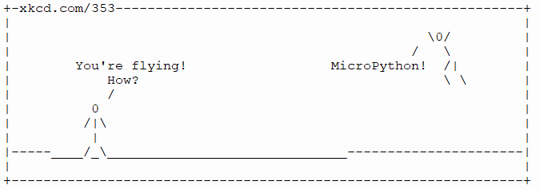

==========================
Modules
==========================

Module list
----------------

| To get a list of built-in modules for the microbit:

| Open the REPL (3 white vertical dots drop down below simulator)
| Type: help('modules')

The output is:

.. table:: Microbit modules
   :widths: auto
=============     =============     =============     ============= 
__main__          machine           power             urandom
antigravity       math              radio             ustruct
audio             microbit          speech            usys
builtins          micropython       this              utime
gc                music             uarray
log               neopixel          ucollections
love              os                uerrno
=============     =============     =============     ============= 

| Use the REPL and the reset button (or command D) to see the output from the print function after flashing to the microbit.

.. code-block:: python
    
    from microbit import *

    print(help('modules'))

----

https://mpython.readthedocs.io/en/master/library/pythonStd/builtins.html

https://mpython.readthedocs.io/en/master/library/pythonStd/ucollections.html

https://github.com/micropython/micropython/tree/master/docs/library

----

----------------
antigravity
----------------

| The ``antigravity`` module has no practical purpose.
| Use the REPL and press the reset button (or ctrl D in the REPL) to see the printout after flashing to the microbit.

.. code-block:: python

    from microbit import *
    import antigravity

----

----------------
love
----------------

| The ``love`` module has limited practical purpose.

.. py:function::  love.badaboom()

    Pulse the heart image 7 times.

.. code-block:: python

    from microbit import *
    import love

    love.badaboom()

----

----------------
this
----------------

| The ``this`` module has no practical purpose.

.. py:function::  this.authors()

    Returns the authors of micropython for the microbit.

| Use the REPL and the reset button to see the printout after flashing to the microbit.

.. code-block:: python

    from microbit import *
    import this

    print(this.authors())

----

----------------
gc
----------------

| See: https://docs.micropython.org/en/latest/library/gc.html

.. py:function::  gc.mem_alloc()

    Return the number of bytes of heap RAM that are allocated.

.. code-block:: python

    from microbit import *
    import gc

    display.scroll(gc.mem_alloc())

.. py:function::  gc.mem_alloc()

    Return the number of bytes of available heap RAM, or -1 if this amount is not known.

.. code-block:: python

    from microbit import *
    import gc

    display.scroll(gc.mem_free())

----

----------------
usys
----------------

| See: https://docs.micropython.org/en/latest/library/sys.html
| Some functions are listed below. Use ``print(help(usys))`` to get the full list.

.. py:function::  usys.version_info()

    Python language version, as a tuple of ints.

.. py:function::  usys.version()

    Python language version, as a string.

.. py:function::  usys.platform()

    The platform that MicroPython is running on. 

.. py:function::  usys.implementation()

    Object with information about the current MicroPython implementation with following attributes:

    name - string “micropython”

    version - tuple (major, minor, micro), e.g. (1, 15, 0)

.. py:function::  usys.maxsize()

    The maximum integer type value that can be saved on the current platform. It returns the number of bytes of heap RAM that are allocated.

| The code below uses the REPL to print the output.

.. code-block:: python

    from microbit import *
    import usys

    # print(help(usys))
    print('version_info', usys.version_info)
    print('version', usys.version)
    print('platform', usys.platform)
    print('implementation', usys.implementation)
    print('maxsize', usys.maxsize)
    if usys.maxsize > 2147483648:
        print('64-bit')
    else:
        print('32-bit')

----

----------------
ustruct
----------------

| See: https://mpython.readthedocs.io/en/master/library/pythonStd/ustruct.html
| See: https://www.educative.io/answers/what-is-the-python-struct-module
| See: https://docs.micropython.org/en/latest/library/struct.html

| The struct module in Python is used to convert native Python data types such as strings and numbers into a string of bytes and vice versa.

Supported size/byte order prefixes: @, <, >, !.

Supported format codes: b, B, h, H, i, I, l, L, q, Q, s, P, f, d (the latter 2 depending on the floating-point support).

Functions:
  * calcsize
  * pack
  * pack_into
  * unpack
  * unpack_from

----

----------------
uerrno
----------------

| The ``uerrno`` module returns errors.
| See: https://mpython.readthedocs.io/en/master/library/pythonStd/uerrno.html

.. py:function::  uerrno.errorcode

    Returns the error codes dictionary object.

.. code-block:: python

    from microbit import *
    import uerrno

    print(help(uerrno))
    error_codes = uerrno.errorcode
    print(error_codes)
    print(uerrno.errorcode[uerrno.EINVAL])
    print(uerrno.errorcode[22])

errorcodes:
{1: 'EPERM', 2: 'ENOENT', 5: 'EIO', 9: 'EBADF', 11: 'EAGAIN', 12: 'ENOMEM', 13: 'EACCES', 17: 'EEXIST', 19: 'ENODEV', 21: 'EISDIR', 22: 'EINVAL', 95: 'EOPNOTSUPP', 98: 'EADDRINUSE', 103: 'ECONNABORTED', 104: 'ECONNRESET', 105: 'ENOBUFS', 107: 'ENOTCONN', 110: 'ETIMEDOUT', 111: 'ECONNREFUSED', 113: 'EHOSTUNREACH', 114: 'EALREADY', 115: 'EINPROGRESS'}

