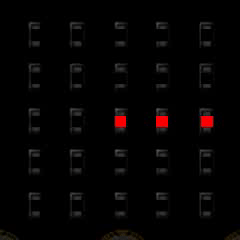

====================================================
Built-in images advanced
====================================================

Advanced use of Built-in Image lists
----------------------------------------

| Image.ALL_CLOCKS and Image.ALL_ARROWS are python objects that can be converted to lists of Image objects.
| Image.ALL_CLOCKS and Image.ALL_ARROWS are of type tuple.
| This can be discovered using by flashing the code below, activating the **REPL**, then using **Control-D** to soft-reset the microbit so it prints the **type**.

.. code-block:: python

    from microbit import *

    clock_list = Image.ALL_CLOCKS
    print(type(clock_list))

| Once converted to a list of Images, the list can be reversed to so that the images can be displayed in an anticlockwise direction instead of clockwise.

| ``list(Image.ALL_CLOCKS)`` can convert **Image.ALL_CLOCKS** to the list: 
| [Image.CLOCK12, Image.CLOCK1, Image.CLOCK2, Image.CLOCK3, Image.CLOCK4, Image.CLOCK5, Image.CLOCK6, Image.CLOCK7, Image.CLOCK8, Image.CLOCK9, Image.CLOCK10, Image.CLOCK11]

| ``list(Image.ALL_ARROWS)`` can convert **Image.ALL_ARROWS** to the list:
| [Image.ARROW_N, Image.ARROW_NE, Image.ARROW_E, Image.ARROW_SE, Image.ARROW_S, Image.ARROW_SW, Image.ARROW_W, Image.ARROW_NW]

----

Reverse direction of list using list slicing
~~~~~~~~~~~~~~~~~~~~~~~~~~~~~~~~~~~~~~~~~~~~~~~~~~~~

| A list, ``arrow_list``, can be reversed using the slicing technique: ``arrow_list[::-1]``.
| ``arrow_list_anticlockwise = arrow_list[::-1]`` reverses the list and places it in a the variable ``arrow_list_anticlockwise``.

.. code-block:: python

    from microbit import *

    arrow_list = list(Image.ALL_ARROWS)
    arrow_list_anticlockwise = arrow_list[::-1]
    while True:
        display.show(arrow_list_anticlockwise, delay=200)

----

Reverse direction of a list using the reverse method
~~~~~~~~~~~~~~~~~~~~~~~~~~~~~~~~~~~~~~~~~~~~~~~~~~~~~~~

| The basic syntax to reverse a list **in place** is:

.. py:function:: a_list.reverse()

    | The list, **a_list**, is reversed. No parameters are involved.

| A list, **clock_list**, can be reversed using the **reverse** **method**: ``clock_list.reverse()``.
| The original list has its elements reversed.
| Note that is it necessary to create the list from Image.ALL_CLOCKS, since the reverse method doesn't work directly on Image.ALL_CLOCKS.  

.. code-block:: python

    from microbit import *

    clock_list = list(Image.ALL_CLOCKS)
    clock_list.reverse()
    while True:
        display.show(clock_list, delay=200)

----

Reverse direction of list using the reversed function
~~~~~~~~~~~~~~~~~~~~~~~~~~~~~~~~~~~~~~~~~~~~~~~~~~~~~~~~

| The basic syntax to reverse a list using the **reversed** **function** is:

.. py:function:: reversed(sequence)

    | sequence is the list to reverse.

| A list, **clock_list**, can be reversed using the reversed function: ``reversed(clock_list)``.
| The python object obtained from the reversed function can be used directly by **display.show**.
| The reversed object is a generator that can only be iterated through once.
| Note that is it not necessary to create the list from Image.ALL_CLOCKS, since the reversed function can work directly on Image.ALL_CLOCKS.

| The code below only displays the clock hands once despite being in a while loop since the generator that is pointed to by the variable, clock_list_anticlockwise, is actually used up the first time through the loop.

.. code-block:: python

    from microbit import *

    clock_list = list(Image.ALL_CLOCKS)
    clock_list_anticlockwise = reversed(clock_list)
    while True:
        display.show(clock_list_anticlockwise, delay=200)

| The python object obtained from the reversed function can be converted to a list for reuse by using ``list(reversed(clock_list))`` and placing the result in the variable **clock_list_anticlockwise**. 

.. code-block:: python

    from microbit import *

    clock_list = list(Image.ALL_CLOCKS)
    clock_list_anticlockwise = list(reversed(clock_list))
    while True:
        display.show(clock_list_anticlockwise, delay=200)

----

.. admonition:: Tasks

    #. Write code that uses list **slicing** to display all the arrow images clockwise then anticlockwise.
    #. Write code that uses the **reverse** method to display all the clock images clockwise then anticlockwise.
    #. Write code that uses the **reversed** function to display all the clock images clockwise then anticlockwise.

    .. dropdown::
        :icon: codescan
        :color: primary
        :class-container: sd-dropdown-container

        .. tab-set::

            .. tab-item:: Q1

                Write code that uses list **slicing** to display all the arrow images clockwise then anticlockwise.

                .. code-block:: python

                    from microbit import *

                    arrow_list = list(Image.ALL_ARROWS)
                    arrow_list_anticlockwise = arrow_list[::-1]
                    while True:
                        display.show(arrow_list, delay=200)
                        display.show(arrow_list_anticlockwise, delay=200)
                        
            .. tab-item:: Q2

                Write code that uses the **reverse** method to display all the clock images clockwise then anticlockwise.

                .. code-block::

                    from microbit import *

                    clock_list = list(Image.ALL_CLOCKS)
                    clock_list_anticlockwise = list(Image.ALL_CLOCKS)
                    clock_list_anticlockwise.reverse()
                    while True:
                        display.show(clock_list, delay=200)
                        display.show(clock_list_anticlockwise, delay=200)
                       
            .. tab-item:: Q3

                Write code that uses the **reversed** function to display all the clock images clockwise then anticlockwise.

                .. code-block::

                    from microbit import *

                    clock_list = list(Image.ALL_CLOCKS)
                    clock_list_anticlockwise = list(reversed(clock_list))
                    while True:
                        display.show(clock_list, delay=200)
                        display.show(clock_list_anticlockwise, delay=200)

----

Randomize list
~~~~~~~~~~~~~~~~~~

| A list can be randomly sorted using random.shuffle in python 3.10.
| But this is not available in the random module in micropython.
| The sorted function can be used instead.

| The basic syntax is:

.. py:function:: sorted(iterable, key=None, reverse=False)

    | iterable Required. The sequence to sort, list, dictionary, tuple etc.
    | key Optional. A Function to execute to decide the order. Default is None
    | reverse Optional. A Boolean. False will sort ascending, True will sort descending. Default is False

| The key function will use a function that generates a random float.

.. py:function:: random.random()

    Returns a random floating number between 0 and 1.

| The key function below, **random_key**,  returns a random floating number between 0 and 1.
| A parameter is required, since the sorted function will pass in the object from a list that is being sorted. The parameter used below is **element**. It is needed to work. Note that it is not used in the function code itself.

.. code-block:: python
    
    def random_key(element):
        return random.random()

| Code to sort a list of numbers randomly, then scroll them is below.

.. code-block:: python

    from microbit import *
    import random

    def random_key(element):
        return random.random()

    orig_list = [1, 2, 3, 4]
    while True:
        new_list = sorted(orig_list, key=random_key)
        for element in new_list:
            display.scroll(element, delay=60)
        sleep(1000)

----

.. admonition:: Tasks

    #. Modify the orig_list to be the list of letters "a", "e", "t". Bonus: What do the 6 possible words mean?
    #. A string can be turned to a list using the list function. Modify the orig_list to be list("ate").
    #. Modify the orig_list to be the list of characters from list("ab12")

    .. dropdown::
            :icon: codescan
            :color: primary
            :class-container: sd-dropdown-container

            .. tab-set::

                .. tab-item:: Q1

                    Modify the orig_list to be the list of letters "a", "e", "t".

                    .. code-block:: python
                        
                        from microbit import *
                        import random

                        def random_key(element):
                            return random.random()

                        orig_list = ["a", "e", "t"]
                        while True:
                            new_list = sorted(orig_list, key=random_key)
                            for element in new_list:
                                display.scroll(element, delay=60)
                            sleep(1000)

                .. tab-item:: Q2

                    A string can be turned to a list using the list function. Modify the orig_list to be list("ate").

                    .. code-block:: python
                        
                        from microbit import *
                        import random

                        def random_key(element):
                            return random.random()

                        orig_list = list("ate")
                        while True:
                            new_list = sorted(orig_list, key=random_key)
                            for element in new_list:
                                display.scroll(element, delay=60)
                            sleep(1000)

                .. tab-item:: Q3

                    Modify the orig_list to be the list of characters from list("ab12")

                    .. code-block:: python
                        
                        from microbit import *
                        import random

                        def random_key(element):
                            return random.random()

                        list("ab12")
                        while True:
                            new_list = sorted(orig_list, key=random_key)
                            for element in new_list:
                                display.scroll(element, delay=60)
                            sleep(1000)

----

Randomize image list
~~~~~~~~~~~~~~~~~~~~~~~

| Use the sorted function to randomly sort **list(Image.ALL_ARROWS)**.
| Use the same **random_key** function from above as the sort key.
| Display the randomly sorted image list with a delay of half a second.

.. code-block:: python

    from microbit import *
    import random

    def random_key(element):
        return random.random()

    orig_list = list(Image.ALL_ARROWS)
    while True:
        new_list = sorted(orig_list, key=random_key)
        display.show(new_list, delay=500)
        sleep(1000)

----

.. admonition:: Tasks

    #. Create a list of the 4 main compass direction arrow images, then randomly sort them and display them.
    #. Create a list of the 4 secondary compass direction arrow images, then randomly sort them and display them.
    #. Create a list of the clock images for 12, 3, 6 and 9 o'clock then randomly sort them and display them.
    #. Create a list of the 4 main compass direction arrow images, then randomly sort them and display them, then display them in reverse order using the **reverse** **method**.
    #. Create a list of the 4 secondary compass direction arrow images, then randomly sort them and display them, then display them in reverse order using the **reversed** **function**.

    .. dropdown::
            :icon: codescan
            :color: primary
            :class-container: sd-dropdown-container

            .. tab-set::

                .. tab-item:: Q1

                    Create a list of the 4 main compass direction arrow images, then randomly sort them and display them.

                    .. code-block:: python

                        from microbit import *
                        import random

                        def random_key(element):
                            return random.random()

                        orig_list = [Image.ARROW_N, Image.ARROW_E, Image.ARROW_S, Image.ARROW_W]
                        while True:
                            new_list = sorted(orig_list, key=random_key)
                            display.show(new_list, delay=500)
                            sleep(1000)

                .. tab-item:: Q2

                    Create a list of the 4 secondary compass direction arrow images, then randomly sort them and display them.

                    .. code-block:: python

                        from microbit import *
                        import random

                        def random_key(element):
                            return random.random()

                        orig_list = [Image.ARROW_NE, Image.ARROW_SE, Image.ARROW_SW, Image.ARROW_NW]
                        while True:
                            new_list = sorted(orig_list, key=random_key)
                            display.show(new_list, delay=500)
                            sleep(1000)

                .. tab-item:: Q3

                    Create a list of the clock images for 12, 3, 6 and 9 o'clock then randomly sort them and display them.

                    .. code-block:: python

                        from microbit import *
                        import random

                        def random_key(element):
                            return random.random()

                        orig_list = [Image.CLOCK12, Image.CLOCK9, Image.CLOCK6, Image.CLOCK3]
                        while True:
                            new_list = sorted(orig_list, key=random_key)
                            display.show(new_list, delay=500)
                            sleep(1000)

                .. tab-item:: Q4

                    Create a list of the 4 main compass direction arrow images, then randomly sort them and display them then display them in reverse order using the **reverse** **method**.
    
                    .. code-block:: python

                        from microbit import *
                        import random

                        def random_key(element):
                            return random.random()

                        orig_list = [Image.ARROW_N, Image.ARROW_E, Image.ARROW_S, Image.ARROW_W]
                        while True:
                            new_list = sorted(orig_list, key=random_key)
                            display.show(new_list, delay=500)
                            display.clear()
                            sleep(500)
                            new_list.reverse()
                            display.show(new_list, delay=500)
                            display.clear()
                            sleep(1000)

                .. tab-item:: Q5

                    Create a list of the 4 secondary compass direction arrow images, then randomly sort them and display them then display them in reverse order using the **reversed** **function**.

                    .. code-block:: python

                        from microbit import *
                        import random

                        def random_key(element):
                            return random.random()

                        orig_list = [Image.ARROW_NE, Image.ARROW_SE, Image.ARROW_SW, Image.ARROW_NW]
                        while True:
                            new_list = sorted(orig_list, key=random_key)
                            display.show(new_list, delay=500)
                            display.clear()
                            sleep(500)
                            rev_list = reversed(new_list)
                            display.show(rev_list, delay=500)
                            display.clear()
                            sleep(1000)

----

Interrupting an image list
~~~~~~~~~~~~~~~~~~~~~~~~~~~~~~

| There are several approaches to interrupting the display of a built-in collection of images.

| The approach below uses ``wait=False``. This causes **display.show** to run in the background. The rest of the code in the **while block** runs without waiting for the **display.show** to complete.
| A **for-loop** with timing to match the timing of the clocks is used to allow button pressing to interrupt the clocks animation.
| Since the clocks has a delay of 100, with 12 images, the **for-loop** must be set to run for a similar time so that the clocks images have enough time to complete. Using a range of 12 with a sleep of 100 will do this.
| If a button is pressed, it stops the the display of the ALL_CLOCKS and displays the button letter.

.. code-block:: python

    from microbit import *

    while True:
        display.show(Image.ALL_CLOCKS, delay=100, wait=False)
        for i in range(12):
            if button_a.is_pressed():
                display.show("A")
            elif button_b.is_pressed():
                display.show("B")
            sleep(100)

| The approach below converts ALL_CLOCKS to a list that can be iterated over in a for-loop.
| After displaying a clock image, the A and B buttons are checked.

.. code-block:: python

    from microbit import *

    img_list = list(Image.ALL_CLOCKS)
    while True:
        for img in img_list:
            display.show(img)
            sleep(200)
            if button_a.is_pressed():
                display.show("A")
            elif button_b.is_pressed():
                display.show("B")
            sleep(400)

.. admonition:: Tasks

    #. Modify the code to make better use of A or B button pressing.

----

Enumerate to show the clock time
----------------------------------

| The enumerate() function takes a collection (e.g. a list or tuple) and returns it as an enumerate object with a counter as the key.
| The basic syntax is:

.. py:function:: enumerate(iterable, start)

    | iterable An iterable object such as a list or tuple
    | start A number defining the start number of the enumerate object. Default 0.

See: https://realpython.com/python-enumerate/

| The code below uses enumerate to create an object made up of tuples consisting of the count number (set to start at 0 using the optional start number; even though the default is 0 when the start parameter is left out).
| The enumerate object is used up when iterated through, so it must either be placed in the **while True** loop to be recreated each time or converted to a list to be reused.
| Pressing the A button shows the time as a number

.. code-block:: python

    from microbit import *

    all_img = list(enumerate(Image.ALL_CLOCKS, start=0))
    
    while True:
        for count, img in all_img:
            display.show(img)
            if button_a.is_pressed():
                sleep(1000)
                display.scroll(count, delay = 60)
                sleep(1000)
            elif button_b.is_pressed():
                sleep(30)
            else:
                sleep(1000)

| Here is the list, **all_img**:

.. code-block:: python
    
    [
        (0, Image("00900:00900:00900:00000:00000:")),
        (1, Image("00090:00090:00900:00000:00000:")),
        (2, Image("00000:00099:00900:00000:00000:")),
        (3, Image("00000:00000:00999:00000:00000:")),
        (4, Image("00000:00000:00900:00099:00000:")),
        (5, Image("00000:00000:00900:00090:00090:")),
        (6, Image("00000:00000:00900:00900:00900:")),
        (7, Image("00000:00000:00900:09000:09000:")),
        (8, Image("00000:00000:00900:99000:00000:")),
        (9, Image("00000:00000:99900:00000:00000:")),
        (10, Image("00000:99000:00900:00000:00000:")),
        (11, Image("09000:09000:00900:00000:00000:")),
    ]

----

.. admonition:: Tasks

    #. Modify the code to display 12 instead of 0 when the clock is in the 12 O'clock position.

