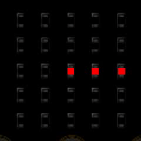

====================================================
Built-in images advanced
====================================================

Advanced use of Built-in Image lists
----------------------------------------

| Image.ALL_CLOCKS and Image.ALL_ARROWS are python objects that can be converted to lists of Image objects.
| Once converted to a list of Images, the list can be reversed to so that the images can be displayed in an anticlockwise direction instead of clockwise.

| ``list(Image.ALL_CLOCKS)`` can convert **Image.ALL_CLOCKS** to the list: 
| [Image.CLOCK12, Image.CLOCK1, Image.CLOCK2, Image.CLOCK3, Image.CLOCK4, Image.CLOCK5, Image.CLOCK6, Image.CLOCK7, Image.CLOCK8, Image.CLOCK9, Image.CLOCK10, Image.CLOCK11]

| ``list(Image.ALL_ARROWS)`` can convert **Image.ALL_ARROWS** to the list:
| [Image.ARROW_N, Image.ARROW_NE, Image.ARROW_E, Image.ARROW_SE, Image.ARROW_S, Image.ARROW_SW, Image.ARROW_W, Image.ARROW_NW]

----

Reverse direction of list using list slicing
~~~~~~~~~~~~~~~~~~~~~~~~~~~~~~~~~~~~~~~~~~~~~~~~~~~~

| A list, ``arrow_list``, can be reversed using the slicing technique: ``arrow_list[::-1]``.
| ``arrow_list_anticlockwise = arrow_list[::-1]`` reverses the list and places it in a the variable ``arrow_list_anticlockwise``.

.. code-block:: python

    from microbit import *

    arrow_list = list(Image.ALL_ARROWS)
    arrow_list_anticlockwise = arrow_list[::-1]
    while True:
        display.show(arrow_list_anticlockwise, delay=200)

----

Reverse direction of list using the reverse method
~~~~~~~~~~~~~~~~~~~~~~~~~~~~~~~~~~~~~~~~~~~~~~~~~~~~~~~~~~~~~~~~~~~~~~~~~~~~~~~~~~~~~~~

| The basic syntax to reverse a list **in place** is:

.. py:function:: list.reverse()

    | No parameters are involved.

| A list, **clock_list**, can be reversed using the **reverse** **method**: ``clock_list.reverse()``.
| The original list has its elements reversed. 

.. code-block:: python

    from microbit import *

    clock_list = list(Image.ALL_CLOCKS)
    clock_list.reverse()
    while True:
        display.show(clock_list, delay=200)

----

Reverse direction of list using the reversed function
~~~~~~~~~~~~~~~~~~~~~~~~~~~~~~~~~~~~~~~~~~~~~~~~~~~~~~~~~~~~~~~~~~~~~~~~~~~~~~~~~~~~~~~

| The basic syntax to reverse a list using the **reversed** **function** is:

.. py:function:: reversed(sequence)

    | sequence is the list to reverse.

| A list, **clock_list**, can be reversed using the reversed function: ``reversed(clock_list)``.
| The python object obtained from the reversed function can used directly by **display.show**. 

.. code-block:: python

    from microbit import *

    clock_list = list(Image.ALL_CLOCKS)
    clock_list_anticlockwise = reversed(clock_list)
    while True:
        display.show(clock_list_anticlockwise, delay=200)

| The python object obtained from the reversed function can be converted to a list for reuse by using ``list(reversed(clock_list))`` and placing the result in the variable **clock_list_anticlockwise**. 

.. code-block:: python

    from microbit import *

    clock_list = list(Image.ALL_CLOCKS)
    clock_list_anticlockwise = list(reversed(clock_list))
    while True:
        display.show(clock_list_anticlockwise, delay=200)

----

.. admonition:: Tasks

    #. Write code that uses list **slicing** to display all the arrow images clockwise then anticlockwise.
    #. Write code that uses the **reverse** method to display all the clock images clockwise then anticlockwise.
    #. Write code that uses the **reversed** function to display all the clock images clockwise then anticlockwise.

    .. dropdown::
        :icon: codescan
        :color: primary
        :class-container: sd-dropdown-container

        .. tab-set::

            .. tab-item:: Q1

                Write code that uses list **slicing** to display all the arrow images clockwise then anticlockwise.

                .. code-block:: python

                    from microbit import *

                    arrow_list = list(Image.ALL_ARROWS)
                    arrow_list_anticlockwise = arrow_list[::-1]
                    while True:
                        display.show(arrow_list, delay=200)
                        display.show(arrow_list_anticlockwise, delay=200)
                        
            .. tab-item:: Q2

                Write code that uses the **reverse** method to display all the clock images clockwise then anticlockwise.

                .. code-block::

                    from microbit import *

                    clock_list = list(Image.ALL_CLOCKS)
                    clock_list_anticlockwise = list(Image.ALL_CLOCKS)
                    clock_list_anticlockwise.reverse()
                    while True:
                        display.show(clock_list, delay=200)
                        display.show(clock_list_anticlockwise, delay=200)
                       
            .. tab-item:: Q3

                Write code that uses the **reversed** function to display all the clock images clockwise then anticlockwise.

                .. code-block::

                    from microbit import *

                    clock_list = list(Image.ALL_CLOCKS)
                    clock_list_anticlockwise = list(reversed(clock_list))
                    while True:
                        display.show(clock_list, delay=200)
                        display.show(clock_list_anticlockwise, delay=200)

----

Randomize list
~~~~~~~~~~~~~~~~~~~~~~~~~~~~~~~~~~~~~~~~~~~~~~~~~~~~

| A list can be randomly sorted using random.shuffle in python 3.10.
| This is not available in Mu editor in 2022, so the sorted function with a sort key can be used instead.

| The basic syntax is:

.. py:function:: sorted(iterable, key=key, reverse=reverse)

    | iterable Required. The sequence to sort, list, dictionary, tuple etc.
    | key Optional. A Function to execute to decide the order. Default is None
    | reverse Optional. A Boolean. False will sort ascending, True will sort descending. Default is False

| The key function will use a function that generates a random float.
| The **random.random()** method returns a random floating number between 0 and 1.
| The basic syntax is:

.. py:function:: random.random()

| The key function, **randomkey**,  returns a random floating number between 0 and 1.
| A parameter is required, since the sorted function will pass in the object from a list that is being sorted. The parameter used below is **element**. Note that it is not used in the function code itself.

.. code-block:: python
    
    def randomkey(element):
        return random.random()

| Code to sort a list of numbers randomly then scroll them is below.

.. code-block:: python

    from microbit import *
    import random

    def randomkey(element):
        return random.random()

    oldlist = [1, 2, 3, 4]
    while True:
        newlist = sorted(oldlist, key=randomkey)
        for element in newlist:
            display.scroll(element, delay=60)
        sleep(1000)

----

.. admonition:: Tasks

    #. Modify the oldlist to be the list of letters "a", "e", "t". Bonus: What do the 6 possible words mean?
    #. A string can be turned to a list using the list function. Modify the oldlist to be list("ate").
    #. Modify the oldlist to be the list of characters from list("ab12")

    .. dropdown::
            :icon: codescan
            :color: primary
            :class-container: sd-dropdown-container

            .. tab-set::

                .. tab-item:: Q1

                    Modify the oldlist to be the list of letters "a", "e", "t".

                    .. code-block:: python
                        
                        from microbit import *
                        import random

                        def randomkey(element):
                            return random.random()

                        origlist = ["a", "e", "t"]
                        while True:
                            newlist = sorted(origlist, key=randomkey)
                            for element in newlist:
                                display.scroll(element, delay=60)
                            sleep(1000)

                .. tab-item:: Q2

                    A string can be turned to a list using the list function. Modify the oldlist to be list("ate").

                    .. code-block:: python
                        
                        from microbit import *
                        import random

                        def randomkey(element):
                            return random.random()

                        origlist = list("ate")
                        while True:
                            newlist = sorted(origlist, key=randomkey)
                            for element in newlist:
                                display.scroll(element, delay=60)
                            sleep(1000)

                .. tab-item:: Q3

                    Modify the oldlist to be the list of characters from list("ab12")

                    .. code-block:: python
                        
                        from microbit import *
                        import random

                        def randomkey(element):
                            return random.random()

                        list("ab12")
                        while True:
                            newlist = sorted(origlist, key=randomkey)
                            for element in newlist:
                                display.scroll(element, delay=60)
                            sleep(1000)

----

Randomize image list
~~~~~~~~~~~~~~~~~~~~~~~~~~~~~~~~~~~~~~~~~~~~~~~~~~~~

| Use the sorted function to randomly sort **list(Image.ALL_ARROWS)**.
| Use the same **randomkey** function from above as the sort key.
| Display hte randomly sorted image list with a delay of half a second.

.. code-block:: python

    from microbit import *
    import random

    def randomkey(element):
        return random.random()

    origlist = list(Image.ALL_ARROWS)
    while True:
        newlist = sorted(origlist, key=randomkey)
        display.show(newlist, delay=500)
        sleep(1000)

----

.. admonition:: Tasks

    #. Create a list of the 4 main compass direction arrow images, then randomly sort them and display them.
    #. Create a list of the 4 secondary compass direction arrow images, then randomly sort them and display them.
    #. Create a list of the clock images for 12, 3, 6 and 9 o'clock then randomly sort them and display them.
    #. Create a list of the 4 main compass direction arrow images, then randomly sort them and display them then display them in reverse order using the **reverse** **method**.
    #. Create a list of the 4 secondary compass direction arrow images, then randomly sort them and display them then display them in reverse order using the **reversed** **function**.

    .. dropdown::
            :icon: codescan
            :color: primary
            :class-container: sd-dropdown-container

            .. tab-set::

                .. tab-item:: Q1

                    Create a list of the 4 main compass direction arrow images, then randomly sort them and display them.

                    .. code-block:: python

                        from microbit import *
                        import random

                        def randomkey(element):
                            return random.random()

                        origlist = [Image.ARROW_N, Image.ARROW_E, Image.ARROW_S, Image.ARROW_W]
                        while True:
                            newlist = sorted(origlist, key=randomkey)
                            display.show(newlist, delay=500)
                            sleep(1000)

                .. tab-item:: Q2

                    Create a list of the 4 secondary compass direction arrow images, then randomly sort them and display them.

                    .. code-block:: python

                        from microbit import *
                        import random

                        def randomkey(element):
                            return random.random()

                        origlist = [Image.ARROW_NE, Image.ARROW_SE, Image.ARROW_SW, Image.ARROW_NW]
                        while True:
                            newlist = sorted(origlist, key=randomkey)
                            display.show(newlist, delay=500)
                            sleep(1000)

                .. tab-item:: Q3

                    Create a list of the clock images for 12, 3, 6 and 9 o'clock then randomly sort them and display them.

                    .. code-block:: python

                        from microbit import *
                        import random

                        def randomkey(element):
                            return random.random()

                        origlist = [Image.CLOCK12, Image.CLOCK9, Image.CLOCK6, Image.CLOCK3]
                        while True:
                            newlist = sorted(origlist, key=randomkey)
                            display.show(newlist, delay=500)
                            sleep(1000)

                .. tab-item:: Q4

                    Create a list of the 4 main compass direction arrow images, then randomly sort them and display them then display them in reverse order using the **reverse** **method**.
    
                    .. code-block:: python

                        from microbit import *
                        import random

                        def randomkey(element):
                            return random.random()

                        origlist = [Image.ARROW_N, Image.ARROW_E, Image.ARROW_S, Image.ARROW_W]
                        while True:
                            newlist = sorted(origlist, key=randomkey)
                            display.show(newlist, delay=500)
                            display.clear()
                            sleep(500)
                            newlist.reverse()
                            display.show(newlist, delay=500)
                            display.clear()
                            sleep(1000)

                .. tab-item:: Q5

                    Create a list of the 4 secondary compass direction arrow images, then randomly sort them and display them then display them in reverse order using the **reversed** **function**.

                    .. code-block:: python

                        from microbit import *
                        import random

                        def randomkey(element):
                            return random.random()

                        origlist = [Image.ARROW_NE, Image.ARROW_SE, Image.ARROW_SW, Image.ARROW_NW]
                        while True:
                            newlist = sorted(origlist, key=randomkey)
                            display.show(newlist, delay=500)
                            display.clear()
                            sleep(500)
                            rev_list = reversed(newlist)
                            display.show(rev_list, delay=500)
                            display.clear()
                            sleep(1000)

