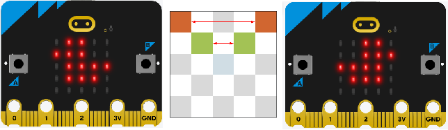
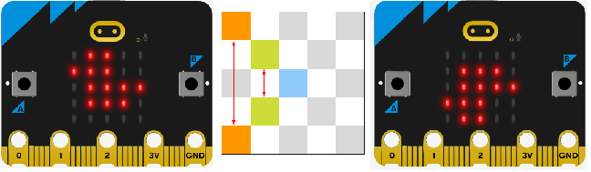
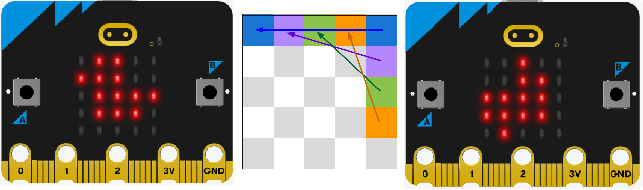
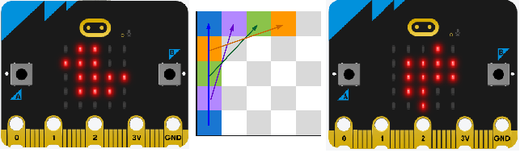
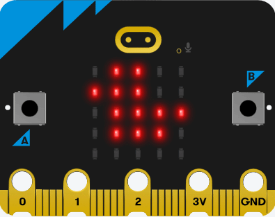

====================================================
Flip and Rotate images
====================================================

| Custom functions are needed to flip or rotate images.
| The pixel brightness data needs to be obtained then re-organised and used to create a new image.

----

Useful Syntax
------------------

Image repr
~~~~~~~~~~~

.. py:function:: repr(image)

    | Get a compact string representation of the image.
    
----

String replace
~~~~~~~~~~~~~~~~~~~~~~

| The replace method will be used to remove the colons in the image brightness string.

.. py:function:: string.replace(old_value, new_value, count)

    | old_value	The string to search for
    | new_value	The string to replace the old value with
    | count	Optional. A number specifying how many occurrences of the old value to be replaced. Defaults to all occurrences if omitted.

----

Reverse list method syntax
~~~~~~~~~~~~~~~~~~~~~~~~~~~~~~~~~

.. py:function:: a_list.reverse()

    | Reverses a list. No parameters are involved.

----

Pixels from repr
------------------

| To get the pixel data, use the **repr** function on the image object.
| In the code example below, the **repr** for the DUCK image is printed.
| Image('09900:99900:09999:09990:00000:')

.. code-block:: python
    
    from microbit import *
    
    img0 = Image.DUCK
    img_repr = repr(img0)
    print(img_repr)
    # Image('09900:99900:09999:09990:00000:')

----

Brightness array
------------------

| The next step is to collect just the numbers from the string, then put the numbers in a list format that can then be used to create an image using bytearray.
| So: Image('09900:99900:09999:09990:00000:')
| is converted to: [0, 9, 9, 0, 0, 9, 9, 9, 0, 0, 0, 9, 9, 9, 9, 0, 9, 9, 9, 0, 0, 0, 0, 0, 0]

| The string can be sliced to ignore the first 6 characters and the last 3 characters
| This is done using **img_repr[7:-3]**.
| Then the colon is removed using the replace method. **img_str = img_str.replace(":", "")**
| Finally, list comprehension, **img_array = [int(x) for x in img_str]**,  is used on the string to convert each string numeral to an int in a list.
| This produces the list for a DUCK: [0, 9, 9, 0, 0, 9, 9, 9, 0, 0, 0, 9, 9, 9, 9, 0, 9, 9, 9, 0, 0, 0, 0, 0, 0]

.. code-block:: python
    
    from microbit import *

    img_str = img_repr[7:-3]
    img_str = img_str.replace(":", "")
    img_array = [int(x) for x in img_str]

----

.. admonition:: Tasks

    #. Write a function to return and image array from an image.

    .. dropdown::
            :icon: codescan
            :color: primary
            :class-container: sd-dropdown-container

            .. tab-set::

                .. tab-item:: get_image_array

                    .. code-block:: python

                        from microbit import *

                        def get_image_array(img):
                            img_repr = repr(img)
                            img_str = img_repr[7:-3]
                            img_str = img_str.replace(":", "")
                            img_array = [int(x) for x in img_str]
                            return img_array

----

So far
---------

| So far the code has gone from 
| **Image.DUCK** 
| to 
| **Image('09900:99900:09999:09990:00000:')** 
| to 
| **[0, 9, 9, 0, 0, 9, 9, 9, 0, 0, 0, 9, 9, 9, 9, 0, 9, 9, 9, 0, 0, 0, 0, 0, 0]**.

| Now, functions need to be created for:
* flipping horizontally
* flipping vertically
* rotating 90 degrees clockwise or 90 anticlockwise.

----

Flipping horizontally
---------------------------

| The code to flip an image horizontally will be broken up into 2 custom functions.
| **get_image_array(img)** takes an image object as an argument and returns a list of pixel brightnesses.
| **get_img_arr_flip_hor(img_array)** takes the image array returned by **get_image_array** and outputs a flipped image array.
| **Image(5, 5, bytearray(img_array))** creates the flipped image.

| **get_img_arr_flip_hor(img_array)** should use list slices to get each row.
| The top row would be the first 5 items of the list as given by: row0 = img_array[:5]
| Each row slice can be reversed: row0.reverse()

----

.. admonition:: Tasks

    #. Write code to flip the duck horizontally and swap between the display of the duck and the flipped duck.

    .. dropdown::
            :icon: codescan
            :color: primary
            :class-container: sd-dropdown-container

            .. tab-set::

                .. tab-item:: Q1

                    Write code to flip the duck horizontally and swap between the display of the duck and the flipped duck.

                    .. code-block:: python

                        from microbit import *

                        def get_image_array(img):
                            img_repr = repr(img)
                            img_str = img_repr[7:-3]
                            img_str = img_str.replace(":", "")
                            img_array = [int(x) for x in img_str]
                            return img_array

                        def get_img_arr_flip_hor(img_array):
                            # get every 5 elements and reverse them
                            row0 = img_array[:5]
                            row1 = img_array[5:10]
                            row2 = img_array[10:15]
                            row3 = img_array[15:20]
                            row4 = img_array[20:]
                            row0.reverse()
                            row1.reverse()
                            row2.reverse()
                            row3.reverse()
                            row4.reverse()
                            output_array = row0 + row1 + row2 + row3 + row4
                            return output_array
                            
                        img0 = Image.DUCK
                        img_array = get_img_arr_flip_hor(get_image_array(img0))
                        img0_flip_hor= Image(5, 5, bytearray(img_array))

                        while True:
                            display.show(img0)
                            sleep(300)
                            display.show(img0_flip_hor)
                            sleep(300)

----

Flipping vertically
---------------------------

| Add a new function to flip an image vertically using the image array.
| **get_img_arr_flip_vert(img_array)** takes the image array returned by **get_image_array** and outputs a flipped image array.

| **get_img_arr_flip_vert(img_array)** should use list slices to get each row.
| The top row would be the first 5 items of the list as given by: row0 = img_array[:5]
| The order of each row needs to be reversed, so that the top row goes to the bottom row.

----

.. admonition:: Tasks

    #. Write code to flip the duck vertically and swap between the display of the duck and the flipped duck.

    .. dropdown::
            :icon: codescan
            :color: primary
            :class-container: sd-dropdown-container

            .. tab-set::

                .. tab-item:: Q1

                    Write code to flip the duck vertically and swap between the display of the duck and the flipped duck.

                    .. code-block:: python

                        from microbit import *

                        def get_image_array(img):
                            img_repr = repr(img)
                            img_str = img_repr[7:-3]
                            img_str = img_str.replace(":", "")
                            img_array = [int(x) for x in img_str]
                            return img_array

                        def get_img_arr_flip_vert(img_array):
                            # get every 5 elements as rows and reverse order of rows.
                            row0 = img_array[:5]
                            row1 = img_array[5:10]
                            row2 = img_array[10:15]
                            row3 = img_array[15:20]
                            row4 = img_array[20:]
                            output_array = row4 + row3 + row2 + row1 + row0
                            return output_array

                        img0 = Image.DUCK
                        img_array = get_img_arr_flip_vert(get_image_array(img0))
                        img0_flip_vert = Image(5, 5, bytearray(img_array))

                        while True:
                            display.show(img0)
                            sleep(300)
                            display.show(img0_flip_vert)
                            sleep(300)

----

Flipping a list of images
---------------------------

| Here is the list of some images that are not laterally symmetrical (left and right sides are different): 
| [Image.MUSIC_CROTCHET, Image.MUSIC_QUAVER, Image.MUSIC_QUAVERS, Image.PACMAN, Image.ROLLERSKATE, Image.TRIANGLE_LEFT, Image.UMBRELLA, Image.YES]
| Create a function, **flip_image_list(image_list, transition_time=500)**, which creates img0, img0_flip_hor and img0_flip_vert for each image in the list, then creates a list of these, **[img0, img_flip_hor, img0, img_flip_vert, img0]** which are then displayed using a transition_time which defaults to a delay of 300ms between each image.

.. admonition:: Tasks

    #. Write code to rotate a list of images using flip_image_list(image_list, transition_time=300).

    .. dropdown::
            :icon: codescan
            :color: primary
            :class-container: sd-dropdown-container

            .. tab-set::

                .. tab-item:: Q1

                    Write code to rotate a list of images using rotate_image_list(image_list, transition_time=500).

                    .. code-block:: python

                        from microbit import 

                        def get_image_array(img=Image.DUCK):
                            img_repr = repr(img)
                            img_str = img_repr[7:-3]
                            img_str = img_str.replace(":", "")
                            img_array = [int(x) for x in img_str]
                            return img_array

                        def get_img_arr_flip_hor(img_array):
                            # get every 5 elements and reverse them in each row
                            row0 = img_array[:5]
                            row1 = img_array[5:10]
                            row2 = img_array[10:15]
                            row3 = img_array[15:20]
                            row4 = img_array[20:]
                            row0.reverse()
                            row1.reverse()
                            row2.reverse()
                            row3.reverse()
                            row4.reverse()
                            output_array = row0 + row1 + row2 + row3 + row4
                            return output_array

                        def get_img_arr_flip_vert(img_array):
                            # get every 5 elements as rows and reverse order of rows.
                            row0 = img_array[:5]
                            row1 = img_array[5:10]
                            row2 = img_array[10:15]
                            row3 = img_array[15:20]
                            row4 = img_array[20:]
                            output_array = row4 + row3 + row2 + row1 + row0
                            return output_array

                        object_images = [
                            Image.MUSIC_CROTCHET,
                            Image.MUSIC_QUAVER,
                            Image.MUSIC_QUAVERS,
                            Image.PACMAN,
                            Image.ROLLERSKATE,
                            Image.TRIANGLE_LEFT,
                            Image.UMBRELLA,
                            Image.YES,
                        ]

                        def flip_image_list(image_list, transition_time=500):
                            for img in image_list:
                                img0 = img
                                img_flip_hor = Image(5, 5, bytearray(get_img_arr_flip_hor(get_image_array(img0))))
                                img_flip_vert = Image(5, 5, bytearray(get_img_arr_flip_vert(get_image_array(img0))))
                                img_seq = [img0, img_flip_hor, img0, img_flip_vert, img0]
                                display.show(img_seq, delay=transition_time)

                        while True:
                            flip_image_list(object_images)

----

Rotating 270 degrees
-------------------------------------

| Rotating 90 degrees anticlockwise is the same as rotating 270 degrees clockwise.
| Add a new function to rotate an image 90 degrees anticlockwise using the image array.

| **get_img_arr_rotate_270(img_array)** takes the image array returned by **get_image_array** and outputs a rotated image array.

| **get_img_arr_rotate_270(img_array)** should use list comprehensions to get each row.
| The top row is made up of pixels that had previous array indices of 4, 9, 14, 19, 24.
| This sequence can be created with the range function.
| A similar pattern occurs for the others rows.

.. admonition:: Tasks

    #. Complete the grid of the renumbering of the indices in the image array. Observe the pattern and use that to code range functions for each list comprehension for each row of pixels.

    .. image:: images/rotate_270_arrayQ.png
        :scale: 100 %
        :align: center  

    .. dropdown::
            :icon: codescan
            :color: primary
            :class-container: sd-dropdown-container

            .. tab-set::

                .. tab-item:: Q1

                    Complete the grid of the renumbering of the indices in the image array. Observe the pattern and use that to code range functions for each list comprehension for each row of pixels.

                    .. image:: images/rotate_270_array.png
                        :scale: 100 %
                        :align: center

----

.. admonition:: Tasks

    #. Write code to rotate the duck 90 degrees anticlockwise and swap between the display of the duck and the flipped duck.

    .. dropdown::
            :icon: codescan
            :color: primary
            :class-container: sd-dropdown-container

            .. tab-set::

                .. tab-item:: Q1

                   Write code to rotate the duck 90 degrees anticlockwise and swap between the display of the duck and the flipped duck.

                    .. code-block:: python

                        from microbit import *

                        def get_image_array(img):
                            img_repr = repr(img)
                            img_str = img_repr[7:-3]
                            img_str = img_str.replace(":", "")
                            img_array = [int(x) for x in img_str]
                            return img_array

                        def get_img_arr_rotate_270(img_array):
                            # 4, 9, 14, 19, 24;; 3, 8, 13, 18, 23.
                            row0 = [img_array[x] for x in range(4, 25, 5)]
                            row1 = [img_array[x] for x in range(3, 25, 5)]
                            row2 = [img_array[x] for x in range(2, 25, 5)]
                            row3 = [img_array[x] for x in range(1, 25, 5)]
                            row4 = [img_array[x] for x in range(0, 25, 5)]
                            output_array = row0 + row1 + row2 + row3 + row4
                            return output_array

                        img0 = Image.DUCK
                        img_array = get_img_arr_rotate_270(get_image_array(img0))
                        img270 = Image(5, 5, bytearray(img_array))

                        while True:
                            display.show(img0)
                            sleep(300)
                            display.show(img270)
                            sleep(300)

----

Rotating 90 degrees clockwise
-------------------------------------

| Add a new function to rotate an image 90 degrees anticlockwise using the image array.

| **get_img_arr_rotate_90(img_array)** takes the image array returned by **get_image_array** and outputs a rotated image array.

| **get_img_arr_rotate_90(img_array)** should use list comprehensions to get each row.
| The top row is made up of pixels that had previous array indices of 20, 15, 10, 5, 0.
| This sequence can be created with the range function.
| A similar pattern occurs for the others rows.

.. admonition:: Tasks

    #. Complete the grid of the renumbering of the indices in the image array. Observe the pattern and use that to code range functions for each list comprehension for each row of pixels.

    .. image:: images/rotate_90_arrayQ.png
        :scale: 100 %
        :align: center  

    .. dropdown::
            :icon: codescan
            :color: primary
            :class-container: sd-dropdown-container

            .. tab-set::

                .. tab-item:: Q1

                    Complete the grid of the renumbering of the indices in the image array. Observe the pattern and use that to code range functions for each list comprehension for each row of pixels.

                    .. image:: images/rotate_90_array.png
                        :scale: 100 %
                        :align: center

----

.. admonition:: Tasks

    #. Write code to rotate the duck 90 degrees clockwise and swap between the display of the duck and the flipped duck.

    .. dropdown::
            :icon: codescan
            :color: primary
            :class-container: sd-dropdown-container

            .. tab-set::

                .. tab-item:: Q1

                    Write code to rotate the duck 90 degrees clockwise and swap between the display of the duck and the flipped duck.

                    .. code-block:: python

                        from microbit import *

                        def get_image_array(img):
                            img_repr = repr(img)
                            img_str = img_repr[7:-3]
                            img_str = img_str.replace(":", "")
                            img_array = [int(x) for x in img_str]
                            return img_array

                        def get_img_arr_rotate_90(img_array):
                            # 20,15,10,5,0;;21,16,11,6,1...
                            row0 = [img_array[x] for x in range(20, -1, -5)]
                            row1 = [img_array[x] for x in range(21, -1, -5)]
                            row2 = [img_array[x] for x in range(22, -1, -5)]
                            row3 = [img_array[x] for x in range(23, -1, -5)]
                            row4 = [img_array[x] for x in range(24, -1, -5)]
                            output_array = row0 + row1 + row2 + row3 + row4
                            return output_array

                        img0 = Image.DUCK
                        img_array = get_img_arr_rotate_90(get_image_array(img0))
                        img90 = Image(5, 5, bytearray(img_array))

                        while True:
                            display.show(img0)
                            sleep(300)
                            display.show(img90)
                            sleep(300)

----

Rotating 180 degrees
------------------------------------

| Rotating 180 degrees can be achieved by combine flipping horizontally with flipping vertically.

| **get_img_arr_rotate_180(img_array)** takes the image array returned by **get_image_array** and outputs a rotated image array.
| **get_img_arr_rotate_180(img_array)** combines the flipping functions.

.. admonition:: Tasks

    #. Write a function to combine flipping to rotate an image 180 degrees.
    #. Write code to rotate the duck 180 degrees and swap between the display of the duck and the flipped duck. 

    .. dropdown::
            :icon: codescan
            :color: primary
            :class-container: sd-dropdown-container

            .. tab-set::

                .. tab-item:: Q1

                    .. code-block:: python

                        from microbit import *

                            def get_img_arr_rotate_180(img_array):
                                return get_img_arr_flip_vert(get_img_arr_flip_hor(img_array))

                .. tab-item:: Q2

                    .. code-block:: python

                        from microbit import *

                        def get_image_array(img=Image.DUCK):
                            img_repr = repr(img)
                            img_str = img_repr[7:-3]
                            img_str = img_str.replace(":", "")
                            img_array = [int(x) for x in img_str]
                            return img_array

                        def get_img_arr_flip_hor(img_array):
                            # get every 5 elements and reverse them in each row
                            row0 = img_array[:5]
                            row1 = img_array[5:10]
                            row2 = img_array[10:15]
                            row3 = img_array[15:20]
                            row4 = img_array[20:]
                            row0.reverse()
                            row1.reverse()
                            row2.reverse()
                            row3.reverse()
                            row4.reverse()
                            output_array = row0 + row1 + row2 + row3 + row4
                            return output_array

                        def get_img_arr_flip_vert(img_array):
                            # get every 5 elements as rows and reverse order of rows.
                            row0 = img_array[:5]
                            row1 = img_array[5:10]
                            row2 = img_array[10:15]
                            row3 = img_array[15:20]
                            row4 = img_array[20:]
                            output_array = row4 + row3 + row2 + row1 + row0
                            return output_array

                        def get_img_arr_rotate_180(img_array):
                            return get_img_arr_flip_vert(get_img_arr_flip_hor(img_array))

                        img0 = Image.DUCK
                        img180 = Image(5, 5, bytearray(get_img_arr_rotate_180(get_image_array(img0))))

                        while True:
                            display.show(img0)
                            sleep(800)
                            display.show(img180)
                            sleep(800)

----

Rotating image animation
---------------------------

.. admonition:: Tasks

    #. Use the functions developed on this page to create an animation of a duck rotating clockwise.
    #. Use the functions developed on this page to create an animation of a duck rotating anti clockwise.

    .. dropdown::
            :icon: codescan
            :color: primary
            :class-container: sd-dropdown-container

            .. tab-set::

                .. tab-item:: Q1

                    Use the functions developed on this page to create an animation of a duck rotating clockwise.

                    .. code-block:: python

                        from microbit import *

                        def get_image_array(img=Image.DUCK):
                            img_repr = repr(img)
                            img_str = img_repr[7:-3]
                            img_str = img_str.replace(":", "")
                            img_array = [int(x) for x in img_str]
                            return img_array

                        def get_img_arr_flip_hor(img_array):
                            # get every 5 elements and reverse them in each row
                            row0 = img_array[:5]
                            row1 = img_array[5:10]
                            row2 = img_array[10:15]
                            row3 = img_array[15:20]
                            row4 = img_array[20:]
                            row0.reverse()
                            row1.reverse()
                            row2.reverse()
                            row3.reverse()
                            row4.reverse()
                            output_array = row0 + row1 + row2 + row3 + row4
                            return output_array

                        def get_img_arr_flip_vert(img_array):
                            # get every 5 elements as rows and reverse order of rows.
                            row0 = img_array[:5]
                            row1 = img_array[5:10]
                            row2 = img_array[10:15]
                            row3 = img_array[15:20]
                            row4 = img_array[20:]
                            output_array = row4 + row3 + row2 + row1 + row0
                            return output_array

                        def get_img_arr_rotate_270(img_array):
                            # 4, 9, 14, 19, 24;; 3, 8, 13, 18, 23.
                            row0 = [img_array[x] for x in range(4, 25, 5)]
                            row1 = [img_array[x] for x in range(3, 25, 5)]
                            row2 = [img_array[x] for x in range(2, 25, 5)]
                            row3 = [img_array[x] for x in range(1, 25, 5)]
                            row4 = [img_array[x] for x in range(0, 25, 5)]
                            output_array = row0 + row1 + row2 + row3 + row4
                            return output_array

                        def get_img_arr_rotate_90(img_array):
                            # 20,15,10,5,0;;21,16,11,6,1...
                            row0 = [img_array[x] for x in range(20, -1, -5)]
                            row1 = [img_array[x] for x in range(21, -1, -5)]
                            row2 = [img_array[x] for x in range(22, -1, -5)]
                            row3 = [img_array[x] for x in range(23, -1, -5)]
                            row4 = [img_array[x] for x in range(24, -1, -5)]
                            output_array = row0 + row1 + row2 + row3 + row4
                            return output_array
                            
                        def get_img_arr_rotate_180(img_array):
                            return get_img_arr_flip_vert(get_img_arr_flip_hor(img_array))

                        img0 = Image.DUCK
                        img90 = Image(5, 5, bytearray(get_img_arr_rotate_90(get_image_array(img0))))
                        img180 = Image(5, 5, bytearray(get_img_arr_rotate_180(get_image_array(img0))))
                        img270 = Image(5, 5, bytearray(get_img_arr_rotate_270(get_image_array(img0))))
                        

                        img_seq = [img0, img90, img180, img270]
                        while True:
                            display.show(img_seq, delay=400)

                .. tab-item:: Q2

                    Use the functions developed on this page to create an animation of a duck rotating anti clockwise.

                    .. code-block:: python

                        from microbit import *

                        def get_image_array(img=Image.DUCK):
                            img_repr = repr(img)
                            img_str = img_repr[7:-3]
                            img_str = img_str.replace(":", "")
                            img_array = [int(x) for x in img_str]
                            return img_array

                        def get_img_arr_flip_hor(img_array):
                            # get every 5 elements and reverse them in each row
                            row0 = img_array[:5]
                            row1 = img_array[5:10]
                            row2 = img_array[10:15]
                            row3 = img_array[15:20]
                            row4 = img_array[20:]
                            row0.reverse()
                            row1.reverse()
                            row2.reverse()
                            row3.reverse()
                            row4.reverse()
                            output_array = row0 + row1 + row2 + row3 + row4
                            return output_array

                        def get_img_arr_flip_vert(img_array):
                            # get every 5 elements as rows and reverse order of rows.
                            row0 = img_array[:5]
                            row1 = img_array[5:10]
                            row2 = img_array[10:15]
                            row3 = img_array[15:20]
                            row4 = img_array[20:]
                            output_array = row4 + row3 + row2 + row1 + row0
                            return output_array

                        def get_img_arr_rotate_270(img_array):
                            # 4, 9, 14, 19, 24;; 3, 8, 13, 18, 23.
                            row0 = [img_array[x] for x in range(4, 25, 5)]
                            row1 = [img_array[x] for x in range(3, 25, 5)]
                            row2 = [img_array[x] for x in range(2, 25, 5)]
                            row3 = [img_array[x] for x in range(1, 25, 5)]
                            row4 = [img_array[x] for x in range(0, 25, 5)]
                            output_array = row0 + row1 + row2 + row3 + row4
                            return output_array

                        def get_img_arr_rotate_90(img_array):
                            # 20,15,10,5,0;;21,16,11,6,1...
                            row0 = [img_array[x] for x in range(20, -1, -5)]
                            row1 = [img_array[x] for x in range(21, -1, -5)]
                            row2 = [img_array[x] for x in range(22, -1, -5)]
                            row3 = [img_array[x] for x in range(23, -1, -5)]
                            row4 = [img_array[x] for x in range(24, -1, -5)]
                            output_array = row0 + row1 + row2 + row3 + row4
                            return output_array
                            
                        def get_img_arr_rotate_180(img_array):
                            return get_img_arr_flip_vert(get_img_arr_flip_hor(img_array))

                        img0 = Image.DUCK
                        img90 = Image(5, 5, bytearray(get_img_arr_rotate_90(get_image_array(img0))))
                        img180 = Image(5, 5, bytearray(get_img_arr_rotate_180(get_image_array(img0))))
                        img270 = Image(5, 5, bytearray(get_img_arr_rotate_270(get_image_array(img0))))
                        

                        img_seq = [img0, img270, img180, img90]
                        while True:
                            display.show(img_seq, delay=400)

----

Rotating a list of images
---------------------------

| Here is the list of animals: 
| [Image.RABBIT, Image.COW, Image.DUCK, Image.TORTOISE, Image.BUTTERFLY, Image.GIRAFFE, Image.SNAKE]
| Create a function, **rotate_image_list(image_list, transition_time=500)**, which creates img0, img90, img180 and img270 for each image in the list, then creates a list of these which are then displayed using a transition_time which defaults to 500ms.

.. admonition:: Tasks

    #. Write code to rotate a list of images using rotate_image_list(image_list, transition_time=500).

    .. dropdown::
            :icon: codescan
            :color: primary
            :class-container: sd-dropdown-container

            .. tab-set::

                .. tab-item:: Q1

                    Write code to rotate a list of images using rotate_image_list(image_list, transition_time=500).

                    .. code-block:: python

                        from microbit import *

                        def get_image_array(img=Image.DUCK):
                            img_repr = repr(img)
                            img_str = img_repr[7:-3]
                            img_str = img_str.replace(":", "")
                            img_array = [int(x) for x in img_str]
                            return img_array

                        def get_img_arr_flip_hor(img_array):
                            # get every 5 elements and reverse them in each row
                            row0 = img_array[:5]
                            row1 = img_array[5:10]
                            row2 = img_array[10:15]
                            row3 = img_array[15:20]
                            row4 = img_array[20:]
                            row0.reverse()
                            row1.reverse()
                            row2.reverse()
                            row3.reverse()
                            row4.reverse()
                            output_array = row0 + row1 + row2 + row3 + row4
                            return output_array

                        def get_img_arr_flip_vert(img_array):
                            # get every 5 elements as rows and reverse order of rows.
                            row0 = img_array[:5]
                            row1 = img_array[5:10]
                            row2 = img_array[10:15]
                            row3 = img_array[15:20]
                            row4 = img_array[20:]
                            output_array = row4 + row3 + row2 + row1 + row0
                            return output_array

                        def get_img_arr_rotate_270(img_array):
                            # 4, 9, 14, 19, 24;; 3, 8, 13, 18, 23.
                            row0 = [img_array[x] for x in range(4, 25, 5)]
                            row1 = [img_array[x] for x in range(3, 25, 5)]
                            row2 = [img_array[x] for x in range(2, 25, 5)]
                            row3 = [img_array[x] for x in range(1, 25, 5)]
                            row4 = [img_array[x] for x in range(0, 25, 5)]
                            output_array = row0 + row1 + row2 + row3 + row4
                            return output_array

                        def get_img_arr_rotate_90(img_array):
                            # 20,15,10,5,0;;21,16,11,6,1...
                            row0 = [img_array[x] for x in range(20, -1, -5)]
                            row1 = [img_array[x] for x in range(21, -1, -5)]
                            row2 = [img_array[x] for x in range(22, -1, -5)]
                            row3 = [img_array[x] for x in range(23, -1, -5)]
                            row4 = [img_array[x] for x in range(24, -1, -5)]
                            output_array = row0 + row1 + row2 + row3 + row4
                            return output_array

                        def get_img_arr_rotate_180(img_array):
                            return get_img_arr_flip_vert(get_img_arr_flip_hor(img_array))

                        animal_images = [
                            Image.RABBIT,
                            Image.COW,
                            Image.DUCK,
                            Image.TORTOISE,
                            Image.BUTTERFLY,
                            Image.GIRAFFE,
                            Image.SNAKE,
                        ]

                        def rotate_image_list(image_list, transition_time=500):
                            for img in image_list:
                                img0 = img
                                img180 = Image(5, 5, bytearray(get_img_arr_rotate_180(get_image_array(img0))))
                                img270 = Image(5, 5, bytearray(get_img_arr_rotate_270(get_image_array(img0))))
                                img90 = Image(5, 5, bytearray(get_img_arr_rotate_90(get_image_array(img0))))
                                img_seq = [img0, img90, img180, img270]
                                display.show(img_seq, delay=transition_time)

                        while True:
                            rotate_image_list(animal_images)

