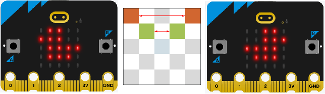

====================================================
Flipping and Rotating images
====================================================

| Custom functions are needed to flip or rotate images.
| The pixel brightness data needs to be obtained then reorganised and used to create a new image.

----

Pixels from repr
------------------

| To get the pixel data, use the **repr** function on the image object.

.. py:function:: repr(image)

    | Get a compact string representation of the image.

| In the code example below, the **repr** for the DUCK image is printed.
| Image('09900:99900:09999:09990:00000:')

.. code-block:: python
    
    from microbit import *
    
    img1 = Image.DUCK
    img_repr = repr(img1)
    print(img_repr)
    # Image('09900:99900:09999:09990:00000:')

----

String replace
------------------

| The replace method will be used to remove the colons in the image brightness string.

.. py:function:: string.replace(oldvalue, newvalue, count)

    | oldvalue	The string to search for
    | newvalue	The string to replace the old value with
    | count	Optional. A number specifying how many occurrences of the old value to be replaced. Defaults to all occurrences if omitted.

| The next step is to collect just the numbers from the string, then put the numbers in a list format that can then be used to create an image using bytearray.
| So: Image('09900:99900:09999:09990:00000:')
| is converted to: [0, 9, 9, 0, 0, 9, 9, 9, 0, 0, 0, 9, 9, 9, 9, 0, 9, 9, 9, 0, 0, 0, 0, 0, 0]

| The string can be sliced to ignore the first 6 characters and the last 3 characters
| This is done using **img_repr[7:-3]**.
| Then the colon is removed using the replace method. **img_str = img_str.replace(":", "")**
| Finally, list comprehension, **img_array = [int(x) for x in img_str]**,  is used on the string to convert each string numeral to an int in a list.
| This produces the list for a DUCK: [0, 9, 9, 0, 0, 9, 9, 9, 0, 0, 0, 9, 9, 9, 9, 0, 9, 9, 9, 0, 0, 0, 0, 0, 0]

.. code-block:: python
    
    from microbit import *

    img_str = img_repr[7:-3]
    img_str = img_str.replace(":", "")
    img_array = [int(x) for x in img_str]

----

| So far the code has gone from 
| **Image.DUCK** 
| to 
| **Image('09900:99900:09999:09990:00000:')** 
| to 
| **[0, 9, 9, 0, 0, 9, 9, 9, 0, 0, 0, 9, 9, 9, 9, 0, 9, 9, 9, 0, 0, 0, 0, 0, 0]**.

| Now, functions need to be created for:
* flipping horizontally
* flipping vertically
* rotating 90 degrees clockwise or 90 anticlockwise.

----

Flipping horizontally
---------------------------

| The code to flip an image horizontally will be broken up into 2 custom functions.
| **get_image_array(img)** takes an image object as an argument and returns a list of pixel brightnesses.
| **get_image_flipped_hor(imgarray)** takes the image array returned by **get_image_array** and outputs a flipped image array.
| **display.show(Image(5, 5, bytearray(img_array)))** displays the flipped image.

| **get_image_flipped_hor(imgarray)** should use list slices to get each row.
| The top row would be the first 5 items of the list as given by: row0 = imgarray[:5]
| Each row slice can be reversed: row0.reverse()

----

Reverse list method syntax
-----------------------------

.. py:function:: a_list.reverse()

    | Reverses a list. No parameters are involved.

----

.. admonition:: Tasks

    #. Write code to flip a duck horizontally and swap between the display of a duck and the flipped duck.

    .. dropdown::
            :icon: codescan
            :color: primary
            :class-container: sd-dropdown-container

            .. tab-set::

                .. tab-item:: Q1

                    Write code to flip a duck horizontally and swap between the display of a duck and the flipped duck.

                    .. code-block:: python

                        from microbit import *

                        def get_image_array(img):
                            img_repr = repr(img)
                            img_str = img_repr[7:-3]
                            img_str = img_str.replace(":", "")
                            img_array = [int(x) for x in img_str]
                            return img_array

                        def get_image_flipped_hor(imgarray):
                            # get every 5 elements and reverse them
                            row0 = imgarray[:5]
                            row1 = imgarray[5:10]
                            row2 = imgarray[10:15]
                            row3 = imgarray[15:20]
                            row4 = imgarray[20:]
                            row0.reverse()
                            row1.reverse()
                            row2.reverse()
                            row3.reverse()
                            row4.reverse()
                            output_array = row0 + row1 + row2 + row3 + row4
                            return output_array
                            
                        img1 = Image.DUCK
                        img_array = get_image_flipped_hor(get_image_array(img1))

                        while True:
                            display.show(img1)
                            sleep(300)
                            display.show(Image(5, 5, bytearray(img_array)))
                            sleep(300)