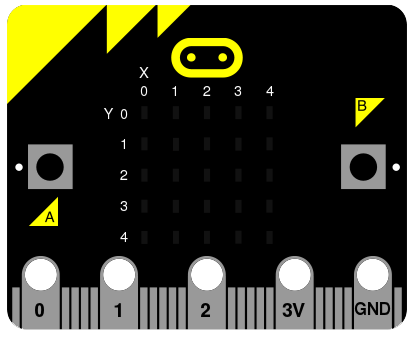
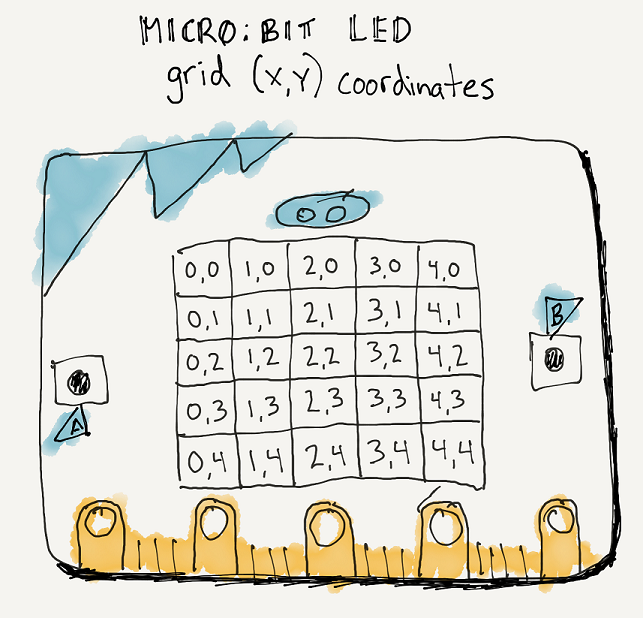

====================================================
Images by setting pixels
====================================================

.. py:module:: display

----

Set pixel
---------------------

| Each pixel on the 5 by 5 grid can be controlled individually.
| The column numbers are 0 to 4 from left to right.
| The row numbers are 0 to 4 from top to bottom.

.. py:function:: display.set_pixel(x, y, value)

    Set the brightness of the LED at column x and row y to value, which has to be an integer between 0 and 9.

| The code below turns on the pixel in the top left with full brightness.

.. code-block:: python

    from microbit import *

    display.set_pixel(0, 0, 9)

| The code below turns on the pixel in column 2, row 1 with full brightness.

.. code-block:: python

    from microbit import *

    display.set_pixel(2, 1, 9)

----

.. admonition:: Tasks

    #. Write code to turn on the pixel, 3 columns across and 4 rows down.
    #. Write code to turn on the pixel, 4 columns across and 2 rows down.
    #. Write code to turn on the pixel in the top right.
    #. Write code to turn on the pixel in the bottom right.
    #. Write code to turn on the pixel in the bottom left.
    #. Write code to turn on the 4 corner pixels.
    #. Write code to turn on the top 5 pixels.
    #. Write code to turn on the top 5 pixels at brightnesses of 1, 3, 5, 7, 9 from left to right.

    .. dropdown::
            :icon: codescan
            :color: primary
            :class-container: sd-dropdown-container

            .. tab-set::

                .. tab-item:: Q1

                    Write code to turn on the pixel, 3 columns across and 4 rows down.

                    .. code-block:: python

                        from microbit import *

                        display.set_pixel(2, 3, 9)

                .. tab-item:: Q2

                    Write code to turn on the pixel, 4 columns across and 2 rows down.

                    .. code-block:: python

                        from microbit import *

                        display.set_pixel(3, 1, 9)

                .. tab-item:: Q3

                    Write code to turn on the pixel in the top right.

                    .. code-block:: python

                        from microbit import *

                        display.set_pixel(4, 0, 9)

                .. tab-item:: Q4

                    Write code to turn on the pixel in the bottom right.

                    .. code-block:: python

                        from microbit import *
                        
                        display.set_pixel(4, 4, 9)

                .. tab-item:: Q5

                    Write code to turn on the pixel in the bottom left.

                    .. code-block:: python

                        from microbit import *

                        display.set_pixel(0, 4, 9)

                .. tab-item:: Q6

                    Write code to turn on the 4 corner pixels.

                    .. code-block:: python

                        from microbit import *

                        display.set_pixel(0, 0, 9)
                        display.set_pixel(0, 4, 9)
                        display.set_pixel(4, 0, 9)
                        display.set_pixel(4, 4, 9)

                .. tab-item:: Q7

                    Write code to turn on the top 5 pixels.

                    .. code-block:: python

                        from microbit import *

                        display.set_pixel(0, 0, 9)
                        display.set_pixel(1, 0, 9)
                        display.set_pixel(2, 0, 9)
                        display.set_pixel(3, 0, 9)
                        display.set_pixel(4, 0, 9)

                .. tab-item:: Q8

                    Write code to turn on the top 5 pixels at brightnesses of 1, 3, 5, 7, 9 from left to right.

                    .. code-block:: python

                        from microbit import *

                        display.set_pixel(0, 0, 1)
                        display.set_pixel(1, 0, 3)
                        display.set_pixel(2, 0, 5)
                        display.set_pixel(3, 0, 7)
                        display.set_pixel(4, 0, 9)

----

Pixel rows and columns
------------------------

| For loops can be used to turn on all the pixels in a row or colum.

.. sidebar::

    .. image:: images/col0.png
        :scale: 50 %
        :align: center

| The code below sets the brightness to 9 for the first column, column 0.

.. code-block:: python

    from microbit import *

    x = 0
    for y in range(0, 5):
        display.set_pixel(x, y, 9)

----

.. sidebar::

    .. image:: images/row0.png
        :scale: 50 %
        :align: center

| The code below sets the brightness to 9 for the first row, row 0.

.. code-block:: python

    from microbit import *

    y = 0
    for x in range(0, 5):
        display.set_pixel(x, y, 9)

----

.. admonition:: Tasks

    #. Write code to turn on the pixels in column 3.
    #. Write code to turn on the pixels in row 2.

    .. dropdown::
            :icon: codescan
            :color: primary
            :class-container: sd-dropdown-container

            .. tab-set::

                .. tab-item:: Q1

                    Write code to turn on the pixels in column 3.

                    .. code-block:: python

                        from microbit import *

                        x = 3
                        for y in range(0, 5):
                            display.set_pixel(x, y, 9)

                .. tab-item:: Q2

                    Write code to turn on the pixels in row 2.

                    .. code-block:: python

                        from microbit import *

                        y = 2
                        for x in range(0, 5):
                            display.set_pixel(x, y, 9)

----

Pixel rows and columns lists
------------------------------

| For loops can be used to turn on pixels based on values in lists.
| Each row will have the same patern of pixels.
| Each column will have the same patern of pixels.
| A variable, ``xlist``, can store the columns numbers.
| A variable, ``ylist``, can store the row numbers.
| The code below produces an image of a six on a die.

.. code-block:: python

    from microbit import *

    xlist = [0, 4]
    ylist = [0, 2, 4]
    for x in xlist:
        for y in ylist:
            display.set_pixel(x, y, 9)

----

.. admonition:: Tasks

    #. Adjust the code above to turn on pixels that are in both columns 1 to 3 and rows 0 and 4.
    #. Adjust the code above to turn on pixels that are in both columns 0 and 4 and rows 1 to 3.
    #. Combine the two answers to produce a square shape without the corners.

    .. dropdown::
            :icon: codescan
            :color: primary
            :class-container: sd-dropdown-container

            .. tab-set::

                .. tab-item:: Q1

                    Adjust the code above to turn on pixels that are in both columns 1 to 3 and rows 0 and 4.

                    .. code-block:: python

                        from microbit import *

                        xlist = [1, 2, 3]
                        ylist = [0, 4]
                        for x in xlist:
                            for y in ylist:
                                display.set_pixel(x, y, 9)

                .. tab-item:: Q2

                    Adjust the code above to turn on pixels that are in both columns 0 and 4 and rows 1 to 3.

                    .. code-block:: python

                        from microbit import *

                        xlist = [0, 4]
                        ylist = [1, 2, 3]
                        for x in xlist:
                            for y in ylist:
                                display.set_pixel(x, y, 9)

                .. tab-item:: Q3

                    Combine the two answers to produce a square shape without the corners.

                    .. code-block:: python

                        from microbit import *

                        xlist = [1, 2, 3]
                        ylist = [0, 4]
                        for x in xlist:
                            for y in ylist:
                                display.set_pixel(x, y, 9)
                                
                        xlist = [0, 4]
                        ylist = [1, 2, 3]
                        for x in xlist:
                            for y in ylist:
                                display.set_pixel(x, y, 9)

----

get_pixel and set_pixel
---------------------------

.. py:method:: get_pixel(x, y)

    Return the brightness of pixel at column ``x`` and row ``y`` as an
    integer between 0 and 9.

| ``display.get_pixel(x, y) == 0`` can be used to check if a pixel is on or off.

| The definition below checks each pixel to set if it is off and returns True if all are on.
| If any pixels are off, it returns False immediately htat a pixel if found to be off.

.. code-block:: python

    from microbit import *
    
    def full_screen_on_check():
        for y in range(0, 5):
            for x in range(0, 5):
                if display.get_pixel(x, y) == 0:
                    return False
        return True

| The code below creates changing displays of random pixels. 
| **full_screen_on_check()** checks to see when the display has been filled with 25 pixels.
| **fill_screen_with_counter** turns on random pixels with brightness between 5 and 9. It checks to see if the screen is filled, and returns the number of random pixels used in the process.
| The number of random pixels used to fill the screen is then scrolled.

.. code-block:: python

    from microbit import *
    from random import randint

    def full_screen_on_check():
        for y in range(0, 5):
            for x in range(0, 5):
                if display.get_pixel(x, y) == 0:
                    return False
        return True

    def fill_screen_with_counter():
        counter = 0
        while True:
            counter += 1
            x = randint(0, 4)
            y = randint(0, 4)
            brightness = randint(5, 9)
            display.set_pixel(x, y, brightness)
            if full_screen_on_check():
                return counter
            sleep(30)

    while True:
        new_fill_count = fill_screen_with_counter()
        display.scroll(new_fill_count)
        sleep(1000)

.. admonition:: Tasks

    #. Add code to display the min and max counts obtained in the code above.

    .. dropdown::
            :icon: codescan
            :color: primary
            :class-container: sd-dropdown-container

            .. tab-set::

                .. tab-item:: Q1

                    Add code to display the min and max counts obtained in the code above.

                    .. code-block:: python

                        from microbit import *
                        from random import randint

                        def full_screen_check():
                            for y in range(0, 5):
                                for x in range(0, 5):
                                    if display.get_pixel(x, y) == 0:
                                        return False
                            return True

                        def fill_screen_with_counter():
                            counter = 0
                            while True:
                                counter += 1
                                x = randint(0, 4)
                                y = randint(0, 4)
                                brightness = randint(5,9)
                                display.set_pixel(x, y, brightness)
                                if full_screen_check():
                                    return counter
                                sleep(30)

                        min_fill_count = None
                        max_fill_count = None

                        while True:
                            new_fill_count = fill_screen_with_counter()
                            display.scroll(new_fill_count, delay=60)
                            if min_fill_count is not None:
                                min_fill_count = min(min_fill_count, new_fill_count)
                            else:
                                min_fill_count = new_fill_count
                            if max_fill_count is not None:
                                max_fill_count = max(max_fill_count, new_fill_count)
                            else:
                                max_fill_count = new_fill_count
                            display.scroll(min_fill_count, delay=60)
                            display.scroll(max_fill_count, delay=60)
                            sleep(1000)