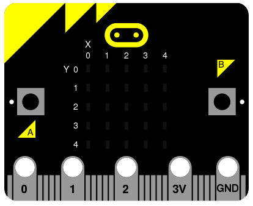
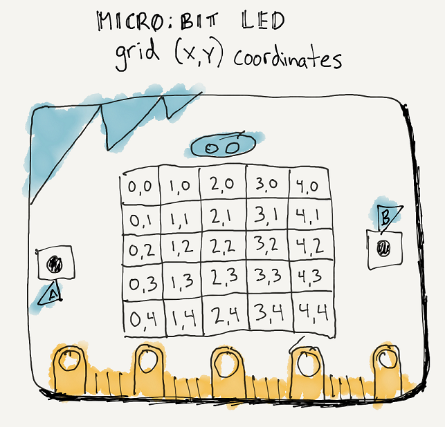
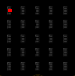
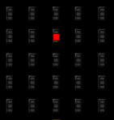
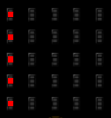
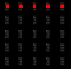
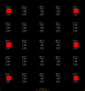

====================================================
Setting pixels
====================================================

.. py:module:: display

----

Set pixel
---------------------

| Each pixel on the 5 by 5 grid can be controlled individually.
| The column numbers are 0 to 4 from left to right.
| The row numbers are 0 to 4 from top to bottom.

.. py:function:: display.set_pixel(x, y, value)

    Set the brightness of the LED at column x and row y to value, which has to be an integer between 0 and 9, where 0 is off and 9 is full brightness.

| The code below turns on the pixel in the top left with full brightness.

.. code-block:: python

    from microbit import *

    display.set_pixel(0, 0, 9)

| The code below turns on the pixel in column 2, row 1 with full brightness.

.. code-block:: python

    from microbit import *

    display.set_pixel(2, 1, 9)

----

.. admonition:: Tasks

    #. Write code to turn on the pixel, 3 columns across and 4 rows down.
    #. Write code to turn on the pixel, 4 columns across and 2 rows down.
    #. Write code to turn on the pixel in the top right.
    #. Write code to turn on the pixel in the bottom right.
    #. Write code to turn on the pixel in the bottom left.
    #. Write code to turn on the 4 corner pixels.
    #. Write code to turn on the top 5 pixels.
    #. Write code to turn on the top 5 pixels at brightnesses of 1, 3, 5, 7, 9 from left to right.

    .. dropdown::
        :icon: codescan
        :color: primary
        :class-container: sd-dropdown-container

        .. tab-set::

            .. tab-item:: Q1

                Write code to turn on the pixel, 3 columns across and 4 rows down.

                .. code-block:: python

                    from microbit import *

                    display.set_pixel(2, 3, 9)

            .. tab-item:: Q2

                Write code to turn on the pixel, 4 columns across and 2 rows down.

                .. code-block:: python

                    from microbit import *

                    display.set_pixel(3, 1, 9)

            .. tab-item:: Q3

                Write code to turn on the pixel in the top right.

                .. code-block:: python

                    from microbit import *

                    display.set_pixel(4, 0, 9)

            .. tab-item:: Q4

                Write code to turn on the pixel in the bottom right.

                .. code-block:: python

                    from microbit import *
                    
                    display.set_pixel(4, 4, 9)

            .. tab-item:: Q5

                Write code to turn on the pixel in the bottom left.

                .. code-block:: python

                    from microbit import *

                    display.set_pixel(0, 4, 9)

            .. tab-item:: Q6

                Write code to turn on the 4 corner pixels.

                .. code-block:: python

                    from microbit import *

                    display.set_pixel(0, 0, 9)
                    display.set_pixel(0, 4, 9)
                    display.set_pixel(4, 0, 9)
                    display.set_pixel(4, 4, 9)

            .. tab-item:: Q7

                Write code to turn on the top 5 pixels.

                .. code-block:: python

                    from microbit import *

                    display.set_pixel(0, 0, 9)
                    display.set_pixel(1, 0, 9)
                    display.set_pixel(2, 0, 9)
                    display.set_pixel(3, 0, 9)
                    display.set_pixel(4, 0, 9)

            .. tab-item:: Q8

                Write code to turn on the top 5 pixels at brightnesses of 1, 3, 5, 7, 9 from left to right.

                .. code-block:: python

                    from microbit import *

                    display.set_pixel(0, 0, 1)
                    display.set_pixel(1, 0, 3)
                    display.set_pixel(2, 0, 5)
                    display.set_pixel(3, 0, 7)
                    display.set_pixel(4, 0, 9)

----

Pixel rows and columns
------------------------

| For loops can be used to turn on all the pixels in a row or colum.

| The code below sets the brightness to 9 for the first column, column 0.

.. code-block:: python

    from microbit import *

    x = 0
    for y in range(0, 5):
        display.set_pixel(x, y, 9)

----

| The code below sets the brightness to 9 for the first row, row 0.

.. code-block:: python

    from microbit import *

    y = 0
    for x in range(0, 5):
        display.set_pixel(x, y, 9)

----

.. admonition:: Tasks

    #. Write code to turn on the pixels in column 3.
    #. Write code to turn on the pixels in row 2.

    .. dropdown::
        :icon: codescan
        :color: primary
        :class-container: sd-dropdown-container

        .. tab-set::

            .. tab-item:: Q1

                Write code to turn on the pixels in column 3.

                .. code-block:: python

                    from microbit import *

                    x = 3
                    for y in range(0, 5):
                        display.set_pixel(x, y, 9)

            .. tab-item:: Q2

                Write code to turn on the pixels in row 2.

                .. code-block:: python

                    from microbit import *

                    y = 2
                    for x in range(0, 5):
                        display.set_pixel(x, y, 9)

----

Pixel rows and columns lists
------------------------------

| For loops can be used to turn on pixels based on values in lists.
| Each row will have the same pattern of pixels.
| Each column will have the same pattern of pixels.
| A variable, ``x_list``, can store the columns numbers.
| A variable, ``y_list``, can store the row numbers.
| The code below produces an image of a six on a die.

.. code-block:: python

    from microbit import *

    x_list = [0, 4]
    y_list = [0, 2, 4]
    for x in x_list:
        for y in y_list:
            display.set_pixel(x, y, 9)

----

.. admonition:: Tasks

    #. Adjust the code above to turn on pixels that are in both columns 1 to 3 and rows 0 and 4.
    #. Adjust the code above to turn on pixels that are in both columns 0 and 4 and rows 1 to 3.
    #. Combine the two answers to produce a square shape without the corners.

    .. dropdown::
        :icon: codescan
        :color: primary
        :class-container: sd-dropdown-container

        .. tab-set::

            .. tab-item:: Q1

                Adjust the code above to turn on pixels that are in both columns 1 to 3 and rows 0 and 4.

                .. code-block:: python

                    from microbit import *

                    x_list = [1, 2, 3]
                    y_list = [0, 4]
                    for x in x_list:
                        for y in y_list:
                            display.set_pixel(x, y, 9)

            .. tab-item:: Q2

                Adjust the code above to turn on pixels that are in both columns 0 and 4 and rows 1 to 3.

                .. code-block:: python

                    from microbit import *

                    x_list = [0, 4]
                    y_list = [1, 2, 3]
                    for x in x_list:
                        for y in y_list:
                            display.set_pixel(x, y, 9)

            .. tab-item:: Q3

                Combine the two answers to produce a square shape without the corners.

                .. code-block:: python

                    from microbit import *

                    x_list = [1, 2, 3]
                    y_list = [0, 4]
                    for x in x_list:
                        for y in y_list:
                            display.set_pixel(x, y, 9)
                            
                    x_list = [0, 4]
                    y_list = [1, 2, 3]
                    for x in x_list:
                        for y in y_list:
                            display.set_pixel(x, y, 9)

