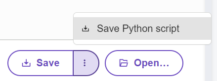

====================================================
Micropython editor
====================================================

| The standard online **micropython** editor is at: https://python.microbit.org/v/3.

----

Saving python files
---------------------------------------

| Type in some code.
| Click on the three vertical dots of the Save button to save as a python file.

----

Opening python files
---------------------------------------

| Click on the Open button to navigate to a saved python file.

----

Uploading modules to the microbit
---------------------------------------

.. image:: images/online_editor.png
    :scale: 50 %

| Create a project.
| The main.py file is where you place any code to flash to the microbit.

| A blank module file, such as MOVEMotor.py can be created using the Create file button. Code can be typed in or pasted in to that file.
| Alternatively, a previously created module file can be added using Open.
| In doing so a dialog will ask whether to replace the main file with that file. Click on the right hand icon instead, and choose Add file ... Then click Confirm.

.. image:: images/online_editor_open_file.png
    :scale: 50 %