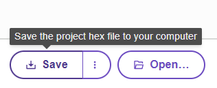

====================================================
Micropython editor
====================================================

| The standard online **micropython** editor is at: `<https://python.microbit.org/v/3>`_.
| See the guide at: `<https://support.microbit.org/support/solutions/articles/19000135210>`_

Micro:bit Educational Foundation YouTube Videos
---------------------------------------------------------

`Welcome to the  micro:bit Python Editor <https://www.youtube.com/watch?v=mREwMW69qKc>`_

`Editing code <https://www.youtube.com/watch?v=9tt95qUMO7s>`_

`Simulator <https://www.youtube.com/watch?v=FysIFdq3ZOE>`_

`Direct flashing from Python to micro:bit <https://www.youtube.com/watch?v=2zumYE7Mk08>`_

`Send to microbit without webUSB <https://www.youtube.com/watch?v=ZjhYiiFwm4E>`_

`Opening a hex file <https://www.youtube.com/watch?v=z2jqwgR98rk>`_

`Reference section <https://www.youtube.com/watch?v=9vmrKgQRYjE>`_

`Ideas Section <https://www.youtube.com/watch?v=mdJ_UszVj4c>`_

`API Section <https://www.youtube.com/watch?v=QX61MzdlFUI>`_

`Setting language <https://www.youtube.com/watch?v=RD3XtCygsm4>`_

`Projects section <https://www.youtube.com/watch?v=TJKe16S2RmM>`_

----

Saving python files
---------------------------------------

.. image:: images/save_python_file.png
    :scale: 50 %

| Type in some code.
| Click on the three vertical dots of the Save button to save as a python file.

----

Opening python files
---------------------------------------

| Click on the Open button to navigate to a saved python file.

----

Uploading modules to the microbit
---------------------------------------

.. image:: images/online_editor.png
    :scale: 50 %

| Create a project.
| The main.py file is where you place any code to flash to the microbit.

| A blank module file, such as MOVEMotor.py can be created using the Create file button. Code can be typed in or pasted in to that file.
| Alternatively, a previously created module file can be added using Open.
| In doing so a dialog will ask whether to replace the main file with that file. Click on the right hand icon instead, and choose Add file ... Then click Confirm.

.. image:: images/online_editor_open_file.png
    :scale: 50 %

----

Saving hex files
---------------------------------------

| Using hex files has the advantage that saving and opening files with modules is done automatically.
| This is the recommended approach for projects with a main file and a module so that both are saved and opened with one hex file.

| Type in some code.
| Click on the Save button to save as a hex file.
