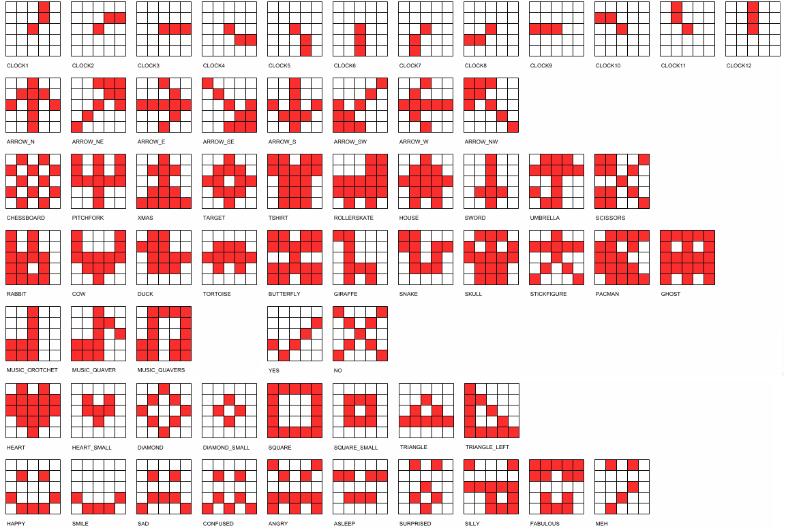

====================================================
Built-in images
====================================================

| The microbit library contains over 60 built-in images that have specific names.
| e.g ``Image.HEART``
| The **Image** object must have a capital **I**.
| The built-in image name must be in capitals. e.g **HEART** not **heart**.
| No quotation marks are used. e.g ``Image.HEART`` not ``'Image.HEART'``.
| The same syntax that was used to show text can be used for images.
| When typing ``Image.``, as soon as the stop is typed, a drop list of images will be displayed to allow selection of an image.

.. admonition:: Tip

    | Variables and functions should only use lower case letters.
    | Classes should use CapWords like **TeamPlayers**.
    | Constants should be in ALLCAPS, like **PIN**.
    | The use of **Image** with a capital is typical of a class, and **HEART** is a constant within the **Image** class.

----

Display.show a built-in Image
----------------------------------------

.. py:function:: display.show(image)

    | Display an image, where image is an image such as the built-in image **Image.Heart**.

| The code below displays a built-in heart image.

.. code-block:: python

    from microbit import *

    display.show(Image.HEART)

----

.. admonition:: Tasks

    #. Write code to show an ARROW_N.
    #. Write code to show a GIRAFFE.
    #. Write code to show a SMILE.

    .. dropdown::
        :icon: codescan
        :color: primary
        :class-container: sd-dropdown-container

        .. tab-set::

            .. tab-item:: Q1

                Write code to show an ARROW_N.

                .. code-block:: python

                    from microbit import *

                    while True:
                        display.show(Image.ARROW_N)

            .. tab-item:: Q2

                Write code to show a GIRAFFE.

                .. code-block:: python

                    from microbit import *

                    while True:
                        display.show(Image.GIRAFFE)

            .. tab-item:: Q3

                Write code to show a SMILE.

                .. code-block:: python

                    from microbit import *

                    while True:
                        display.show(Image.SMILE)

----

Flashing Image
----------------------------------------

| When a sleep is used along with clearing the display, an image can be made to flash.
| The code below flashes a the built-in heart image.

.. code-block:: python

    from microbit import *

    while True:
        display.show(Image.HEART)
        sleep(300)
        display.clear()
        sleep(300)

----

.. admonition:: Tasks

    #. Modify the code to have the heart appear for 1/3 of the time.
    #. Modify the code to have the heart appear for 2/3 of the time.

    .. dropdown::
        :icon: codescan
        :color: primary
        :class-container: sd-dropdown-container

        .. tab-set::

            .. tab-item:: Q1

                Modify the code to have the heart appear for 1/3 of the time.

                .. code-block:: python

                    from microbit import *

                    while True:
                        display.show(Image.HEART)
                        sleep(300)
                        display.clear()
                        sleep(600)

            .. tab-item:: Q2

                Modify the code to have the heart appear for 2/3 of the time.

                .. code-block:: python

                    from microbit import *

                    while True:
                        display.show(Image.HEART)
                        sleep(600)
                        display.clear()
                        sleep(300)

----

EXT: Random times for flashing an image
----------------------------------------

| Import the random library. Then use randint to get a random times for flashing an image.

.. py:function:: random.randint(a, b)

    Return a random integer from a to b, including both.

| The code below gets a random integer from 600 to 900 and uses that for the sleep time during which the image is shown.
| Then it is used to calculate sleep time during which the display is cleared.
| This creates some variation in the flashing of the image.

.. code-block:: python

    from microbit import *
    import random

    while True:
        on_time = random.randint(600, 900)
        off_time = 1000 - on_time
        display.show(Image.HEART)
        sleep(on_time)
        display.clear()
        sleep(off_time)

----

.. admonition:: Tasks

    #. Write the code to have the heart appear for 500ms, but clear the screen for a random time ranging from 100 to 500ms.
    #. Write the code to have the heart appear for a random time ranging from 100 to 500ms, but clear the screen for 500ms.

    .. dropdown::
        :icon: codescan
        :color: primary
        :class-container: sd-dropdown-container

        .. tab-set::

            .. tab-item:: Q1

                Write the code to have the heart appear for 500ms but clear the screen for a random time ranging from 100 to 500ms.

                .. code-block:: python

                    from microbit import *
                    import random

                    while True:
                        on_time = 500
                        off_time = random.randint(100, 500)
                        display.show(Image.HEART)
                        sleep(on_time)
                        display.clear()
                        sleep(off_time)

            .. tab-item:: Q2

                Write the code to have the heart appear for a random time ranging from 100 to 500ms, but clear the screen for 500ms.

                .. code-block:: python

                    from microbit import *
                    import random

                    while True:
                        on_time = random.randint(100, 500)
                        off_time = 500
                        display.show(Image.HEART)
                        sleep(on_time)
                        display.clear()
                        sleep(off_time)

----

Display.show a list of images
----------------------------------------

| A list of images can be displayed in sequence.

.. py:function:: display.show(image_list, delay=400)

    | Display images from a list in sequence.
    | Each image in a list of images is shown with ``delay`` milliseconds between them.
    | The delay defaults to 400ms if it is omitted.

| The code below shows a sequence of 5 face images with half a second between them.

.. code-block:: python

    from microbit import *

    while True:
        display.show([Image.HAPPY, Image.SMILE, Image.SAD, Image.CONFUSED, Image.ANGRY], delay=500)

----

.. admonition:: Tasks

    #. Write code to show a list of 3 different animals with an 0.5 sec delay between them.
    #. Write code to show a list of 4 different arrows with an 400ms delay between them.
    #. Write code to show a list of 3 different shapes with an 0.3 sec delay between them.

    .. dropdown::
        :icon: codescan
        :color: primary
        :class-container: sd-dropdown-container

        .. tab-set::

            .. tab-item:: Q1

                Write code to show a list of 3 different animals with an 0.5 sec delay between them.

                .. code-block:: python

                    from microbit import *

                    while True:
                        display.show([Image.RABBIT, Image.COW, Image.GIRAFFE], delay=500)

            .. tab-item:: Q2

                Write code to show a list of 4 different arrows with an 400ms delay between them.

                .. code-block:: python

                    from microbit import *

                    while True:
                        display.show([Image.ARROW_N, Image.ARROW_E, Image.ARROW_S, Image.ARROW_W], delay=400)

            .. tab-item:: Q3

                Write code to show a list of 3 different shapes with an 0.3 sec delay between them.

                .. code-block:: python

                    from microbit import *

                    while True:
                        display.show([Image.TRIANGLE, Image.DIAMOND, Image.SQUARE], delay=300)

----

Image lists
----------------------------------------

| When the list of images is more than a few, it is usual to put the list in a variable.
| The list of 5 images is placed in the variable ``face_list``.
| The variable is then used to display the images: ``display.show(face_list, delay=500)``.

.. code-block:: python

    from microbit import *

    face_list = [Image.HAPPY, Image.SMILE, Image.SAD, Image.CONFUSED, Image.ANGRY]
    while True:
        display.show(face_list, delay=500)

| The code below displays a list of shapes, so the variable name chosen is ``shape_list``.
| Whitespace (tabs, spaces, line endings) are ignored within a list, so a long list can be set out like that below, with all the Images lined up for easy reading.
| Trailing commas are preferred in such lists, making it easy to extend the list with new lines.

.. code-block:: python

    from microbit import *

    shape_list = [
        Image.TRIANGLE,
        Image.TRIANGLE_LEFT,
        Image.DIAMOND,
        Image.DIAMOND_SMALL,
        Image.SQUARE,
        Image.SQUARE_SMALL,
    ]
    while True:
        display.show(shape_list, delay=100)

----

.. admonition:: Tasks

    #. Write code to use a variable, ``animal_list``, to show a list of 3 different animals with an 0.5 sec delay between them.
    #. Write code to use a variable, ``arrow_list``,  to show a list of 4 different arrows with an 0.4 sec delay between them.
    #. Write code to use a variable to show a list of 3 different music images with an 0.3 sec delay between them.
    #. Write code to use a variable to show a list of 4 different clock images with an 0.2 sec delay between them.

    .. dropdown::
        :icon: codescan
        :color: primary
        :class-container: sd-dropdown-container

        .. tab-set::

            .. tab-item:: Q1

                Write code to use a variable, ``animal_list``, to show a list of 3 different animals with an 0.5 sec delay between them.

                .. code-block:: python

                    from microbit import *

                    animal_list = [Image.RABBIT, Image.COW, Image.GIRAFFE]
                    while True:
                        display.show(animal_list, delay=500)

            .. tab-item:: Q2

                Write code to use a variable, ``arrow_list``,  to show a list of 4 different arrows with an 0.4 sec delay between them.

                .. code-block:: python

                    from microbit import *

                    arrow_list = [Image.ARROW_N, Image.ARROW_E, Image.ARROW_S, Image.ARROW_W]
                    while True:
                        display.show(arrow_list, delay=400)

            .. tab-item:: Q3

                Write code to use a variable to show a list of 3 different music images with an 0.3 sec delay between them.

                .. code-block:: python

                    from microbit import *

                    music_list = [Image.MUSIC_CROTCHET, Image.MUSIC_QUAVER, Image.MUSIC_QUAVERS]
                    while True:
                        display.show(music_list, delay=300)

            .. tab-item:: Q4

                Write code to use a variable to show a list of 4 different clock images with a 0.2 sec delay between them.

                .. code-block:: python

                    from microbit import *

                    clock_list = [Image.CLOCK12, Image.CLOCK3, Image.CLOCK6, Image.CLOCK9]
                    while True:
                        display.show(clock_list, delay=200)

----

Built-in Image lists
----------------------------------------

| There are 2 built-in collections of images.
| They are: ``Image.ALL_CLOCKS`` and ``Image.ALL_ARROWS``.
| Both collections have images that follow a clockwise sequence.
| The code below displays the built-in collection of clock images.

.. code-block:: python

    from microbit import *

    while True:
        display.show(Image.ALL_CLOCKS, delay=100)

----

.. admonition:: Tasks

    #. Write code to display the images in the built-in image collection: ``Image.ALL_ARROWS``, with a delay of 200ms.

    .. dropdown::
        :icon: codescan
        :color: primary
        :class-container: sd-dropdown-container

        .. tab-set::

            .. tab-item:: Q1

                Write code to display the images in the built-in image collection: ``Image.ALL_ARROWS``, with a delay of 200ms.

                .. code-block:: python

                    from microbit import *

                    while True:
                        display.show(Image.ALL_ARROWS, delay=200)

----

EXT: Random images
-----------------------------------

| Import the random library. Then use random.choice to show a random image from a list.

.. py:function:: random.choice(image_list)

    Return a random image from the list of images: image_list.

| The code below shows a random image from a list every 500ms.

.. code-block:: python

    from microbit import *
    import random

    shape_list = [
        Image.TRIANGLE,
        Image.TRIANGLE_LEFT,
        Image.DIAMOND,
        Image.DIAMOND_SMALL,
        Image.SQUARE,
        Image.SQUARE_SMALL,
    ]
    while True:
        img = random.choice(shape_list)
        display.show(img)
        sleep(500)

----

.. admonition:: Exercise

    #. Write the code to show a random face image every second.
    #. Write the code to show a random animal image every 800ms.

----

Image sentences
----------------------------------------

| The code below makes a sentence using words and images.
| Delays of ``sleep(300)`` are used to prevent the sequence from being too fast to see.

.. code-block:: python

    from microbit import *

    while True:
        display.scroll('I')
        sleep(300)
        display.show(Image.HEART)
        sleep(300)
        display.show(Image.GIRAFFE)
        sleep(300)

----

.. admonition:: Tasks

    #. Write an image sentence combining words and images.

    .. dropdown::
        :icon: codescan
        :color: primary
        :class-container: sd-dropdown-container

        .. tab-set::

            .. tab-item:: Q1

                Write an image sentence combining words and images.

                .. code-block:: python

                    # tortoises live long
                    from microbit import *

                    while True:
                        display.show(Image.TORTOISE)
                        sleep(300)
                        display.show(Image.HOUSE)
                        sleep(300)
                        display.scroll("long")
                        sleep(300)

----

Image sentences using "mixed" lists
----------------------------------------

| **display.show** can be used to show text images along with other images.
| The text images must be one character in quotes.
| Normally, a text image requires **Image** as in Image("U").
| But the list input for **display.show** automatically treats "U" as Image("U").
| Single quoted digits, e.g. "4", work in a similar way.
| Multiple digits in an image, as in Image("12345"), set the pixel brightness for those pixels.
| Strings, such as "1234" or "abcd", will be ignored.

| The image sentence below uses a built-in image and an image from a digit and an image from a letter.

.. code-block:: python

    from microbit import *

        # snake ate rabbit
        mixed_list = [Image.SNAKE, "8", Image.RABBIT]
        while True:
            display.show(mixed_list, delay=300, clear=True)
            sleep(300)

----

.. admonition:: Tasks

    #. Write an image sentence using an image list that asks if you are sad.
    #. Write an image sentence using an image list that encourages joy.
    #. Write an image sentence using an image list that translates as "Are you surprised to be confused?"

    .. dropdown::
        :icon: codescan
        :color: primary
        :class-container: sd-dropdown-container

        .. tab-set::

            .. tab-item:: Q1

                Write an image sentence using an image list that asks if you are sad.

                .. code-block:: python

                    from microbit import *

                    mixed_list = ["R", "U", Image.SAD]
                    while True:
                        display.show(mixed_list, delay=700, clear=True)
                        sleep(1000)

            .. tab-item:: Q2

                Write an image sentence using an image list that encourages joy.

                .. code-block:: python

                    from microbit import *

                    mixed_list = ["B", Image.HAPPY]
                    while True:
                        display.show(mixed_list, delay=700, clear=True)
                        sleep(1000)

            .. tab-item:: Q3

                Write an image sentence using an image list that translates as "Are you surprised to be confused?"

                .. code-block:: python

                    from microbit import *

                    mixed_list = ["R", "U", Image.SURPRISED, "2", "B", Image.CONFUSED, "?"]
                    while True:
                         display.show(mixed_list, delay=700, clear=True)
                        sleep(1000)

----

All Images
----------------------------------------

| The code below displays all the built-in images.

.. code-block:: python

    from microbit import *

    built_in_images = [Image.ANGRY, Image.ARROW_E, Image.ARROW_N, Image.ARROW_NE,
        Image.ARROW_NW, Image.ARROW_S, Image.ARROW_SE, Image.ARROW_SW,
        Image.ARROW_W, Image.ASLEEP, Image.BUTTERFLY, Image.CHESSBOARD,
        Image.CLOCK1, Image.CLOCK10, Image.CLOCK11, Image.CLOCK12,
        Image.CLOCK2, Image.CLOCK3, Image.CLOCK4, Image.CLOCK5,
        Image.CLOCK6, Image.CLOCK7, Image.CLOCK8, Image.CLOCK9, Image.CONFUSED,
        Image.COW, Image.DIAMOND, Image.DIAMOND_SMALL, Image.DUCK,
        Image.FABULOUS, Image.GHOST, Image.GIRAFFE, Image.HAPPY,
        Image.HEART, Image.HEART_SMALL, Image.HOUSE, Image.MEH,
        Image.MUSIC_CROTCHET, Image.MUSIC_QUAVER, Image.MUSIC_QUAVERS,
        Image.NO, Image.PACMAN, Image.PITCHFORK, Image.RABBIT, Image.ROLLERSKATE,
        Image.SAD, Image.SCISSORS, Image.SILLY, Image.SKULL, Image.SMILE,
        Image.SNAKE, Image.SQUARE, Image.SQUARE_SMALL, Image.STICKFIGURE,
        Image.SURPRISED, Image.SWORD, Image.TARGET, Image.TORTOISE,
        Image.TRIANGLE, Image.TRIANGLE_LEFT, Image.TSHIRT, Image.UMBRELLA,
        Image.XMAS, Image.YES,
    ]

    while True:
        display.show(built_in_images, delay=100)

----

.. admonition:: Tasks

    #. Edit the built-in images list from above to just include animals.
    #. Edit the built-in images list from above to just include faces.
    #. Edit the built-in images list from above to just include objects.
    #. Edit the built-in images list from above to just include shapes.

    .. dropdown::
        :icon: codescan
        :color: primary
        :class-container: sd-dropdown-container

        .. tab-set::

            .. tab-item:: Q1

                Edit the built-in images list from above to just include animals.

                .. code-block:: python

                    from microbit import *

                    animal_images = [
                                        Image.RABBIT,
                                        Image.COW,
                                        Image.DUCK,
                                        Image.TORTOISE,
                                        Image.BUTTERFLY,
                                        Image.GIRAFFE,
                                        Image.SNAKE,
                                    ]
                    while True:
                        display.show(animal_images, delay=250)

            .. tab-item:: Q2

                Edit the built-in images list from above to just include animals.

                .. code-block:: python

                    from microbit import *

                    face_images = [
                                    Image.HAPPY,
                                    Image.SMILE,
                                    Image.SAD,
                                    Image.CONFUSED,
                                    Image.ANGRY,
                                    Image.ASLEEP,
                                    Image.SURPRISED,
                                    Image.SILLY,
                                    Image.FABULOUS,
                                    Image.MEH,
                                ]

                    while True:
                        display.show(face_images, delay=250)

            .. tab-item:: Q3

                Edit the built-in images list from above to just include objects.

                .. code-block:: python

                    from microbit import *

                    object_images = [
                                    Image.CHESSBOARD,
                                    Image.PITCHFORK,
                                    Image.TARGET,
                                    Image.TSHIRT,
                                    Image.ROLLERSKATE,
                                    Image.HOUSE,
                                    Image.STICKFIGURE,
                                    Image.GHOST,
                                    Image.SWORD,
                                    Image.SKULL,
                                    Image.UMBRELLA,
                                ]

                    while True:
                        display.show(object_images, delay=250)

            .. tab-item:: Q4

                Edit the built-in images list from above to just include shapes.

                .. code-block:: python

                    from microbit import *

                    shape_images = [
                                    Image.TRIANGLE,
                                    Image.TRIANGLE_LEFT,
                                    Image.DIAMOND,
                                    Image.DIAMOND_SMALL,
                                    Image.SQUARE,
                                    Image.SQUARE_SMALL,
                                ]

                    while True:
                        display.show(shape_images, delay=250)

.. admonition:: Tip

    Advanced code to collect the list of all images is below.

    .. code-block:: python

        from microbit import *

        # Get a list of built-in images
        dir_images = dir(Image)
        built_in_images = ["Image." + img for img in dir_images if isinstance(getattr(Image, img, None), Image)]

        # Convert list to a string and clean it up
        built_in_images_string = ", ".join(built_in_images)
        built_in_images_string = built_in_images_string.replace('"', '')
        # Print the result to the terminal
        print(built_in_images_string)

    Advanced code to print the list of all image objects using their pixel data is below.

    .. code-block:: python

        from microbit import *

        # Get a list of built-in image objects
        dir_images = dir(Image)
        built_in_images = [getattr(Image, img) for img in dir_images if isinstance(getattr(Image, img, None), Image)]

        # Print the result to check the built-in images
        print(built_in_images)

        # Display each built-in image
        while True:
            display.show(built_in_images, delay=100)
