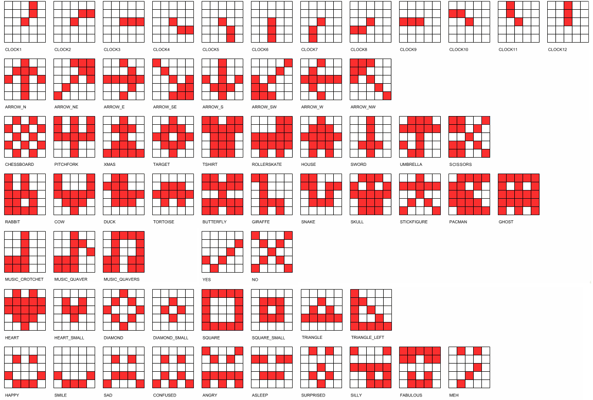

====================================================
EXT: Using built-in images
====================================================

All Images
----------------------------------------

| The code below displays all the built-in images.

.. code-block:: python

    from microbit import *

    built_in_images = [Image.ANGRY, Image.ARROW_E, Image.ARROW_N, Image.ARROW_NE,
        Image.ARROW_NW, Image.ARROW_S, Image.ARROW_SE, Image.ARROW_SW,
        Image.ARROW_W, Image.ASLEEP, Image.BUTTERFLY, Image.CHESSBOARD,
        Image.CLOCK1, Image.CLOCK10, Image.CLOCK11, Image.CLOCK12,
        Image.CLOCK2, Image.CLOCK3, Image.CLOCK4, Image.CLOCK5, Image
        .CLOCK6, Image.CLOCK7, Image.CLOCK8, Image.CLOCK9, Image.CONFUSED,
        Image.COW, Image.DIAMOND, Image.DIAMOND_SMALL, Image.DUCK,
        Image.FABULOUS, Image.GHOST, Image.GIRAFFE, Image.HAPPY,
        Image.HEART, Image.HEART_SMALL, Image.HOUSE, Image.MEH,
        Image.MUSIC_CROTCHET, Image.MUSIC_QUAVER, Image.MUSIC_QUAVERS,
        Image.NO, Image.PACMAN, Image.PITCHFORK, Image.RABBIT, Image.ROLLERSKATE,
        Image.SAD, Image.SCISSORS, Image.SILLY, Image.SKULL, Image.SMILE,
        Image.SNAKE, Image.SQUARE, Image.SQUARE_SMALL, Image.STICKFIGURE,
        Image.SURPRISED, Image.SWORD, Image.TARGET, Image.TORTOISE,
        Image.TRIANGLE, Image.TRIANGLE_LEFT, Image.TSHIRT, Image.UMBRELLA,
        Image.XMAS, Image.YES,
    ]

    while True:
        display.show(built_in_images, delay=100)

    
----

.. admonition:: Tasks

    #. Edit the built-in images list from above to just include animals.
    #. Edit the built-in images list from above to just include faces.
    #. Edit the built-in images list from above to just include objects.
    #. Edit the built-in images list from above to just include shapes.
    
    .. dropdown::
        :icon: codescan
        :color: primary
        :class-container: sd-dropdown-container

        .. tab-set::

            .. tab-item:: Q1

                Edit the built-in images list from above to just include animals.

                .. code-block:: python

                    from microbit import *

                    animal_images = [
                                        Image.RABBIT,
                                        Image.COW,
                                        Image.DUCK,
                                        Image.TORTOISE,
                                        Image.BUTTERFLY,
                                        Image.GIRAFFE,
                                        Image.SNAKE,
                                    ]
                    while True:
                        display.show(animal_images, delay=250)

            .. tab-item:: Q2

                Edit the built-in images list from above to just include animals.

                .. code-block:: python

                    from microbit import *

                    face_images = [
                                    Image.HAPPY,
                                    Image.SMILE,
                                    Image.SAD,
                                    Image.CONFUSED,
                                    Image.ANGRY,
                                    Image.ASLEEP,
                                    Image.SURPRISED,
                                    Image.SILLY,
                                    Image.FABULOUS,
                                    Image.MEH,
                                ]

                    while True:
                        display.show(face_images, delay=250)

            .. tab-item:: Q3

                Edit the built-in images list from above to just include objects.

                .. code-block:: python

                    from microbit import *

                    object_images = [
                                    Image.CHESSBOARD,
                                    Image.PITCHFORK,
                                    Image.TARGET, 
                                    Image.TSHIRT,
                                    Image.ROLLERSKATE, 
                                    Image.HOUSE,
                                    Image.STICKFIGURE, 
                                    Image.GHOST,
                                    Image.SWORD,
                                    Image.SKULL,
                                    Image.UMBRELLA,
                                ]

                    while True:
                        display.show(object_images, delay=250)

            .. tab-item:: Q4

                Edit the built-in images list from above to just include shapes.

                .. code-block:: python

                    from microbit import *

                    shape_images = [
                                    Image.TRIANGLE,
                                    Image.TRIANGLE_LEFT,
                                    Image.DIAMOND,
                                    Image.DIAMOND_SMALL,
                                    Image.SQUARE,
                                    Image.SQUARE_SMALL,
                                ]

                    while True:
                        display.show(shape_images, delay=250)

 
.. admonition:: Tip

    Advanced code to collect the list of all images is below.
    
    .. code-block:: python

        from microbit import *

        dir_images = dir(Image)
        built_in_images = ["Image." + img for img in dir_images if type(getattr(Image, img)) == Image]
        built_in_images_string = ", ".join(built_in_images)
        built_in_images_string.replace('"', '')
        print(built_in_images_string)

----

Random times for flashing an image
-----------------------------------

| Import the random library. Then use randint to get a random times for flashing an image.

.. py:function:: random.randint(a, b)

    Return a random integer from a to b, including both. 

| The code below gets a random integer from 600 to 900 and uses that for the sleep time during which the image is shown.
| Then it is used to calculate sleep time during which the display is cleared.
| This creates some variation in the flashing of the image.

.. code-block:: python

    from microbit import *
    import random

    while True:
        on_time = random.randint(600, 900)
        off_time = 1000 - on_time
        display.show(Image.HEART)
        sleep(on_time)
        display.clear()
        sleep(off_time)

----

.. admonition:: Tasks

    #. Write the code to have the heart appear for 500ms, but clear the screen for a random time ranging from 100 to 500ms.
    #. Write the code to have the heart appear for a random time ranging from 100 to 500ms, but clear the screen for 500ms.
    
    .. dropdown::
        :icon: codescan
        :color: primary
        :class-container: sd-dropdown-container

        .. tab-set::

            .. tab-item:: Q1

                Write the code to have the heart appear for 500ms but clear the screen for a random time ranging from 100 to 500ms.

                .. code-block:: python

                    from microbit import *
                    import random

                    while True:
                        on_time = 500
                        off_time = random.randint(100, 500)
                        display.show(Image.HEART)
                        sleep(on_time)
                        display.clear()
                        sleep(off_time)

            .. tab-item:: Q2

                Write the code to have the heart appear for a random time ranging from 100 to 500ms, but clear the screen for 500ms.

                .. code-block:: python

                    from microbit import *
                    import random

                    while True:
                        on_time = random.randint(100, 500)
                        off_time = 500
                        display.show(Image.HEART)
                        sleep(on_time)
                        display.clear()
                        sleep(off_time)

----

Random images
-----------------------------------

| Import the random library. Then use random.choice to show a random image from a list.

.. py:function:: random.choice(image_list)

    Return a random image from the list of images: image_list. 

| The code below shows a random image from a list every 500ms.

.. code-block:: python

    from microbit import *
    import random
    
    shape_list = [
        Image.TRIANGLE,
        Image.TRIANGLE_LEFT,
        Image.DIAMOND,
        Image.DIAMOND_SMALL,
        Image.SQUARE,
        Image.SQUARE_SMALL,
    ]
    while True:
        img = random.choice(shape_list)
        display.show(img)
        sleep(500)

----

.. admonition:: Tasks

    #. Write the code to show a random face image every second.
    #. Write the code to show a random animal image every 800ms.
    
    .. dropdown::
        :icon: codescan
        :color: primary
        :class-container: sd-dropdown-container

        .. tab-set::

            .. tab-item:: Q1

                Write the code to show a random face image every second.

                .. code-block:: python

                    from microbit import *
                    import random

                    face_images = [
                                    Image.HAPPY,
                                    Image.SMILE,
                                    Image.SAD,
                                    Image.CONFUSED,
                                    Image.ANGRY,
                                    Image.ASLEEP,
                                    Image.SURPRISED,
                                    Image.SILLY,
                                    Image.FABULOUS,
                                    Image.MEH,
                                ]

                    while True:
                        img = random.choice(face_images)
                        display.show(img)
                        sleep(1000)

            .. tab-item:: Q2

                Write the code to show a random animal image every 800ms.

                .. code-block:: python

                    from microbit import *
                    import random

                    animal_images = [
                                        Image.RABBIT,
                                        Image.COW,
                                        Image.DUCK,
                                        Image.TORTOISE,
                                        Image.BUTTERFLY,
                                        Image.GIRAFFE,
                                        Image.SNAKE,
                                    ]

                    while True:
                        img = random.choice(animal_images)
                        display.show(img)
                        sleep(800)

----

Image sentences using "mixed" lists
----------------------------------------

| **display.show** can be used to show text images along with other images.
| The text images must be one character in quotes.
| Normally, a text image requires **Image** as in Image("U").
| But the list input for **display.show** automatically treats "U" as Image("U").
| Single quoted digits, e.g. "4", work in a similar way. 
| Multiple digits in an image, as in Image("12345"), set the pixel brightness for those pixels.
| Strings, such as "1234" or "abcd", will be ignored.

| The image sentence below uses a built-in image and an image from a digit and an image from a letter.

.. code-block:: python

    from microbit import *

    while True:
        # snake ate rabbit
        mixed_list = [Image.SNAKE, "8", Image.RABBIT]
        display.show(mixed_list, delay=300, clear=True)
        sleep(300)

----

.. admonition:: Tasks

    #. Write an image sentence using an image list that asks if you are sad.
    #. Write an image sentence using an image list that encourages joy.
    #. Write an image sentence using an image list that translates as "Are you surprised to be confused?"

    .. dropdown::
        :icon: codescan
        :color: primary
        :class-container: sd-dropdown-container

        .. tab-set::

            .. tab-item:: Q1

                Write an image sentence using an image list that asks if you are sad.

                .. code-block:: python

                    from microbit import *

                    while True:
                        mixed_list = ["R", "U", Image.SAD]
                        display.show(mixed_list, delay=700, clear=True)
                        sleep(1000)

            .. tab-item:: Q2

                Write an image sentence using an image list that encourages joy.

                .. code-block:: python

                    from microbit import *

                    while True:
                        mixed_list = ["B", Image.HAPPY]
                        display.show(mixed_list, delay=700, clear=True)
                        sleep(1000)

            .. tab-item:: Q3

                Write an image sentence using an image list that translates as "Are you surprised to be confused?"

                .. code-block:: python

                    from microbit import *

                    while True:
                        mixed_list = ["R", "U", Image.SURPRISED, "2", "B", Image.CONFUSED, "?"]
                        display.show(mixed_list, delay=700, clear=True)
                        sleep(1000)

