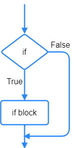
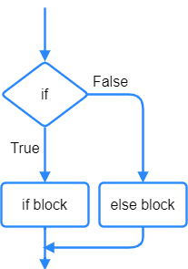
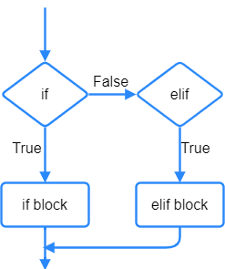
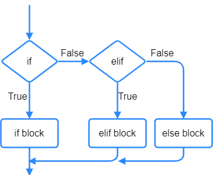
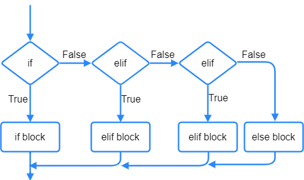

====================================================
Buttons and selection
====================================================

| The A and B-buttons can be used to carry out various actions on the microbit.
| See https://microbit-micropython.readthedocs.io/en/latest/tutorials/buttons.html

----

Button is pressed
----------------------------------------

| The ``.is_pressed`` method is used to detect button pressing at the moment the running code gets to that point.

.. py:function:: button_a.is_pressed()

    | returns ``True`` if the A-button is being pressed or ``False`` if not.

.. py:function:: button_b.is_pressed()

    | returns ``True`` if the B-button is being pressed or ``False`` if not.

| The code below scrolls True or False to indicate whether the A-button is being pressed or not.

.. code-block:: python

    from microbit import *

    while True:
        display.scroll(button_a.is_pressed(), delay=60)
        sleep(1000)

.. admonition:: Tasks

    #. Edit the code to indicate whether the B-button is being pressed or not.
    
    .. dropdown::
        :icon: codescan
        :color: primary
        :class-container: sd-dropdown-container

        .. tab-set::

            .. tab-item:: Q1

                Edit the code to indicate whether the B-button is being pressed or not.

                .. code-block:: python

                    from microbit import *

                    while True:
                        display.scroll(button_b.is_pressed(), delay=60)
                        sleep(1000)

----

Button was pressed
----------------------------------------

| The ``.was_pressed`` method is used to detect button pressing since the last check or since the device started.
| The ``.was_pressed`` method will clear the press state so that the button must be pressed again before this method will return True again. 

.. py:function:: button_a.was_pressed()

    | returns ``True`` if the A-button was pressed since the last check, or ``False`` if not.

.. py:function:: button_b.was_pressed()

    | returns ``True`` if the B-button was pressed since the last check, or ``False`` if not.

| The code below scrolls True or False.

.. code-block:: python

    from microbit import *

    while True:
        display.scroll(button_b.was_pressed(), delay=60)
        sleep(1000)

.. admonition:: Tasks

    #. Edit the code to indicate whether the A-button was pressed or not.
    
    .. dropdown::
        :icon: codescan
        :color: primary
        :class-container: sd-dropdown-container

        .. tab-set::

            .. tab-item:: Q1

                Edit the code to indicate whether the A-button was pressed or not.

                .. code-block:: python

                    from microbit import *

                    while True:
                        display.scroll(button_a.was_pressed(), delay=60)
                        sleep(1000)

| The code examples below use **is_pressed** rather than was_pressed since **is_pressed** works better when the button is **held down.**
| In contrast, **was_pressed** requires **separate pressing** for it to return True.

----

Selection
----------------------------------------

| Button pressing can be tested and used as conditions in ``if`` and ``elif`` statements.

| ``if``, ``elif`` and ``else`` provide choices or branches in the code.
| They all are used in lines of code which end with a colon, ``:``.
| Both ``if`` and ``elif`` test a condition that returns ``True`` or ``False``. Their indented code block runs if the condition is True. e.g ``if button_a.is_pressed():``.
| Multiple ``elif`` can be used to provide more choices.
| The ``else`` block does not have a condition.
| The ``else`` block only runs if all the previous conditions were ``False``.

----

if
----------------------------------------

| ``if`` requires a condition that returns ``True`` or ``False``.

| The code below checks if the variable, num, is 5 and scrolls it if it is.
| num is set to 0 then 1 is added to it each time through the while loop.

.. code-block:: python

    from microbit import *

    num = 0
    while True:
        if num == 5:
            display.scroll(num)
        num = num + 1
        sleep(200)

| The code below checks if the A-button is pressed and displays "A" if it is.
| A short sleep pauses the code between presses.

.. code-block:: python

    from microbit import *

    while True:
        if button_a.is_pressed() == True:
            display.scroll("A")
        sleep(200)

| Since ``button_a.is_pressed()`` returns a boolean, there is no need to use ``== True``.
| ``if button_a.is_pressed():`` becomes ``if True:`` when the A-button is pressed.

.. code-block:: python

    from microbit import *

    while True:
        if button_a.is_pressed():
            display.scroll("A")
        sleep(200)

----

.. admonition:: Tasks

    #. Edit the code to scroll your name when the A-button is pressed.
    #. Edit the code to display a happy face when the A-button is pressed.
    #. Edit the code to scroll your age when the B-button is pressed.
    #. Edit the code to display a sad face when the B-button is pressed.

    .. dropdown::
        :icon: codescan
        :color: primary
        :class-container: sd-dropdown-container

        .. tab-set::

            .. tab-item:: Q1

                Edit the code to scroll your name when the A-button is pressed.

                .. code-block:: python

                    from microbit import *

                    while True:
                        if button_a.is_pressed():
                            display.scroll("name")
                        sleep(200)

            .. tab-item:: Q2

                Edit the code to display a happy face when the A-button is pressed.

                .. code-block:: python

                    from microbit import *

                    while True:
                        if button_a.is_pressed():
                            display.show(Image.HAPPY)
                        sleep(200)

            .. tab-item:: Q3

                Edit the code to scroll your age when the B-button is pressed.

                .. code-block:: python

                    from microbit import *

                    while True:
                        if button_b.is_pressed():
                            display.scroll(12)
                        sleep(200)

            .. tab-item:: Q4

                Edit the code to display a sad face when the B-button is pressed.

                .. code-block:: python

                    from microbit import *

                    while True:
                        if button_b.is_pressed():
                            display.show(Image.SAD)
                        sleep(200)
                                                                                 
----

if - else
----------------------------------------

| The ``else`` block does not have a condition.
| The ``else`` block only runs if all the previous conditions were ``False``.

| The code below counts up in steps of 1 from 0 to a target number, but does not display the number till the target number is reached after which program breaks out of the loop and displays the message "target reached". 

.. code-block:: python

    from microbit import *

    num = 0
    target = 5
    while True:
        if num == target:
            display.scroll(num)
            break
        else:
            num = num + 1
        sleep(200)
    display.scroll("target reached", delay=50)

| The code below counts up in steps of 1 from 0 to a target number, displaying the number till the target number is reached after which program breaks out of the loop and displays the message "target reached".
| Notice that the condition uses "less than" rather than "equal".

.. code-block:: python

    from microbit import *

    num = 0
    target = 5
    while True:
        if num < target:
            display.scroll(num, delay=50)
            num = num + 1
        else:
            break
        sleep(200)
    display.scroll(target, delay=50)
    display.scroll("target reached", delay=50)

| The code below checks if the A-button is pressed and displays "A" if it is or "X" if not.

.. code-block:: python

    from microbit import *

    while True:
        if button_a.is_pressed():
            display.show("A")
        else:
            display.show("X")
        sleep(200)

----

.. admonition:: Tasks

    #. Edit the code to scroll your name when the A-button is pressed and to show "?" when nothing is pressed.
    #. Edit the code to display a happy face when the A-button is pressed and a sad face when nothing is pressed.
    #. Edit the code to display a sad face when the B-button is pressed and a confused face when nothing is pressed.
    
    .. dropdown::
        :icon: codescan
        :color: primary
        :class-container: sd-dropdown-container

        .. tab-set::

            .. tab-item:: Q1

                Edit the code to scroll your name when the A-button is pressed and to show "?" when nothing is pressed.

                .. code-block:: python

                    from microbit import *

                    while True:
                        if button_a.is_pressed():
                            display.scroll("name")
                        else:
                            display.show("?")
                        sleep(200)

            .. tab-item:: Q2

                Edit the code to display a happy face when the A-button is pressed and a sad face when nothing is pressed.

                .. code-block:: python

                    from microbit import *

                    while True:
                        if button_a.is_pressed():
                            display.show(Image.HAPPY)
                        else:
                            display.show(Image.SAD)
                        sleep(200)

            .. tab-item:: Q3

                Edit the code to display a sad face when the B-button is pressed and a confused face when nothing is pressed.

                .. code-block:: python

                    from microbit import *

                    while True:
                        if button_b.is_pressed():
                            display.show(Image.SAD)
                        else:
                            display.show(Image.CONFUSED)
                        sleep(200)

----

if - elif
----------------------------------------

| ``elif`` can be used to provide another choice by testing to see if its condition is True.
| The code below checks if the A-button is pressed and displays "A" if it is.
| If A is not pressed, the code then checks if the B-button is pressed and displays "B" if it is.

.. code-block:: python

    from microbit import *

    while True:
        if button_a.is_pressed():
            display.show("A")
        elif button_b.is_pressed():
            display.show("B")
        sleep(200)

----

.. admonition:: Tasks

    #. Edit the code to scroll your name when the A-button is pressed and your tutor group when the B-button is pressed.
    #. Edit the code to display a happy face when the A-button is pressed and a sad face when the B-button is pressed.
    
    .. dropdown::
        :icon: codescan
        :color: primary
        :class-container: sd-dropdown-container

        .. tab-set::

            .. tab-item:: Q1

                Edit the code to scroll your name when the A-button is pressed and your tutor group when the B-button is pressed.

                .. code-block:: python

                    from microbit import *

                    while True:
                        if button_a.is_pressed():
                            display.scroll("name")
                        elif button_b.is_pressed():
                            display.scroll("TG")
                        sleep(200)

            .. tab-item:: Q2

                Edit the code to display a happy face when the A-button is pressed and a sad face when the B-button is pressed.

                .. code-block:: python

                    from microbit import *

                    while True:
                        if button_a.is_pressed():
                            display.show(Image.HAPPY)
                        elif button_b.is_pressed():
                            display.show(Image.SAD)
                        sleep(200)

----

If - elif - else
----------------------------------------

| Using ``if``, ``elif`` and ``else`` together provides 3 branches in the code.
| The code below checks if the A-button is pressed and displays "A" if it is.
| If A is not pressed, the code then checks if the B-button is pressed and displays "B" if it is.
| If neither A nor B is pressed, "X" is displayed.

.. code-block:: python

    from microbit import *

    while True:
        if button_a.is_pressed():
            display.show("A")
        elif button_b.is_pressed():
            display.show("B")
        else:
            display.show("X")
        sleep(200)

----

.. admonition:: Tasks

    #. Edit the code to scroll your name when the A-button is pressed and your school house when the B-button is pressed and your Tutor group when nothing is pressed.
    #. Edit the code to display a happy face when the A-button is pressed and a sad face when the B-button is pressed and a confused face when nothing is pressed.

    .. dropdown::
        :icon: codescan
        :color: primary
        :class-container: sd-dropdown-container

        .. tab-set::

            .. tab-item:: Q1

                Edit the code to scroll your name when the A-button is pressed and your school house when the B-button is pressed and your Tutor group when nothing is pressed.

                .. code-block:: python

                    from microbit import *

                    while True:
                        if button_a.is_pressed():
                            display.scroll("name")
                        elif button_b.is_pressed():
                            display.scroll("house")
                        else:
                            display.scroll("TG")
                        sleep(200)

            .. tab-item:: Q2

                Edit the code to display a happy face when the A-button is pressed and a sad face when the B-button is pressed and a confused face when nothing is pressed.

                .. code-block:: python

                    from microbit import *

                    while True:
                        if button_a.is_pressed():
                            display.show(Image.HAPPY)
                        elif button_b.is_pressed():
                            display.show(Image.SAD)
                        else:
                            display.show(Image.CONFUSED)
                        sleep(200)
 
----

If - elif - elif - else
----------------------------------------

| Using ``if``, two ``elif`` and ``else`` together provides 4 branches in the code.
| The code below first checks whether both buttons are pressed. 
| The logical keyword ``and`` requires both conditions to be True for the combined condition to be True.
| If either button is not pressed the combined condition with be False.

.. code-block:: python

    from microbit import *

    while True:
        if button_a.is_pressed() and button_b.is_pressed():
            display.show(Image.ARROW_N)
        elif button_a.is_pressed():
            display.show(Image.ARROW_W)
        elif button_b.is_pressed():
            display.show(Image.ARROW_E)
        else:
            display.show(Image.ARROW_S)
        sleep(100)

----

.. admonition:: Tasks

    #. Edit the code to scroll your favourite subject when both buttons are pressed together, your best subject when the A-button is pressed, your favourite sport when the B-button is pressed, and your favourite food when nothing is pressed.
    #. Edit the code to display a giraffe when both buttons are pressed, a duck when the A-button is pressed, a rabbit when the B-button is pressed and a snake when nothing is pressed.

    .. dropdown::
        :icon: codescan
        :color: primary
        :class-container: sd-dropdown-container

        .. tab-set::

            .. tab-item:: Q1

                Edit the code to scroll your favourite subject when both buttons are pressed together, your best subject when the A-button is pressed, your favourite sport when the B-button is pressed, and your favourite food when nothing is pressed.

                .. code-block:: python

                    from microbit import *

                    while True:
                        if button_a.is_pressed() and button_b.is_pressed():
                            display.scroll("digistem")
                        elif button_a.is_pressed():
                            display.scroll("maths")
                        elif button_b.is_pressed():
                            display.scroll("table tennis")
                        else:
                            display.scroll("chicken 5 spice")
                        sleep(100)

            .. tab-item:: Q2

                Edit the code to display a giraffe when both buttons are pressed, a duck when the A-button is pressed, a rabbit when the B-button is pressed and a snake when nothing is pressed.

                .. code-block:: python

                    from microbit import *

                    while True:
                        if button_a.is_pressed() and button_b.is_pressed():
                            display.show(Image.GIRAFFE)
                        elif button_a.is_pressed():
                            display.show(Image.DUCK)
                        elif button_b.is_pressed():
                            display.show(Image.RABBIT)
                        else:
                            display.show(Image.SNAKE)
                        sleep(100)

----

Changing values with A and B-buttons
----------------------------------------

| Use the A-button to increase a variable.
| Use the B-button to decrease a variable.
| In the code below, the ``delay_time`` variable is increased in steps of 10 by the A-button and decreased in steps of 10 by the B-button. Finally, text is scrolled with a delay of ``delay_time``.

.. code-block:: python

    from microbit import *

    delay_time = 80

    while True:
        if button_a.is_pressed():
            delay_time += 10
        elif button_b.is_pressed():
            delay_time -= 10
        else:
            sleep(100)
        display.scroll("ABC", delay=delay_time)    

| The code above fails when the delay_time goes below 0.
| The variable, ``delay_time``, can be restricted to a set range of values using the min and max functions.
| ``delay_time = min(400, delay_time + 10)`` prevents the ``delay_time`` from going above 400.
| ``delay_time = max(50, delay_time - 10)`` prevents the ``delay_time`` from going below 50.

.. code-block:: python

    from microbit import *

    delay_time = 80

    while True:
        if button_a.is_pressed():
            delay_time = min(400, delay_time + 10)
        elif button_b.is_pressed():
            delay_time = max(50, delay_time - 10)
        else:
            sleep(100)
        display.scroll("ABC", delay=delay_time)  

----

.. admonition:: Tasks

    #. Edit the code to adjust the scroll delay in steps of 25.
    #. Write code to alter a ``guess_number`` variable in steps of 1 by the buttons. Use both buttons to set the number and show it. Start the number at 5 and limit it to a minimum of 1 and a maximum of 9.

    .. dropdown::
        :icon: codescan
        :color: primary
        :class-container: sd-dropdown-container

        .. tab-set::

            .. tab-item:: Q1

                Edit the code to adjust the scroll delay in steps of 25.

                .. code-block:: python

                    from microbit import *

                    delay_time = 80

                    while True:
                        if button_a.is_pressed():
                            delay_time += 25
                        elif button_b.is_pressed():
                            delay_time -= 25
                        else:
                            sleep(100)
                        display.scroll("ABC", delay=delay_time) 

            .. tab-item:: Q2

                Write code to alter a ``guess_number`` variable in steps of 1 by the buttons. Use both buttons to set the number and scroll it. Start the number at 5 and limit it to a minimum of 1 and a maximum of 9.

                .. code-block:: python

                    from microbit import *

                    guess_number = 5
                    while True:
                        if button_a.is_pressed() and button_b.is_pressed():
                            display.show(guess_number, delay=80)
                            # now start again
                            guess_number = 5
                        if button_a.is_pressed():
                            guess_number = min(9, guess_number + 1)
                        elif button_b.is_pressed():
                            guess_number = max(1, guess_number - 1)
                        else:
                            sleep(100)
                        display.show(guess_number, delay=80)
                        sleep(200)
