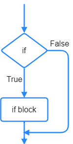
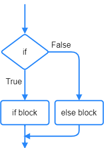
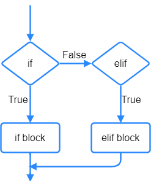
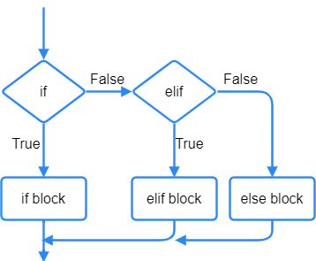
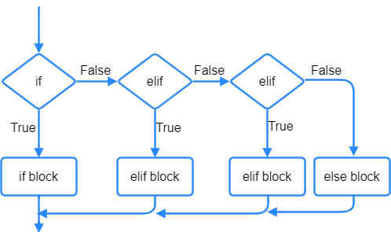

====================================================
Buttons and selection
====================================================

| The A and B-buttons can be used to carry out various actions on the microbit.
| See https://microbit-micropython.readthedocs.io/en/latest/tutorials/buttons.html

----

Button is pressed
----------------------------------------

| The ``.is_pressed`` method is used to detect button pressing at the moment the running code gets to that point.

.. py:function:: button_a.is_pressed()

    | returns ``True`` if the A-button is being pressed or ``False`` if not.

.. py:function:: button_b.is_pressed()

    | returns ``True`` if the B-button is being pressed or ``False`` if not.

----

Button was pressed
----------------------------------------

| The ``.was_pressed`` method is used to detect button pressing since the last check or since the device started.
| The ``.was_pressed`` method will clear the press state so that the button must be pressed again before this method will return True again. 

.. py:function:: button_a.was_pressed()

    | returns ``True`` if the A-button was pressed since the last check, or ``False`` if not.

.. py:function:: button_b.was_pressed()

    | returns ``True`` if the B-button was pressed since the last check, or ``False`` if not.

| The code examples below use **is_pressed** rather than was_pressed since **is_pressed** works better when the button is **held down.**
| In contrast, **was_pressed** requires **separate pressing** for it to return True.

----

Selection
----------------------------------------

| Button pressing can be tested and used as conditions in ``if`` and ``elif`` statements.

| ``if``, ``elif`` and ``else`` provide choices or branches in the code.
| They all are used in lines of code which end with a colon, ``:``.
| Both ``if`` and ``elif`` test a condition that returns ``True`` or ``False``. Their indented code block runs if the condition is True. e.g ``if button_a.is_pressed():``.
| Multiple ``elif`` blocks can be used to provide more choices.
| The ``else`` block does not have a condition.
| The ``else`` block only runs if all the previous conditions were ``False``.

----

if
----------------------------------------

| ``if`` requires a condition that returns ``True`` or ``False``.
| The code below checks if the A-button is pressed and displays "A" if it is.
| A short sleep pauses the code between presses.

.. code-block:: python

    from microbit import *

    while True:
        if button_a.is_pressed():
            display.show("A")
        sleep(200)

----

.. admonition:: Tasks

    #. Edit the code to scroll your name when the A-button is pressed.
    #. Edit the code to display a happy face when the A-button is pressed.
    #. Edit the code to scroll your age when the B-button is pressed.
    #. Edit the code to display a sad face when the B-button is pressed.

    .. dropdown::
        :icon: codescan
        :color: primary
        :class-container: sd-dropdown-container

        .. tab-set::

            .. tab-item:: Q1

                Edit the code to scroll your name when the A-button is pressed.

                .. code-block:: python

                    from microbit import *

                    while True:
                        if button_a.is_pressed():
                            display.scroll("name")
                        sleep(200)

            .. tab-item:: Q2

                Edit the code to display a happy face when the A-button is pressed.

                .. code-block:: python

                    from microbit import *

                    while True:
                        if button_a.is_pressed():
                            display.show(Image.HAPPY)
                        sleep(200)

            .. tab-item:: Q3

                Edit the code to scroll your age when the B-button is pressed.

                .. code-block:: python

                    from microbit import *

                    while True:
                        if button_b.is_pressed():
                            display.scroll(12)
                        sleep(200)

            .. tab-item:: Q4

                Edit the code to display a sad face when the B-button is pressed.

                .. code-block:: python

                    from microbit import *

                    while True:
                        if button_b.is_pressed():
                            display.show(Image.SAD)
                        sleep(200)
                                                                                 
----

if - else
----------------------------------------

| The ``else`` block does not have a condition.
| The ``else`` block only runs if all the previous conditions were ``False``.
| The code below checks if the A-button is pressed and displays "A" if it is or "X" if not.

.. code-block:: python

    from microbit import *

    while True:
        if button_a.is_pressed():
            display.show("A")
        else:
            display.show("X")
        sleep(200)

----

.. admonition:: Tasks

    #. Edit the code to scroll your name when the A-button is pressed and to show "?" when nothing is pressed.
    #. Edit the code to display a happy face when the A-button is pressed and a sad face when nothing is pressed.
    #. Edit the code to display a sad face when the B-button is pressed and a confused face when nothing is pressed.
    
    .. dropdown::
        :icon: codescan
        :color: primary
        :class-container: sd-dropdown-container

        .. tab-set::

            .. tab-item:: Q1

                Edit the code to scroll your name when the A-button is pressed and to show "?" when nothing is pressed.

                .. code-block:: python

                    from microbit import *

                    while True:
                        if button_a.is_pressed():
                            display.scroll("name")
                        else:
                            display.show("?")
                        sleep(200)

            .. tab-item:: Q2

                Edit the code to display a happy face when the A-button is pressed and a sad face when nothing is pressed.

                .. code-block:: python

                    from microbit import *

                    while True:
                        if button_a.is_pressed():
                            display.show(Image.HAPPY)
                        else:
                            display.show(Image.SAD)
                        sleep(200)

            .. tab-item:: Q3

                Edit the code to display a sad face when the B-button is pressed and a confused face when nothing is pressed.

                .. code-block:: python

                    from microbit import *

                    while True:
                        if button_b.is_pressed():
                            display.show(Image.SAD)
                        else:
                            display.show(Image.CONFUSED)
                        sleep(200)

----

if - elif
----------------------------------------

| ``elif`` can be used to provide another choice by testing to see if its condition is True.
| The code below checks if the A-button is pressed and displays "A" if it is.
| If A is not pressed, the code then checks if the B-button is pressed and displays "B" if it is.

.. code-block:: python

    from microbit import *

    while True:
        if button_a.is_pressed():
            display.show("A")
        elif button_b.is_pressed():
            display.show("B")
        sleep(200)

----

.. admonition:: Tasks

    #. Edit the code to scroll your name when the A-button is pressed and your tutor group when the B-button is pressed.
    #. Edit the code to display a happy face when the A-button is pressed and a sad face when the B-button is pressed.
    
    .. dropdown::
        :icon: codescan
        :color: primary
        :class-container: sd-dropdown-container

        .. tab-set::

            .. tab-item:: Q1

                Edit the code to scroll your name when the A-button is pressed and your tutor group when the B-button is pressed.

                .. code-block:: python

                    from microbit import *

                    while True:
                        if button_a.is_pressed():
                            display.scroll("name")
                        elif button_b.is_pressed():
                            display.scroll("TG")
                        sleep(200)

            .. tab-item:: Q2

                Edit the code to display a happy face when the A-button is pressed and a sad face when the B-button is pressed.

                .. code-block:: python

                    from microbit import *

                    while True:
                        if button_a.is_pressed():
                            display.show(Image.HAPPY)
                        elif button_b.is_pressed():
                            display.show(Image.SAD)
                        sleep(200)

----

If - elif - else
----------------------------------------

| Using ``if``, ``elif`` and ``else`` together provides 3 branches in the code.
| The code below checks if the A-button is pressed and displays "A" if it is.
| If A is not pressed, the code then checks if the B-button is pressed and displays "B" if it is.
| If neither A nor B is pressed, "X" is displayed.

.. code-block:: python

    from microbit import *

    while True:
        if button_a.is_pressed():
            display.show("A")
        elif button_b.is_pressed():
            display.show("B")
        else:
            display.show("X")
        sleep(200)

----

.. admonition:: Tasks

    #. Edit the code to scroll your name when the A-button is pressed and your school house when the B-button is pressed and your Tutor group when nothing is pressed.
    #. Edit the code to display a happy face when the A-button is pressed and a sad face when the B-button is pressed and a confused face when nothing is pressed.

    .. dropdown::
        :icon: codescan
        :color: primary
        :class-container: sd-dropdown-container

        .. tab-set::

            .. tab-item:: Q1

                Edit the code to scroll your name when the A-button is pressed and your school house when the B-button is pressed and your Tutor group when nothing is pressed.

                .. code-block:: python

                    from microbit import *

                    while True:
                        if button_a.is_pressed():
                            display.scroll("name")
                        elif button_b.is_pressed():
                            display.scroll("house")
                        else:
                            display.scroll("TG")
                        sleep(200)

            .. tab-item:: Q2

                Edit the code to display a happy face when the A-button is pressed and a sad face when the B-button is pressed and a confused face when nothing is pressed.

                .. code-block:: python

                    from microbit import *

                    while True:
                        if button_a.is_pressed():
                            display.show(Image.HAPPY)
                        elif button_b.is_pressed():
                            display.show(Image.SAD)
                        else:
                            display.show(Image.CONFUSED)
                        sleep(200)
 
----

If - elif - elif - else via logical and
----------------------------------------

| Using ``if``, two ``elif`` and ``else`` together provides 4 branches in the code.
| The code below first checks whether both buttons are pressed. 
| The logical keyword ``and`` requires both conditions to be True for the combined condition to be True.
| If either button is not pressed the combined condition with be False.

.. code-block:: python

    from microbit import *

    while True:
        if button_a.is_pressed() and button_b.is_pressed():
            display.show(Image.ARROW_N)
        elif button_a.is_pressed():
            display.show(Image.ARROW_W)
        elif button_b.is_pressed():
            display.show(Image.ARROW_E)
        else:
            display.show(Image.ARROW_S)
        sleep(100)

----

.. admonition:: Tasks

    #. Edit the code to scroll your favourite subject when both buttons are pressed together, your best subject when the A-button is pressed, your favourite sport when the B-button is pressed, and your favourite food when nothing is pressed.
    #. Edit the code to display a giraffe when both buttons are pressed, a duck when the A-button is pressed, a rabbit when the B-button is pressed and a snake when nothing is pressed.

    .. dropdown::
        :icon: codescan
        :color: primary
        :class-container: sd-dropdown-container

        .. tab-set::

            .. tab-item:: Q1

                Edit the code to scroll your favourite subject when both buttons are pressed together, your best subject when the A-button is pressed, your favourite sport when the B-button is pressed, and your favourite food when nothing is pressed.

                .. code-block:: python

                    from microbit import *

                    while True:
                        if button_a.is_pressed() and button_b.is_pressed():
                            display.scroll("digistem")
                        elif button_a.is_pressed():
                            display.scroll("maths")
                        elif button_b.is_pressed():
                            display.scroll("table tennis")
                        else:
                            display.scroll("chicken 5 spice")
                        sleep(100)

            .. tab-item:: Q2

                Edit the code to display a giraffe when both buttons are pressed, a duck when the A-button is pressed, a rabbit when the B-button is pressed and a snake when nothing is pressed.

                .. code-block:: python

                    from microbit import *

                    while True:
                        if button_a.is_pressed() and button_b.is_pressed():
                            display.show(Image.GIRAFFE)
                        elif button_a.is_pressed():
                            display.show(Image.DUCK)
                        elif button_b.is_pressed():
                            display.show(Image.RABBIT)
                        else:
                            display.show(Image.SNAKE)
                        sleep(100)

