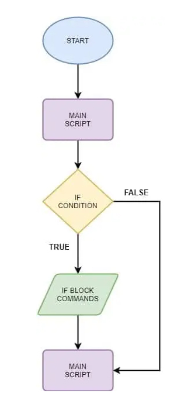

====================================================
Buttons and selection
====================================================

| The A and B buttons can be used to carry out various actions on the microbit.
| See https://microbit-micropython.readthedocs.io/en/latest/tutorials/buttons.html

----

Button is pressed
----------------------------------------

.. py:function:: button_a.is_pressed()

    | returns ``True`` if the A button is being pressed or ``False`` if not.

.. py:function:: button_b.is_pressed()

    | returns ``True`` if the B button is being pressed or ``False`` if not.

Button pressing can be tested and used as conditions in ``if`` and ``elif`` statements.

----

Selection
----------------------------------------

| ``if``, ``elif`` and ``else`` provide choices or branches in the code.
| They all are used in lines of code which end with a colon, ``:``.
| Both ``if`` and  ``elif`` test a condition that returns ``True`` or ``False``. Their indented code block runs if the condition is True. e.g ``if button_a.is_pressed():``.
| Multiple  ``elif`` can be used to provide more choices.
| The ``else`` block does not have a condition.
| The ``else`` block only runs if all the previous conditions were ``False``.

----

if
----------------------------------------

.. |img_sel_2| .. image:: images/if_else.jpg
    :scale: 75 %

.. |img_sel_3| .. image:: images/if_elif_else.jpg
    :scale: 75 %

+-----------+-----------+-----------+
| img_sel_1 | img_sel_2 | img_sel_3 |
+-----------+-----------+-----------+

| ``if`` requires a condition that returns ``True`` or ``False``.
| The code below checks if the A button is pressed and displays "A" if it is.
| A short sleep pauses the code between presses.

.. code-block:: python

    from microbit import *

    while True:
        if button_a.is_pressed():
            display.show("A")
        sleep(200)

----

.. admonition:: Tasks

    #. Edit the code to scroll your name when the A button is pressed.
    #. Edit the code to display a happy face when the A button is pressed.
    #. Edit the code to display "B" when the B button is pressed.
    #. Edit the code to display a sad face when the B button is pressed.

----

if along with else
----------------------------------------

| The ``else`` block does not have a condition.
| The ``else`` block only runs if all the previous conditions were ``False``.
| The code below checks if the A button is pressed and displays "A" if it is or "X" if not.

.. code-block:: python

    from microbit import *

    while True:
        if button_a.is_pressed():
            display.show("A")
        else:
            display.show("X")
        sleep(200)

----

.. admonition:: Tasks

    #. Edit the code to scroll your name when the A button is pressed and to show "?" when nothing is pressed.
    #. Edit the code to display a happy face when the A button is pressed and a sad face when nothing is pressed.
    #. Edit the code to display a sad face when the B button is pressed and a happy face when nothing is pressed.

----

if along with elif
----------------------------------------

| ``elif`` can be used to provide another choice by testing to see if its condition is True.
| The code below checks if the A button is pressed and displays "A" if it is.
| If A is not pressed, the code then checks if the B button is pressed and displays "B" if it is.

.. code-block:: python

    from microbit import *

    while True:
        if button_a.is_pressed():
            display.show("A")
        elif button_b.is_pressed():
            display.show("B")
        sleep(200)

----

.. admonition:: Tasks

    #. Edit the code to scroll your name when the A button is pressed and your house name when the B button is pressed.
    #. Edit the code to display a happy face when the A button is pressed and a sad face when the B button is pressed.

----

If elif else
----------------------------------------

| Using ``if``, ``elif`` and ``else`` together provides 3  branches in the code.
| The code below checks if the A button is pressed and displays "A" if it is.
| If A is not pressed, the code then checks if the B button is pressed and displays "B" if it is.
| If neither A nor B is pressed, "X" is displayed.

.. code-block:: python

    from microbit import *

    while True:
        if button_a.is_pressed():
            display.show("A")
        elif button_b.is_pressed():
            display.show("B")
        else:
            display.show("X")
        sleep(200)

----

.. admonition:: Tasks

    #. Edit the code to scroll your name when the A button is pressed and your house when the B button is pressed and your Tutor group when nothing is pressed.
    #. Edit the code to display a happy face when the A button is pressed and a sad face when the B button is pressed and a confused face when nothing is pressed.

----

If elif elif else
----------------------------------------

| Using ``if``, two ``elif`` and ``else`` together provides 4  branches in the code.
| The code below first checks whether both buttons are pressed. 
| The logical keyword ``and`` requires both conditions to be True for the combined condition to be True.
| If either button is not pressed the combined condition with be False.

.. code-block:: python

    from microbit import *

    while True:
        if button_a.is_pressed() and button_b.is_pressed():
            display.show(Image.ARROW_N)
        elif button_a.is_pressed():
            display.show(Image.ARROW_W)
        elif button_b.is_pressed():
            display.show(Image.ARROW_E)
        else:
            display.show(Image.ARROW_S)
        sleep(100)

----

.. admonition:: Tasks

    #. Edit the code to scroll your favourite subject when both buttons are pressed together, your best subject when the A button is pressed, your favourite sport when the B button is pressed, and your favourite food when nothing is pressed.
    #. Edit the code to display a giraffe when both buttons are pressed, a duck when the A button is pressed, a rabbit when the B button is pressed and a snake when nothing is pressed.

