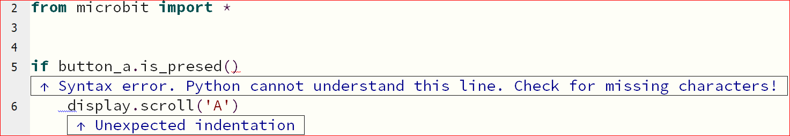

====================================================
Mu editor Errors
====================================================

Import Errors
====================================================

| A syntax error occur when the code language is not used proeprly.
| The interpreter reports it in Mu editor when the **check** button is pressed.

Library not imported properly
---------------------------------------------

| Normally the microbit is imported via ``from microbit import *``.
| If the askterisk is left out, a red wavy line will be shown at the end of the line and a **Syntax error** is reported.

.. code-block:: python

    from microbit import 

.. image:: images/import_error_1b.png
    :scale: 50 %
    :align: center

----

Imported library not used
--------------------------

| If the microbit library is imported via ``import microbit``, all microbit code needs to start with ``microbit.``
| In the code below, the line should be: ``microbit.display.scroll('hello')``.
| If ``microbit.`` is left out, a red wavy line will be shown where the errors are.
| ``display`` will not be recognised since python has not been told that it is in microbit library.
| The microbit library will also appear not to be used.

.. code-block:: python

    import microbit

    display.scroll('hello')

.. image:: images/import_error_2.png
    :scale: 50 %
    :align: center

----

Misspelt library: undefined names
-----------------------------------

| If the microbit library is misspelt, then an error occurs, as shown below.

.. code-block:: python

    from microbot import *

.. image:: images/import_error_3.png
    :scale: 50 %
    :align: center

----

Variable used which has no value
-----------------------------------

| ``display.scroll('hello')`` will scroll 'hello' across the microbit.
| If 'hello' is not in quotes, it will be treated as a variable.
| If ``display.scroll(hello)`` is used by accident, leaving out the quotes, an **undefined name** error occurs. 

.. code-block:: python

    from microbit import *

    display.scroll(hello)

.. image:: images/undefined_name_1.png
    :scale: 50 %
    :align: center

This can also be fixed by giving the variable a value, as shown below:

.. code-block:: python
    
    from microbit import *

    hello = 'Hi'
    display.scroll(hello)

----

Missing colon
-----------------------------------

| The correct code is below.
| When the A button is pressed, 'A' will be scrolled across the microbit.

.. code-block:: python

    from microbit import *

    if button_a.is_presed():
        display.scroll('A')

| If the colon is left out from the end of the ``if`` line, ``if button_a.is_presed()`` , an error occurs.

.. code-block:: python

    from microbit import *

    if button_a.is_presed():
        display.scroll('A')

| A red wavy line shown where the colon should have been. 
| A blue wavy line shows where the unexpected indentation occurred.
| The indentation is only needed after a colon.

