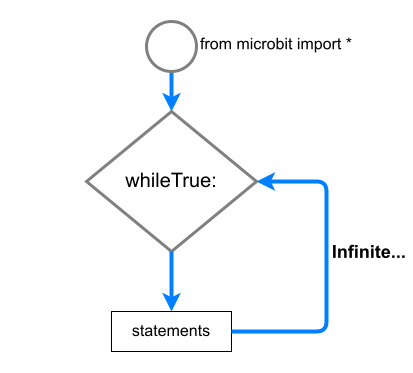

====================================================
Event loop
====================================================

| See: https://www.w3schools.com/python/python_while_loops.asp
| While loops run a set of statements as long as a test condition is true.
| The statements within the loop are indented.

While true
----------------------------------------

| ``while True:`` loops run forever.
| The ``while True`` loop below scrolls the text ``I never stop`` across the LED display over and over again.

.. code-block:: python

    from microbit import *

    while True:
        display.scroll('I never stop')

When testing code on the microbit, it can be useful to do it within a ``while True`` loop so the results can be seen over and over again.

