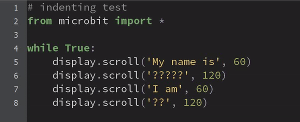

====================================================
Mu editor
====================================================

Mu editor is the simplest choice of windows apps to use when programming the microbit with micropython.

----

Installing at school
--------------------------

#. Do a windows search for ``Software centre`` and open it.
#. Search for Mu.
#. Install Mu editor.

----

First use
--------------------------

#. Click the **Mode** icon and set the mode to **BBC micro:bit**.
#. Create a new file and save it in a folder called "DigiStem".
#. Create code for the microbit then click **Check** to check for any errors.
#. To put code onto the microbit, connect it via USB then click the **Flash** icon.

----

Keyboard shortcuts
--------------------------

Useful keyboard shortcuts are at: https://codewith.mu/en/tutorials/1.1/shortcuts

| **Microbit**
=============  ======================================================================
 Keys          Action
=============  ======================================================================
 F3            Flash code onto device (the same as clicking "Flash").
=============  ======================================================================

| **Text Editing**
=============  ======================================================================
 Keys          Action
=============  ======================================================================
 CTRL F        Show the find and replace dialog.
 CTRL K        Toggle comments for the current or selected lines of code.
 TAB           Indent the current or selected lines by four spaces.
 SHIFT TAB     Unindent the current or selected lines by four spaces.
 CTRL Z        Undo (keep pressing to keep undoing).
 CTRL Y        Redo (keep pressing to keep redoing).
 CTRL A        Select all
 CTRL X        Cut selected text into the clipboard.
 CTRL C        Copy selected text into the clipboard.
 CTRL V        Paste text from the clipboard.
 CTRL SHIFT S  Save the current tab with a new name (or double click the tab's name).
=============  ======================================================================

----

Fixing indenting quickly
--------------------------

| Select multiple lines at once.
| Unindent them all at once using ``SHIFT TAB``.
| Indent them all at once using ``TAB``

----

Downloads
--------------------------

The latest version can be downloaded from: https://codewith.mu/en/download
